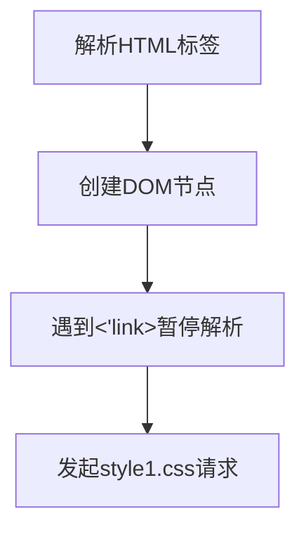
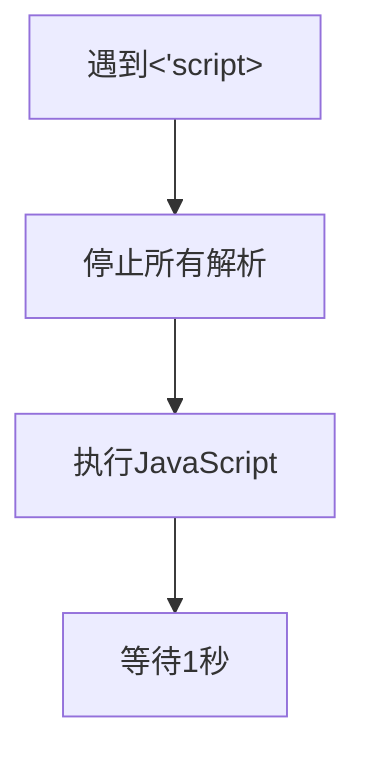
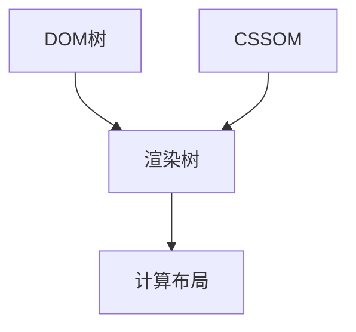

# Learn

## HTML

iframe 允许在一个页面内嵌入另一个页面的html，可用于**嵌入网页、视频、广告、文档等**，并且通过postMessage() 方法，两个页面可以实现跨域通讯


使用 postMessage 进行跨域通信
父页面向 iframe 发送消息：
在父页面中，可以使用 iframe.contentWindow.postMessage 来向 iframe 发送消息：

```javascript
<iframe id="myFrame" src="https://www.another-site.com"></iframe>

<script>
  const iframe = document.getElementById('myFrame');
  iframe.contentWindow.postMessage('Hello from parent', '*');
</script>
```

这里的 '*' 表示消息可以发送到任何来源的 iframe。为安全起见，最好指定一个确切的来源。

iframe 接收消息并回应：
在 iframe 页面中，使用 window.addEventListener('message', callback) 来监听消息：

```javascript
<script>
  window.addEventListener('message', function(event) {
    console.log('Received message:', event.data);
    // 确认消息来源的安全性
    if (event.origin === 'https://www.example.com') {
      // 回复消息
      event.source.postMessage('Hello from iframe', event.origin);
    }
  });
</script>
```


缺点：

- iframe 会阻塞主页面的 onload 事件
- 无法被一些搜索引擎索识别


拖拽


## CSS

[ch07. HTML5与CSS3新增特性](https://docs.mphy.top/#/CSS/ch07)

### 布局

#### flex布局

父元素可以控制子元素在主轴和侧轴上的排列方式(如对齐，居中，均分剩余空间，是否换行)，子元素可以通过flex属性设置占据剩余空间的份数


`flex-direction`属性决定主轴的方向（即项目的排列方向）

`justify-conten`t属性定义了项目在主轴上的对齐方式。

`align-items`属性定义项目在交叉轴上如何对齐 (单行)。

`align-content`属性定义了多根轴线的对齐方式(多行)


`flex-flow`属性是`flex-direction`属性和`flex-wrap`属性的简写形式，默认值为`row nowrap`。

`flex-wrap`属性定义，如果一条轴线排不下，如何换行。


`flex` 属性表示元素占据剩余空间的分数，比如 五个div均为flex:1，则表示五等份


### BFC

`BFC`是一个完全独立的空间（布局环境），让空间里的子元素不会影响到外面的布局

触发`BFC`使用的`CSS`属性

- overflow: hidden
- display: inline-block / flex
- position: absolute / fixed
- display: flex


### 过渡、变换、动画

伪类选择器

`:hover` 鼠标悬停

`:active` 当元素被激活（如鼠标点击按下时）触发

`:focus `当元素获得焦点（如输入框被选中）时触发

链接

```css
a:link {
  /* 未访问链接 */
  color: blue;
}
a:visited {
  /* 已访问链接 */
  color: purple;
}
a:hover {
  /* 用户鼠标悬停 */
  background: yellow;
}
a:active {
  /* 激活链接 */
  color: red;
}
```


transition 过渡

```css
.box{
   transition : all .5s
}
linear 匀速
ease 变速(默认)
```


transform 变换

2d变换

```css
.box:hover{
   transform: translate(x,y) rotate(45deg) scale(1.0,1.0)
   transform-origin: x y;
}
translate() : px , 百分比
rotate(n deg) : n顺时针旋转角度
scale(1.0,1.0) : x和y的放大比例
transform-origin: 变化的中心点
	x y 默认转换的中心点是元素的中心点（50% 50%）
	还可以给 x y 设置像素或者方位名词（top bottom left right center
```


动画

```css
 /* 1. 定义动画 */
@keyframes move {
    /*开始状态*/
    0% {
        transform: translateX(0px);
    }
    /*结束状态*/
    100% {
        transform: translateX(1000px);
    }
}
div {
    width: 200px;
    height: 200px;
    background-color: pink;
    /* 2. 调用动画 */
    /* 动画名称 */
    animation-name: move;
    /* 持续时间 */
    animation-duration: 5s;
}
```


动画常用属性

| 属性                        | 描述                                                         |
| --------------------------- | ------------------------------------------------------------ |
| `keyframes`                 | 规定动画。                                                   |
| `animation`                 | 所有动画属性的简写属性,除了animation-play-state属性。        |
| `animation-name`            | 规定@keyframes动画的名称。(必须的)                           |
| `animation-duration`        | 规定动画完成一个周期所花费的秒或毫秒，默认是0。（必须的)     |
| `animation-timing-function` | 规定动画的速度曲线，默认是“ease” .                           |
| `animation-delay`           | 规定动画何时开始，默认是0.                                   |
| `animation-iteration-count` | 规定动画被播放的次数，默认是1，还有**infinite(无限循环)**    |
| `animation-direction`       | 规定动画是否**在下一周期逆向播放**，默认是 "normal",alternate逆播放 |
| `animation-play-state`      | 规定动画**是否正在运行或暂停**。默认是"running",还有"paused". |
| `animation-fill-mode`       | 规定动画**结束后状态,保持forwards(停在结束)回到起始backwards** |


速度曲线steps步长

指的是动画执行完需要执行多少步，每一步是直接变化的

```css
animation: w 5s step(10) 2s forwards
```

动画简写属性

```css
animation: 动画名称 持续时间 运动曲线 何时开始 播放次数 是否反方向 动画起始或者结束的状态
animation: myfirst 5s linear 2s infinite alternate;
```

- 简写属性里面不包含 `animation-play-state`
- 暂停动画: `animation-play-state: puased;`
- 经常和鼠标经过等其他配合使用想要动画走回来，而不是直接跳回来: `animation-direction: alternate`
- 盒子动画结束后，停在结束位置: ` animation-fill-mode: forwards`


```css
  <style>
    @keyframes walk {
      0% {
      }
      25% {
        transform: translateX(300px);
      }
      50% {
        transform: translate(300px, 300px)
      }
      75% {
        transform: translate(0px, 300px)
      }
      100% {
        transform: translate(0px, 0px)
      }
    }
    .box{
      background-color: pink;
      width: 200px;
      height: 200px;
    }
    .box:hover{
      animation: walk 4s ease infinite;
    }


    @keyframes word {
      0%{
        width: 0px;
      }
      100% {
        width: 240px;
      }
    }
    .word{
      background-color: pink;
      font-size: 20px;
      line-height: 20px;
      height: 20px;
      overflow: hidden;
      animation: word 4s steps(10) forwards;
    }
  </style>
</head>
<body>
  <div class="box"> </div> // 盒子乱动效果
  <hr></hr>
  <div class="word"> //打字机效果
    你说的对但是前端才是出路
  </div>
</body>
</html>
```


### 移动端设配

百分比布局

- 最小宽度
- 最大宽度


## Less

```less
//1.可以定义变量并引用
@color:hotpink;
body{
  background-color: @color;
}
p{
  background-color: @color;
}


.header {
  font-size: 24px;
  //2.可以嵌套 这里a会被解析为 .header a{}
  a{
    color: red;
    //3.遇到伪类/伪元素这些选择器，需要加上&表示和父选择器绑定
    &:hover{
      color: white;
    }
    &::before{
      content: '';
      background-color: black;
    }
  }
}

@border:5px;
.box{
  width: 400px;
  height: 400px;
  //4.可以直接进行运算
  border: (@border + 10) * 2  solid black
}

// 5.单位取决于:
//    如果两个值只有一个值有单位，以有单位的为准
//    如果两个值都有单位，以第一个有单位的为准
@baseFont:5px;
img{
  width: 82rem/@border;
  width: 82rem/@border;
}
```


## ES6

[ES6最通俗易懂的超重点保姆级笔记！女朋友看了都流泪的学习秘籍！没有一句废话，全部都是满满干货！_javastript es6 重点知识笔记-CSDN博客](https://blog.csdn.net/lyyrhf/article/details/115338763)

[12. Symbol - 概述 - 《阮一峰 ECMAScript 6 (ES6) 标准入门教程 第三版》 - 书栈网 · BookStack](https://www.bookstack.cn/read/es6-3rd/spilt.1.docs-symbol.md)

计算属性名

[ES6计算属性名详解-CSDN博客](https://blog.csdn.net/yexudengzhidao/article/details/105632791)

```javascript
let name = "first name"
let person = {
    [name]:"Raaa",
    ["last"+" name"]:"bbit",
    // 方法也可以用这样的方式定义
    ["say"+"Hello"](){
        console.log("hello");
    }
}
console.log(person["first name"]); // Raaa

//可以这样取值
let name = "first name";
let person = {};

person[name] = "Raaa";
console.log(person[name]); // Raaa
console.log(person["first name"]); // Raaa


```


### 集合

#### Set

ES6提供了新的数据结构set(集合）。它类似于数组，但成员的值都是唯一的，集合实现了iterator接口，所以可以使用「扩展运算符』和「 for…of…』进行遍历，集合的属性和方法:

```javascript
<script>
    let s = new Set();
    let s2 = new Set(['A','B','C','D'])
    //元素个数
    console.log(s2.size);
    //添加新的元素
    s2.add('E');
    //删除元素
    s2.delete('A')
    //检测
    console.log(s2.has('C'));
    //清空
    s2.clear()
    console.log(s2);
</script>
```

应用

```javascript
<script>
    let arr = [1,2,3,4,5,4,3,2,1]

    //1.数组去重 传入set再展开
    let result = [...new Set(arr)]
    console.log(result);
    //2.交集
    let arr2=[4,5,6,5,6]
    let result2 = [...new Set(arr)].filter(item => new Set(arr2).has(item))
    console.log(result2);
    //3.并集 合并传入set
    let result3=[new Set([...arr,...arr2])]
    console.log(result3);
    //4.差集
    let result4= [...new Set(arr)].filter(item => !(new Set(arr2).has(item)))
    console.log(result4);

</script>

```

#### Map

ES6提供了Map数据结构。它类似于对象，也是键值对的集合。但是“键”的范围不限于字符串，**各种类型的值（包括对象）都可以当作键**。Map也实现了iterator接口，所以**可以使用『扩展运算符』和「for…of…』进行遍历**。Map的属性和方法。

```javascript
<script>
    let m = new Map();
	
    m.set('name','ran');
    m.set('change',()=>{
        console.log('改变！')
    })
    let key={
        school:'atguigu'
    }
    ////设置值
    m.set(key,['成都','西安']);
    //size
    console.log(m.size);
    //删除
    m.delete('name');
    //获取
    console.log(m.get('change'));
    // //清空
    m.clear()

    //遍历
    for(let v of m){
        //打印的是键值组合
        console.log(v);
    }
</script>

```


#### WeakMap

api与map基本相同

- key必须是引用类型
- key是弱引用，如果内存不足，会被自动回收，key关联的值也会成为垃圾回收的对象
- 

```javascript
const map = new WeakMap();
map.set({value:'1001'}, {
    id:1,
    name:'xushuo'
})
```


### Symbol & BigInt

ES6 引入了一种新的原始数据类型`Symbol`，**表示独一无二的值, 可以从根本上防止属性名与全局变量的冲突。**

由于 Symbol 值不是对象，所以不能添加属性。基本上，它**是一种类似于字符串的数据类型**

```javascript
let s = Symbol();
typeof s
// "symbol"
```

`Symbol`函数可以**接受一个字符串作为参数，表示对 Symbol 实例的描述**

```javascript
let s1 = Symbol('foo');
let s2 = Symbol('bar');
s1 // Symbol(foo)
s2 // Symbol(bar)
s1.toString() // "Symbol(foo)"
s2.toString() // "Symbol(bar)"

```

`Symbol`函数的参数只是表示对当前 Symbol 值的描述，**因此相同参数的`Symbol`函数的返回值是不相等的**

```javascript
// 没有参数的情况
let s1 = Symbol();
let s2 = Symbol();
s1 **= s2 // false
// 有参数的情况
let s1 = Symbol('foo');
let s2 = Symbol('foo');
s1 **= s2 // false
```


使用 BigInt 可以安全地存储和操作大整数，即使这个数已经超出了 Number 能够表示的安全整数范围。

```javascript
//大整型 普通整数后面加n
let n = 521n;
console.log(n,typeof(n))  // 521n  n 

//函数
let n = 123;
console.log(BigInt(n)) // 123n  //不要使用浮点型，只能用int

//大数值运算
let max = Number.MAX_SAFE_INTEGER; // 9007199254740991
console.log(max +1) // 9007199254740992
console.log(max +2) // 9007199254740992 出问题了
// 大整数不能和普通整数混合运算
console.log(BigInt(max)+BigInt(1)) 9007199254740992n
console.log(BigInt(max)+BigInt(2)) 9007199254740993n

```


### 迭代器

```javascript
const xiyou=['AA','BB','CC','DD'];
// for(let v of xiyou){
//     console.log(v)  // 'AA','BB','CC','DD'  //for in保存的是键名，for of保存的是键值
// }
let iterator = xiyou[Symbol.iterator]();
console.log(iterator.next()); //{{value:'唐僧'，done:false}}
console.log(iterator.next()); //{{value:'孙悟空'，done:false}}

```

原理：创建一个指针对象，指向数据结构的起始位置，第一次调用**next（）**方法，指针自动指向数据结构第一个成员，接下来不断调用next（），指针一直往后移动，直到指向最后一个成员，没调用next（）返回一个包含value和done属性的对象

应用：自定义遍历

```javascript
const banji = {
    name : "终极一班",
    stus: [
        'aa',
        'bb',
        'cc',
        'dd'
    ],
    [Symbol.iterator](){
        let index = 0;
        let _this = this;
        return {
            next: () => {
                if(index < this.stus.length){
                    const result = {value: _this.stus[index],done: false};
                    //下标自增
                    index++;
                    //返回结果
                    return result;
                }else {
                    return {value: underfined,done:true};
                }
            }
        }
    }
}
for(let v of banji){
    console.log(v);  // aa bb cc dd
}

```


一个数据结构只要部署了`Symbol.iterator`属性，就被视为具有 iterator 接口，就可以用`for...of`循环遍历它的成员。也就是说，`for...of`循环内部调用的是数据结构的`Symbol.iterator`方法

JavaScript 原有的`for...in`循环，只能获得对象的键名，不能直接获取键值。ES6 提供`for...of`循环，允许遍历获得键值

```javascript
var arr = ['a', 'b', 'c', 'd'];
for (let a in arr) {
  console.log(a); // 0 1 2 3
}
for (let a of arr) {
  console.log(a); // a b c d
}
```

Set 结构遍历时，返回的是一个值，而 Map 结构遍历时，返回的是一个数组，该数组的两个成员分别为当前 Map 成员的键名和键值

```javascript
var engines = new Set(["Gecko", "Trident", "Webkit", "Webkit"]);
for (var e of engines) {
  console.log(e);
}
// Gecko
// Trident
// Webkit
var es6 = new Map();
es6.set("edition", 6);
es6.set("committee", "TC39");
es6.set("standard", "ECMA-262");
for (var [name, value] of es6) {
  console.log(name + ": " + value);
}
// edition: 6
// committee: TC39
// standard: ECMA-262
```

## JS

## Web API


### 事件

常用事件

点击 click


常用鼠标事件
mousemove：鼠标移动事件，即鼠标在页面或被监听的元素中移动即可触发。
mousedown：鼠标按下事件，鼠标点击时候可分两步，按下和抬起，这个事件在鼠标按下时即可触发，不需等待抬起。
mouseup：鼠标抬起事件，这个为鼠标按下后的抬起才会触发，如果不抬起则不会触发

mouseenter：**鼠标移入时触发**，如果绑定在页面上，则移入页面就触发一次，如果绑定在某元素，则移入该元素中则触发一次
mouseout:**鼠标移出时触发**，如果绑定在页面上，则移出页面就触发，如果绑定在某元素中，则移出该元素就触发一次


键盘事件

keydown   键盘按下触发
keyup   键盘抬起触发

焦点事件

focus  获得焦点

blur 失去焦点

文本框输入事件

input


页面加载事件

加载外部资源（如图片、外联CSS和JavaScript等）加载完毕时触发的事件，有些时候需要等页面资源全部处理完了做一些事情

~~~javascript
window.addEventListener('load', function() {
    // xxxxx
})
~~~

元素滚动事件

滚动条在滚动的时候持续触发的事件

~~~javascript
window.addEventListener('scroll', function() {
    // xxxxx
})
~~~

页面尺寸事件

会在窗口尺寸改变的时候触发事件：

~~~javascript
window.addEventListener('resize', function() {
    // xxxxx
})
~~~


### dom节点操作

- 添加节点`document.appendChild(dom)`
- 移除节点`document.removeChild(dom)`
- 移动节点`document.appendChild(targetDom)`
- 复制节点`dom.cloneNode(true)`，参数`true`表示是否复制子节点
- 创建节点`document.createElement(dom)`
- 查找节点:
  - `document.getElementById("elementId")`
  - `document.getElementsByClassName("className")`
  - `document.getElementsByTagName("tagName")`
  - `document.querySelector("selector")`
  - `document.querySelectorAll("selector")`


### 元素定位

在 JavaScript 开发中，处理元素位置和鼠标位置时常用的属性可以分为以下几类：

---

### **一、元素位置相关属性**

`element.offsetTop / element.offsetLeft`

元素相对于最近定位父级元素的偏移


`element.getBoundingClientRect()`  

- `x` / `left`：元素左边界到视口左边的距离。
- `y` / `top`：元素上边界到视口顶部的距离。
- `right` / `bottom`：元素右/下边界到视口左/顶的距离。
- `width` / `height`：元素的宽高（包括 `padding` 和 `border`）

返回一个对象，包含元素相对于视口的坐标信息


 


#### 1. **相对于视口（Viewport）的位置**
- `element.getBoundingClientRect()`  
  返回一个对象，包含元素相对于视口的坐标信息：  
  - `x` / `left`：元素左边界到视口左边的距离。
  - `y` / `top`：元素上边界到视口顶部的距离。
  - `right` / `bottom`：元素右/下边界到视口左/顶的距离。
  - `width` / `height`：元素的宽高（包括 `padding` 和 `border`）。

- `element.offsetTop` / `element.offsetLeft`  
  返回元素相对于最近定位祖先（`position` 非 `static`）的偏移位置。

#### 2. **相对于文档（Document）的位置**
- `element.offsetTop` + 递归父级 `offsetTop`  
  手动计算相对于文档的垂直位置（需遍历定位祖先链）。

- `element.getBoundingClientRect()` + `window.scrollX` / `window.scrollY`  
  通过视口位置加上滚动距离得到文档绝对位置：
  
  ```javascript
  const rect = element.getBoundingClientRect();
  const absoluteTop = rect.top + window.scrollY;
  const absoluteLeft = rect.left + window.scrollX;
  ```

#### 3. **元素尺寸**
- `element.offsetWidth` / `element.offsetHeight`  
  包含元素内容 + `padding` + `border`（不包含滚动条和 `margin`）。
- `element.clientWidth` / `element.clientHeight`  
  包含内容 + `padding`（不包含 `border` 和滚动条）。
- `window.innerWidth` / `window.innerHeight`  
  视口的宽高（包括滚动条）。
- `document.documentElement.scrollWidth` / `scrollHeight`  
  整个文档内容的宽高。


#### 1. **鼠标事件鼠标的位置**
- `event.clientX` / `event.clientY`  
  鼠标相对于视口的坐标（不随页面滚动变化）。
- `event.offsetX` / `event.offsetY`  
  鼠标相对于事件目标元素（`event.target`）边界的坐标。
- `event.pageX` / `event.pageY`  
  鼠标相对于文档的坐标（包含滚动偏移）。
- `event.screenX` / `event.screenY`  
  鼠标相对于屏幕的坐标（物理屏幕位置）。 
- `event.movementX` / `event.movementY`  
  鼠标相对于上一次事件的位移（常用于 `mousemove`）。


---

### **三、滚动相关属性**
- `window.scrollX` (`window.pageXOffset`) / `window.scrollY` (`window.pageYOffset`)  
  文档水平/垂直滚动距离。
- `element.scrollTop` / `element.scrollLeft`  
  元素内部的滚动距离（如 `div` 的滚动条位置）。

---

### **四、应用场景示例**
1. **检测元素是否在视口中**（懒加载/滚动动画）：
   ```javascript
   function isInViewport(element) {
     const rect = element.getBoundingClientRect();
     return (
       rect.top < window.innerHeight && 
       rect.bottom > 0
     );
   }
   ```

2. **拖拽元素时计算偏移**：
   ```javascript
   element.addEventListener('mousedown', (e) => {
     const startX = e.clientX - element.getBoundingClientRect().left;
     const startY = e.clientY - element.getBoundingClientRect().top;
     // 后续根据 mousemove 更新元素位置
   });
   ```

3. **获取鼠标在 Canvas 中的精确坐标**：
   ```javascript
   canvas.addEventListener('click', (e) => {
     const rect = canvas.getBoundingClientRect();
     const x = e.clientX - rect.left;
     const y = e.clientY - rect.top;
   });
   ```

---

### **注意事项**
- **性能**：频繁调用 `getBoundingClientRect()` 可能触发重排（reflow），建议缓存结果。
- **坐标系差异**：区分视口坐标（`clientX/Y`）和文档坐标（`pageX/Y`），尤其在滚动页面时。
- **兼容性**：现代浏览器均支持上述属性，但在老旧项目中需注意 `pageXOffset` 和 `scrollX` 的别名关系。

根据具体需求选择合适的属性，可以高效处理位置计算问题！


## 异步编程

### Promise

```javascript
/**
 * 目标：使用Promise管理异步任务
*/
const p = new Promise(function(resolve,reject){
  setTimeout(()=>{
    // resolve('成功')
    reject(new Error('失败'))
  },2000)
})
p.then(result=>{
  console.log(result)
    //抛出异常或者调用reject时，会进入catch
}).catch(result=>{
  console.log(result)
})
```

Promise 三种状态

1. Promise 有哪三种状态？

   > 每个 Promise 对象必定处于以下三种状态之一

   1. 待定（pending）：初始状态，既没有被兑现，也没有被拒绝
   2. 已兑现（fulfilled）：操作成功完成
   3. 已拒绝（rejected）：操作失败

   > 状态的英文字符串，可以理解为 Promise 对象内的字符串标识符，用于判断什么时候调用哪一个处理函数

2. Promise 的状态改变有什么用：调用对应函数，改变 Promise 对象状态后，内部触发对应回调函数传参并执行

   

3. 注意：每个 Promise 对象一旦被兑现/拒绝，那就是已敲定了，状态无法再被改变


Promise链式调用

**Promise链式调用实现同步，避免回调函数嵌套问题**

1. 依靠 **在then() 方法结束后返回一个新生成的 Promise 对象，继续串联下一环任务**，直到结束

2. 细节：then() 回调函数中的返回值，会影响新生成的 Promise 对象最终状态和结果

3. 好处：通过链式调用，解决回调函数嵌套问题

`then` 检查的是前一个回调函数的最终状态（是否抛出错误或返回 rejected Promise）**，而不仅仅是前一个 Promise 的初始状态。无论是 `onFulfilled`（成功回调）还是 `onRejected`（失败回调），只要它们 **正常执行完毕**（没有抛出错误或返回 rejected Promise），后续的 `then` 就会执行 **成功回调**；如果它们 **抛出错误或返回 rejected Promise**，后续的 `then` 就会执行 **失败回调


```javascript
let promise = new Promise((resolve,reject)=>{
    ajax('first').success(function(res){
        resolve(res);
    })
})
promise.then(res=>{
    return new Promise((resovle,reject)=>{
        ajax('second').success(function(res){
            resolve(res)
        })
    })
}).then(res=>{
    return new Promise((resovle,reject)=>{
        ajax('second').success(function(res){
            resolve(res)
        })
    })
}).then(res=>{
    
})
```

应用 axiso链式调用

```javascript
/**
 * 目标：把回调函数嵌套代码，改成Promise链式调用结构
 * 需求：获取默认第一个省，第一个市，第一个地区并展示在下拉菜单中
*/
let pname = ''
let cname = ''
axios({
    //掉一次远程调用
  url: 'http://hmajax.itheima.net/api/province',
}).then(result => {
  console.log(result.data)
  pname = result.data.list[0]
  return axios({
      //第二次远程调用
    url: 'http://hmajax.itheima.net/api/city',
    params: {
      pname
    }
  })
}).then(result => {
  console.log(result.data)
  cname = result.data.list[0]
  return axios({
      //第三次远程调用
    url: 'http://hmajax.itheima.net/api/area',
    params: {
      pname, cname
    }
  })
}).then(result => {
  console.log(result.data)
})
script>
```

Promise.all() 并行等待

`all`方法可以完成并行任务， 它接收一个数组，数组的每一项都是一个`promise`对象。**当数组中所有的`promise`的状态都达到`resolved`的时候，`all`方法的状态就会变成`resolved`，如果有一个状态变成了`rejected`，那么`all`方法的状态就会变成`rejected`**。

```javascript
const p1 = new Promise(function(resolve,reject){
  setTimeout(()=>{resolve(1)},1000)
})
const p2 = new Promise(function(resolve,reject){
  setTimeout(()=>{resolve(2)},2000)
})
const p3 = new Promise(function(resolve,reject){
  setTimeout(()=>{resolve(3)},3000)
})
const all = Promise.all([p1,p2,p3]).then(res=>console.log(res)) //3s后打印
```

Promise.race() 等待第一个完成

`race`方法和`all`一样，接受的参数是一个每项都是`promise`的数组，但是与`all`不同的是，当最先执行完的事件执行完之后，就直接返回该`promise`对象的值。如果第一个`promise`对象状态变成`resolved`，那自身的状态变成了`resolved`；反之第一个`promise`变成`rejected`，那自身状态就会变成`rejected`。

```javascript
const p1 = new Promise(function(resolve,reject){
  setTimeout(()=>{resolve(1)},1000)
})
const p2 = new Promise(function(resolve,reject){
  setTimeout(()=>{resolve(2)},2000)
})
const p3 = new Promise(function(resolve,reject){
  setTimeout(()=>{resolve(3)},3000)
})
const all = Promise.race([p1,p2,p3]).then(res=>console.log(res)) //1s后打印
```

Promise执行时序

Promise作为微任务，在本轮函数调用的末尾就执行

```javascript
setTimeout(function(){
	console.log('1');
}, 0);
new Promise(function(resolve){
    //直接执行
	console.log('2');
	resolve();
    //回调
}).then(function(){		    
	console.log('3');
    //回调
}).then(function(){
	console.log('4')
}); 		
console.log('5');
// 2 5 3 4 1

```

执行完当前红任务，判断是否有可以执行的微任务，执行完所有微任务后才开启新的宏任务


### **generator** 生成器函数

生成器函数的强大之处在于它们能够暂停和恢复执行， 在函数的执行过程中，将函数的执行权转移出去

```javascript
 function* myGenerator() {
   const data = yield axios.get('http...');
   yield axios.get('http...');
   yield axios.get('http...');
 }
 const generator = myGenerator();
 //执行一次函数，直到yield位置，   yield关键字后语句的返回值 :  { value:promise, done:false }   //yield前的返回值就是传入的参数'data'
 generator.next('data').value.then((res)=>{
   console.log(res)
 }) 
 generator.next().value.then((res)=>{
   console.log(res)
 }) 
 const result = generator.next()
 if(result.done){
   console.log('此时执行完毕，done为true')
 }
   
```

封装handlerResult实现自动调用

```javascript
function* myGenerator() {
  ...
}
const g = myGenerator();
function handlerResult(result){
  if(result.done) return
  result.value.then(data=>{
    handlerResult(g.next(data))
  })
}
handlerResult(g)
```

### Async & Await

async/await其实是`Generator` 的语法糖，async用来表明函数执行是异步的，await 用于等待一个异步方法执行完成

async函数**返回的是一个 Promise 对象**，如果在函数中 `return` 一个变量，`async` 会把这个直接量通过 `Promise.resolve()` 封装成 `Promise`对象。如果没有返回值，返回 Promise.resolve(undefined)


- 代码可读性高，可以以同步的方式书写代码
- 可以用try-catch捕获异常，简洁


## 面向对象

### 深入对象

> 了解面向对象的基础概念，能够利用构造函数创建对象。

3. 

#### 内置构造函数

> 掌握各引用类型和包装类型对象属性和方法的使用。

在 JavaScript 中**最主要**的数据类型有 6 种，分别是字符串、数值、布尔、undefined、null 和 对象，常见的对象类型数据包括数组和普通对象。其中字符串、数值、布尔、undefined、null 也被称为简单类型或基础类型，对象也被称为引用类型。

在 JavaScript 内置了一些构造函数，绝大部的数据处理都是基于这些构造函数实现的，JavaScript 基础阶段学习的 `Date` 就是内置的构造函数。

```html
<script>
  // 实例化
	let date = new Date();
  
  // date 即为实例对象
  console.log(date);
</script>
```

甚至字符串、数值、布尔、数组、普通对象也都有专门的构造函数，用于创建对应类型的数据。

##### Object

`Object` 是内置的构造函数，用于创建普通对象。

```html
<script>
  // 通过构造函数创建普通对象
  const user = new Object({name: '小明', age: 15})

  // 这种方式声明的变量称为【字面量】
  let student = {name: '杜子腾', age: 21}
  
  // 对象语法简写
  let name = '小红';
  let people = {
    // 相当于 name: name
    name,
    // 相当于 walk: function () {}
    walk () {
      console.log('人都要走路...');
    }
  }

  console.log(student.constructor);
  console.log(user.constructor);
  console.log(student instanceof Object);
</script>
```

。

总结：

1. 推荐使用字面量方式声明对象，而不是 `Object` 构造函数
2. `Object.assign` 静态方法**创建新的对象（拷贝）** 可用于给对象增加属性
3. `Object.keys` 静态方法获取对象中所有**属性**
4. `Object.values` 表态方法获取对象中所有**属性值**

##### Array

`Array` 是内置的构造函数，用于创建数组。

```html
<script>
  // 构造函数创建数组
  let arr = new Array(5, 7, 8);

  // 字面量方式创建数组
  let list = ['html', 'css', 'javascript']

</script>
```

数组赋值后，无论修改哪个变量另一个对象的数据值也会相当发生改变。

##### 包装类型

在 JavaScript 中的**字符串、数值、布尔具有对象的使用特征**，如具有属性和方法，如下代码举例：

```html
<script>
  // 字符串类型
  const str = 'hello world!'
 	// 统计字符的长度（字符数量）
  console.log(str.length)
  
  // 数值类型
  const price = 12.345
  // 保留两位小数
  price.toFixed(2) // 12.34
</script>
```

之所以具有对象特征的原因是字符串、数值、布尔类型数据是 JavaScript 底层使用 Object 构造函数“包装”来的，被称为包装类型。

##### String

`String` 是内置的构造函数，用于创建字符串。

```html
<script>
  // 使用构造函数创建字符串
  let str = new String('hello world!');

  // 字面量创建字符串
  let str2 = '你好，世界！';

  // 检测是否属于同一个构造函数
  console.log(str.constructor **= str2.constructor); // true
  console.log(str instanceof String); // false
</script>
```

##### Number

`Number` 是内置的构造函数，用于创建数值。

```html
<script>
  // 使用构造函数创建数值
  let x = new Number('10')
  let y = new Number(5)

  // 字面量创建数值
  let z = 20

</script>
```


面向对象的特性：

- 封装性


- 继承性
- 多态性

### 原型

JavaScript中是使用构造函数来新建一个对象的，**每一个构造函数的内部都有一个 prototype 属性，它的属性值是一个对象，这个对象包含了可以由该构造函数的所有实例共享的属性和方法** : **原型对象**

构造函数**通过原型分配的函数是所有对象所共享的**。 ：**当访问对象的属性或方法时，先在当前实例对象是查找，然后再去原型对象查找，并且原型对象被所有实例共享。**

- **这个对象可以挂载函数，对象实例化不会多次创建原型上函数，节约内存**
- 我们可以把那些不变的方法，直接定义在 prototype 对象上，这样所有对象的实例就可以共享这些方法。
- **构造函数和原型对象中的this 都指向 实例化的对象**

```html
<script>
  function Person() {
    // 此处定义同名方法 sayHi
    this.sayHi = function () {
      console.log('嗨!');
    }
  }

  // 为构造函数的原型对象添加方法
  Person.prototype.sayHi = function () {
    console.log('Hi~');
  }

  let p1 = new Person();
  p1.sayHi(); // 输出结果为 嗨!
</script>
```

总结：**结合构造函数原型的特征，实际开发重往往会将封装的功能函数添加到原型对象中。**

#### constructor 属性


 **每个原型对象里面都有个constructor 属性（constructor 构造函数）,该属性指向该原型对象的构造函数**

**应用：**

如果有多个对象的方法，我们可以给原型对象采取对象形式赋值.

但是这样就会**覆盖构造函数原型对象原来的内容**，这样修改后的原型对象 constructor 就不再指向当前构造函数了

此时，我们可以在修改后的原型对象中，**添加一个 constructor 指向原来的构造函数。**

```java
//添加多个方法
Star.prototype = {
    //添加一个 constructor 指向原来的构造函数，否则会被覆盖
  constructor: Star,
  sing: function () {
    console.log('唱歌')
  },
  dance: function () {
    console.log('跳舞')
  }
}
```


#### 对象原型

**对象都会有一个属性 `_proto_ `指向构造函数的 prototype 原型对象**，之所以我们对象可以使用构造函数 prototype 

原型对象的属性和方法，就是因为对象有` _proto_ `原型的存在。

对象原型是指向原型对象的指针

注意：

- __proto__ 是JS非标准属性
- [[prototype]]和__proto__意义相同
- 用来表明当前实例对象指向哪个原型对象prototype


#### 原型继承

继承是面向对象编程的另一个特征，通过继承进一步提升代码封装的程度，JavaScript 中大多是借助原型对象实现继承

的特性。

**通过将原型对象指向父类对象, 并将原型对象的构造函数指回原来的构造函数** 实现

```javascript
    function Person() {
      this.eyes = 2
      this.head = 1
    }
    // 女人  构造函数   继承  想要 继承 Person
    function Woman() {

    }
	//new Person()实现，原型对象指向不同的Persion，对 Woman.prototype添加属性时不会影响其他继承Persion的对象
    Woman.prototype = new Person()   // {eyes: 2, head: 1} 
    // 指回原来的构造函数
    Woman.prototype.constructor = Woman
```

#### 原型链

每个原型对象会有自己的原型，来实现继承，这样会形成一个链状结构

原型链的尽头一般来说都是 Object的原型


```html
<body>
  <script>
    // function Objetc() {}
    console.log(Object.prototype)
    console.log(Object.prototype.__proto__)

    function Person() {

    }
    const ldh = new Person()
    // console.log(ldh.__proto__ **= Person.prototype)
    // console.log(Person.prototype.__proto__ **= Object.prototype)
    console.log(ldh instanceof Person)
    console.log(ldh instanceof Object)
    console.log(ldh instanceof Array)
    console.log([1, 2, 3] instanceof Array)
    console.log(Array instanceof Object)
  </script>
</body>
```

**① 当访问一个对象的属性（包括方法）时，首先查找这个对象自身有没有该属性。**

**② 如果没有就查找它的原型（也就是 proto指向的 prototype 原型对象）**

**③ 如果还没有就查找原型对象的原型（Object的原型对象）**

**④ 依此类推一直找到 Object 为止（null）**

⑤ __proto__对象原型的意义就在于为对象成员查找机制提供一个方向，或者说一条路线

⑥ 可以**使用 instanceof 运算符用于检测构造函数的 prototype 属性是否出现在某个实例对象的原型链上**


### 判断

**`typeof`**

```javascript
console.log(typeof 2);               // number
console.log(typeof true);            // boolean
console.log(typeof 'str');           // string
console.log(typeof []);              // object    
console.log(typeof function(){});    // function
console.log(typeof {});              // object
console.log(typeof undefined);       // undefined
console.log(typeof null);            // object
```

其中数组、对象、null都会被判断为object


使用 **`instanceof`** 运算符用于检测构造函数的 prototype 属性是否出现在某个实例对象的原型链上


判断对象的 **`constructor`** 是不是某个类型的构造函数 

```javascript
console.log((2).constructor **= Number); // true
console.log((true).constructor **= Boolean); // true
console.log(('str').constructor **= String); // true
console.log(([]).constructor **= Array); // true
console.log((function() {}).constructor **= Function); // true
console.log(({}).constructor **= Object); // true
```


**Object.prototype.toString.call()**使用 Object 对象的原型方法 toString 来判断数据类型

```javascript
var a = Object.prototype.toString;
 
console.log(a.call(2));// [object Number]
console.log(a.call(true));// [object Boolean]
console.log(a.call('str'));// [object String]
console.log(a.call([]));// [object Array]
console.log(a.call(function(){}));// [object Function]
console.log(a.call({}));// [object Object]
console.log(a.call(undefined));// [object Undefined]
console.log(a.call(null));// [object Null]

```


**isPrototypeOf()** 方法用于检查一个对象是否存在于另一个对象的原型链中


使用后**`hasOwnProperty()`**方法来判断属性是否属于原型链的属性

```javascript
for(var key in obj){
        if(obj.hasOwnProperty(key))
           res.push(key+': '+obj[key]);
   }
```

**`hasOwnProperty()`** 方法返回一个布尔值，表示对象自有属性（而不是继承来的属性）

```javascript
const object1 = {};
object1.property1 = 42;

console.log(object1.hasOwnProperty("property1"));
// Expected output: true

console.log(object1.hasOwnProperty("toString"));
// Expected output: false
```


#### 数组

 **`Array.isArray()`** 静态方法用于确定传递的值是否是一个[数组](https://developer.mozilla.org/zh-CN/docs/Web/JavaScript/Reference/Global_Objects/Array)。

```javascript
Array.isArrray([1,2,3]); //true
```


### 对象

#### Class

class类

```javascript
class Persion{
  //实例属性 #开头表示私有属性，私有属性只能才类内访问，可以提供get方法对外提供
  #id
  name
  age
  str='Persion'
  //构造函数
  constructor(id,name,age){
    this.id=id
    this.name=name
    this.age=age
  }
  //静态成员
  static typeName='Persion'
  static print(){
    //this 指向类
    console.log(this)
  }
  //方法
  printName(){
    //this 指向实例
    console.log(this.name)
  }
}
const p = new Persion(1,'xushuo',18)
```

继承

```javascript
//父类
class Animal{
  name
  constructor(name){
    this.name=name
  }
  sayHello(){
    console.log('动物叫')
  }
}
//子类
class Cat extends Animal{
    age
    constructor(name,age){
        //重写构造函数需要super调用父类构造函数
        super(name)
        this.age=age
    }
 
}
class Dog extends Animal{
    //重写父类方法
  sayHello(){
      //调用父类的方法
      super.sayHello()
    console.log('汪汪汪')
  }
}
const d = new Dog('狗宝宝')
console.log(d)
```

class与原型

```javascript
class Persion{
    //这样声明，doSometing()是原型上的属性
  doSometing(){
    console.log(this.name)
  }
    //这样声明，doSometing函数是对象实例上的属性
  doSometing = function(){
    console.log(this.name)
  }
}
```


JS中的继承是通过原型继承实现的

```javascript
class Worker{
}
class Teacher extends Worker{
}
const w = new Worker()
const t =new Teacher()
console.log(t.__proto__.__proto__**=w.__proto__) // true    t的原型 是 Worker的实例 
```


#### 旧类

##### 构造函数

**大写开头，只能通过new执行**

构造函数是专门用于创建对象的函数，**如果一个函数使用 `new` 关键字调用，那么这个函数就是构造函数。**

```html
<script>
  function Person() {
    this.name = '佚名'
    this.setName = function (name) {
      this.name = name
    }
    this.getName = () => {
      console.log(this.name)
    }
  }
  // 实例对像，获得了构造函数中封装的所有逻辑
  let p1 = new Person()
  p1.setName('小明')
  console.log(p1.name)

  // 实例对象
  let p2 = new Person()
  console.log(p2.name)
</script>。
```


##### 在类中添加属性 & 静态属性

```javascript
 // 构造函数
  function Person(name, age) {
      //成员变量
	this.id=1,
    this.name=name,
    this.age=age
  }
  // 静态属性 & 方
  Person.eyes = 2
  Person.arms = 2
  Person.walk = function () {
    console.log('^_^人都会走路...')
    // this 指向 Person
    console.log(this.eyes)
  }
//添加类的成员变量与方法
Person.prototype.sayHello=()=>{
    
}
Person.prototype.name='xushuo'
```


## web存储


## new运算符

**new 去调用一个函数时，这个函数会作为构造函数调用**

1、创建一个空对象

2、**将这个空对象的原型设置为构造函数的 prototype 属性。**

3、**使用实参执行构造函数，并将新对象设置为函数中的this**

4、判断这个返回值 **如果返回的是 Object || Function 类型 就返回该对象 否则返回创建的对象**


## TypeScript 

[🪩 禹神：三小时快速上手TypeScript，TS速通教程_哔哩哔哩_bilibili](https://www.bilibili.com/video/BV1YS411w7Bf/?spm_id_from=333.1007.top_right_bar_window_history.content.click&vd_source=eec8d29cc9562259bc3afddcb56823bd)

## ⼀、TypeScript 简介

- 1. TypeScript 由微软开发,是基于 JavaScript 的⼀个扩展语⾔。
- 2. TypeScript 包含了 JavaScript 的所有内容,即: TypeScript 是 JavaScrip t 的超集。
     ![[｜附件｜/Typora 2025-01-07 11.53.14.png|200]]
- 3. TypeScript 增加了:静态类型检查、接⼝、 泛型等很多现代开发特性,更适合⼤型项⽬ 的开发。
- 4. TypeScript 需要编译为 JavaScript ,然后交给浏览器或其他 JavaScript 运⾏环 境执⾏。

## ⼆、为何需要 TypeScript

### 1.今⾮昔⽐的 JavaScript(了解)

- JavaScript 当年诞⽣时的定位是浏览器脚本语⾔,⽤于在⽹⻚中嵌⼊简单的逻辑,且代码 量很少。
- 随着时间的推移,JavaScript 变得越来越流⾏,如今的 JavaScript 已经可以全栈编程 了。
- 现如今的 JavaScript 应⽤场景⽐当年丰富的多,代码量也⽐当年⼤很多,随便⼀个 JavaScript 项⽬的代码量,可以轻松的达到⼏万⾏,甚⾄⼗⼏万⾏! 
- 然⽽ JavaScript 当年"出⽣简陋",没考虑到如今的应⽤场景和代码量,逐渐就出现了很多 困扰。

### 2.JavaScript 中的困扰

#### 1. 不清楚的数据类型

```js
let welcome = 'hello' 
welcome() // 此⾏报错:TypeError: welcome is not a function
```

#### 2.有漏洞的逻辑

```js
const str = Date.now() % 2 ? '奇数' : '偶数'
if (str !** '奇数'){
	alert('hello') 
}else if(str **= '偶数'){
	alert('world') }
```

#### 3. 访问不存在的属性

```js
const obj = { width: 10, height: 15 }; 
const area = obj.width * obj.heigth;
```

#### 4. 低级的拼写错误

```js
const message = 'hello,world' message.toUperCase() //遗漏了一个"p"
```

### 3.静态类型检查

- 在代码运⾏前进⾏检查,发现代码的错误或不合理之处,减⼩运⾏时出现异常的⼏率,此种检 查叫『静态类型检查』,TypeScript 和核⼼就是『静态类型检查』,简⾔之就是把运⾏时的 错误前置
- 同样的功能,TypeScript 的代码量要⼤于 JavaScript,但由于 TypeScript 的代码结构更加 清晰,在后期代码的维护中 TypeScript 却胜于 JavaScript

## 三、编译 TypeScript

### 1. 命令⾏编译

要把 .ts ⽂件编译为 .js ⽂件,需要配置 TypeScript 的编译环境,步骤如下:

- 第⼀步:创建⼀个 demo.ts ⽂件,例如: 

```ts
const person = {
	name: '李四',
	age: 18
}
console.log(`我叫${person.name}，我今年${person.age}岁了`)
```

- 第⼆步:全局安装 `TypeScript  npm i typescript -g`
- 第三步:使⽤命令编译 .ts ⽂件`tsc demo.ts`

### 2. ⾃动化编译

- 第⼀步:创建 TypeScript 编译控制⽂件：`tsc --init`
- 第⼆步:监视⽬录中的 .ts ⽂件变化  `tsc --watch 或 tsc -w`
- 第三步:⼩优化,当编译出错时不⽣成 .js ⽂件 `tsc --noEmitOnError --watch`
  - 备注:当然也可以修改tsconfig.json 中的 noEmitOnError 配置


## 四、类型声明

使⽤ : 来对变量或函数形参,进⾏类型声明:

```ts
let a: string  // 变量a只能存储字符串
let b: number  // 变量b只能存储数值
let c: boolean // 变量c只能存储布尔值
​
a = 'hello'
a = 100  // 警告: 不能将类型“number”分配给类型“string”
​
b = 666
b = '你好' // 警告: 不能将类型"string"分配给类型"number"
​
c = true
c = 666  // 警告: 不能将类型“number”分配给类型“boolean”
​
// 参数x必须是数字，参数y也必须是数字，函数返回值也必须是数字
function demo(x: number, y: number): number {
  return x + y
}

demo(100, 200)
demo(100, '200') // 警告: 类型“string"的参数不能赋给类型"number"的参数
demo(100, 200, 300) // 警告: 应有 2个参数, 但获得 3个
demo(100) // 警告: 应有 2个参数，但获得 1个
```

在 : 后也可以写字⾯量类型,不过实际开发中⽤的不多。

```ts
let a: '你好' //a的值只能为字符串"你好"
let b: 100 //b的值只能为数字100
a = '欢迎'//警告:不能将类型""欢迎""分配给类型""你好""
b = 200 //警告:不能将类型"200"分配给类型"100"
```

## 五、类型推断

**TS 会根据我们的代码,进⾏类型推导,例如下⾯代码中的变量 d ,只能存储数字**

```ts
let d = -99 //TypeScript会推断出变量d的类型是数字
d = false //警告:不能将类型"boolean"分配给类型"number"
```

但要注意,类型推断不是万能的,⾯对复杂类型时推断容易出问题,所以尽量还是明确的编写类型声明!

## 六、类型总览

### JavaScript 中的数据类型 

① string ② number ③ boolean ④ null ⑤ undefined ⑥ bigint ⑦ symbol ⑧ object
备注:其中 object 包含: Array 、 Function 、 Date 、 Error 等......

### TypeScript 中的数据类型

1. 上述所有 JavaScript 类型
2. 六个新类型： **① any ② unknown ③ never ④ void ⑤ tuple ⑥ enum**
3. 两个用于自定义类型的方式： **① type ② interface**

> [!NOTE] 注意点 
> 在 JavaScript 中的这些内置构造函数: Number 、 String 、 Boolean ,⽤于 创建对应的包装对象, 在⽇常开发时**很少使⽤**,在 TypeScript 中也是同理,所以 **在 TypeScript 中进⾏类型声明时,通常都是⽤⼩写的 number 、 string 、 boolean**

例如下⾯代码:

```js
let str1: string //TS官方推荐的写法
str1 = 'hello'
str1 = new String('hello') //报

let str2: String
str2 = 'hello'
str2 = new String('hello'
 
console.log(typeof str1)
console.log(typeof str2)
```

1. **原始类型 VS 包装对象**

- **原始类型:如 number 、 string 、 boolean ,在 JavaScript 中是简单数据 类型,它们在内存中占⽤空间少,处理速度快。** 
- **包装对象:如 Number 对象、 String 对象、 Boolean 对象,是复杂类型,在 内存中占⽤更多空间,在⽇常开发时很少由开发⼈员⾃⼰创建包装对象。** 

2. **⾃动装箱:JavaScript 在必要时会⾃动将原始类型包装成对象,以便调⽤⽅法或访问属性**

  当访问str.length时,JavaScript引擎做了以下⼯作:

```js
// 原始类型字符串
let str = 'hello';
// 1. ⾃动装箱:创建⼀个临时的String对象包装原始字符串
let size = (function(){
	let tempStringObject = new String(str);
	// 2. 访问String对象的length属性
	let lengthValue = tempStringObject.length;
	// 3. 销毁临时对象,返回⻓度值
	// (JavaScript引擎⾃动处理对象销毁,开发者⽆感知)
	return lengthValue;
})();

console.log(size); // 输出: 5
```

## 七、常⽤类型与语法

### 1. any

**any 的含义是:任意类型,⼀旦将变量类型限制为 any ,那就意味着**放弃了**对该变量的类型检查。**

```TS
// 明确的表示a的类型是 any —— 【显式的any
let a: any // 以下对a的赋值,均⽆警告
a = 100
a = '你好'
a = false

// 没有明确的表示b的类型是any,但TS主动推断出来b是any —— 隐式的any
let b
//以下对b的赋值,均⽆警告
b = 100
b = '你好
b = false
```

**注意点: any 类型的变量,可以赋值给任意类型的变量 （坑!）**

```TS
/* 注意点:any类型的变量,可以赋值给任意类型的变量 */
let c:any
c = 9
let x: string
x = c // ⽆警告
```

### 2. unknown  

unknown 的含义是: **未知类型**

适⽤于: 起初不确定数据的具体类型,要后期才能确定

1. **unknown 可以理解为⼀个类型安全的 any 。**

```TS
// 设置a的类型为unknown
let a: unknown
//以下对a的赋值,均符合规范
a = 100
a = false
a = '你好'
// 设置x的数据类型为string
let x: string
x = a //警告:不能将类型"unknown"分配给类型"string"
```

2. **unknown 会强制开发者在使⽤之前进⾏类型检查,从⽽提供更强的类型安全性**。

```ts
// 设置a的类型为unknown
let a: unknown
a = 'hello'

//第⼀种⽅式:加类型判断
if(typeof a **= 'string'){
 x = a
 console.log(x)
}

//第⼆种⽅式:加断⾔
x = a as string

//第三种⽅式:加断⾔
x = <string>a
```

3. 读取 any 类型数据的任何属性都不会报错,⽽ unknown 正好与之相反。

```ts
let str1: string
str1 = 'hello'
str1.toUpperCase() //⽆警告

let str2: any
str2 = 'hello'
str2.toUpperCase() //⽆警告

let str3: unknown
str3 = 'hello';
str3.toUpperCase() //警告:"str3"的类型为"未知"

// 使⽤断⾔强制指定str3的类型为string
(str3 as string).toUpperCase() //⽆警告
```

### 3. never

never 的含义是:**任何值都不是,即: 不能有值,例如 undefined 、 null 、 '' 、 0 都不⾏!**

1.⼏乎不⽤ never 去直接限制变量,因为没有意义,例如:

```ts
/* 指定a的类型为never, 那就意味着a以后不能存任何的数据了 */
let a: never
​
// 以下对a的所有赋值都会有警告
a = 1
a = true
a = undefined
a = null
```

2.never 一般是 TypeScript 主动推断出来的，例如：

```ts
// 指定a的类型为string
let a: string // 给a设置⼀个值
a = 'hello'

if (typeof a **= 'string'){
	console.log(a.toUpperCase())
}else {
	console.log(a) // TypeScript会推断出此处的a是never,因为没有任何⼀个值符合此处的逻辑
```

3. never 也可⽤于限制函数的返回值

```ts
// 限制throwError函数不需要有任何返回值,任何值都不⾏,像undeifned、null都不⾏
function throwError(str: string): never {
	throw new Error('程序异常退出:' + str)
}
```

### 4.void

void 的含义是空,**即: 函数不返回任何值, 调⽤者也不应依赖其返回值进⾏任何操作**!

1. void 通常⽤于函数返回值声明

```js
function logMessage(msg:string):void{
	console.log(msg)
}
logMessage('你好')
```

注意:编码者没有编写 return 指定函数返回值,所以 logMessage 函数是没有**显式返回值**的,但会有⼀个**隐式返回值** ,是 undefined ,虽然**函数返回类型为 void ,但也是可以接受 undefined 的**,简单记: **undefined** 是 **void** 可以接受的⼀种"空"。

2. 以下写法均符合规范

```ts
// 无警告
function logMessage(msg: string): void {
	console.log(msg)
}
​
// 无警告
function logMessage(msg: string): void {
	console.log(msg)
	return;
}
​
// 无警告
function logMessage(msg: string): void {
	console.log(msg)
	return undefined;
}
```

3. 那限制函数返回值时,是不是 undefined 和 void 就没区别呢?—— 有区别。因为还有 这句话 :【返回值类型为 **void** 的函数,调⽤者不应依赖其返回值进⾏任何操作!】对⽐下 ⾯两段代码:

```ts
function logMessage(msg: string): void {
	console.log(msg)
}

let result = logMessage('你好')

if (result) { // 此行报错：无法测试 "void" 类型的表达式的真实性
	console.log('logMessage有返回值')
}
```

```ts
function logMessage(msg: string): undefined {
	console.log(msg)
}

result = logMessage('你好')

if (result) { // 此行无警告
	console.log('logMessage有返回值')
}
```

**理解 void 与 undefined**

- void 是⼀个⼴泛的概念,⽤来表达"空",⽽ undefined 则是这种"空"的具体 实现。 
- 因此可以说 undefined 是 void 能接受的⼀种"空"的状态。 
- 也可以理解为: void 包含 undefined ,但 void 所表达的语义超越了 undefi ned , void 是⼀种意图上的约定,⽽不仅仅是特定值的限制。 

【总结】
如果⼀个函数返回类型为 void ,那么:

- 1. 从语法上讲:函数是可以返回 undefined 的,⾄于显式返回,还是隐式返回,这⽆ 所谓!
- 2. 从语义上讲:函数调⽤者不应关⼼函数返回的值,也不应依赖返回值进⾏任何操作! 即使我们知道它返回了 undefined 。

### 5.object

[🪩 TypeScript快速梳理_中篇_哔哩哔哩_bilibili](https://www.bilibili.com/video/BV1YS411w7Bf?spm_id_from=333.788.player.switch&vd_source=eec8d29cc9562259bc3afddcb56823bd&p=2)

关于 **object** 与 **Object** ,直接说结论:实际开发中⽤的相对较少,因为范围太⼤了。

#### object(⼩写)

**object** (⼩写)的含义是:所有⾮原始类型,可存储:对象、函数、数组等,由于限制 的范围⽐较宽泛,在实际开发中使⽤的相对较少。

```ts
let a:object //a的值可以是任何【⾮原始类型】,包括:对象、函数、数组等
// 以下代码,是将【⾮原始类型】赋给a,所以均符合要求
a = {}
a = {name:'张三'}
a = [1,3,5,7,9]
a = function(){}
a = new String('123')
class Person {}
a = new Person()

// 以下代码,是将【原始类型】赋给a,有警告
a = 1 // 警告:不能将类型"number"分配给类型"object"
a = true // 警告:不能将类型"boolean"分配给类型"object"
a = '你好' // 警告:不能将类型"string"分配给类型"object"
a = null // 警告:不能将类型"null"分配给类型"object"
a = undefined // 警告:不能将类型"undefined"分配给类型"object"
```

#### Object(⼤写)

- 官⽅描述:所有可以调⽤ **Object** ⽅法的类型。 
- **简单记忆:除了 undefined 和 null 的任何值。** 
- 由于限制的范围实在太⼤了!所以实际开发中使⽤频率极低。 

```ts
let b:Object //b的值必须是Object的实例对象(除去undefined和null的任何值)
// 以下代码,均⽆警告,因为给a赋的值,都是Object的实例对象
b = {}
b = {name:'张三'}
b = [1,3,5,7,9]
b = function(){}
b = new String('123'

class Person {}
b = new Person()
b = 1 // 1不是Object的实例对象,但其包装对象是Object的实例
b = true // truue不是Object的实例对象,但其包装对象是Object的实例
b = '你好' // "你好"不是Object的实例对象,但其包装对象是Object的实例

// 以下代码均有警告
b = null // 警告:不能将类型"null"分配给类型"Object"
b = undefined // 警告:不能将类型"undefined"分配给类型"Object"
```

#### 声明对象类型

1. 实际开发中,限制⼀般对象,通常使⽤以下形式

```ts
// 限制person1对象必须有name属性,age为可选属性
let person1: { name: string, age?: number }
// 含义同上,也能⽤分号做分隔
let person2: { name: string; age?: number }

// 含义同上,也能⽤换⾏做分隔
let person3: {
	name: string
	age?: number  // 加？代表可以为空
}
// 如下赋值均可以
person1 = {name:'李四',age:18}
person2 = {name:'张三'}
person3 = {name:'王五'}

// 如下赋值不合法,因为person3的类型限制中,没有对gender属性的说明
person3 = {name:'王五',gender:'男'}
```

2. 索引签名: **允许定义对象可以具有任意数量的属性,这些属性的键和类型是可变的**, 常⽤于:描述类型不确定的属性,(具有动态属性的对象)。 

```ts
// 限制person对象必须有name属性,可选age属性但值必须是数字,同时可以有任意数量、任意类型的其他属性
let person: { 
	name: string
	age?: number
	[key: string]: any // 索引签名,完全可以不⽤key这个单词,换成其他的也可以(另一种常用写法：index)

// 赋值合法

person = { 
	name:'张三', 
	age:18, 
	gender:'男' 
}
```

#### 声明函数类型

```ts
//对入参进行限制，对返回值进行限制
let count: (a: number, b: number) => number
count = function (x, y) { return x + y }
```

备注:

- TypeScript 中的 => 在函数类型声明时表示**函数类型,**描述其**参数类型**和返回类型。 
- JavaScript 中的 => 是⼀种定义函数的语法,是具体的函数实现。 
- 函数类型声明还可以使⽤:接⼝、⾃定义类型等⽅式,下⽂中会详细讲解。 

#### 声明数组类型

```ts
let arr1: string[]
let arr2: Array<string>
	
arr1 = ['a','b','c']
arr2 = ['hello','world']
```

备注:上述代码中的 `Array<string>` 属于泛型,下⽂会详细讲解。

### 6. tuple

元组 (Tuple) 是⼀种**特殊的数组类型**,可以存储固定数量的元素,并且每个元素的类型是**已知**的且可以**不同**。元组⽤于精确描述⼀组值的类型， ? 表示可选元素。

```ts
// 第⼀个元素必须是 string 类型,第⼆个元素必须是 number 类型。
let arr1: [string,number]
// 第⼀个元素必须是 number 类型,第⼆个元素是可选的,如果存在,必须是 boolean 类型。
let arr2: [number,boolean?]
// 第⼀个元素必须是 number 类型,后⾯的元素可以是任意数量的 string 类型
let arr3: [number,...string[]]

// 可以赋值
arr1 = ['hello',123]
arr2 = [100,false]
arr2 = [200]
arr3 = [100,'hello','world']
arr3 = [100]

// 不可以赋值,arr1声明时是两个元素,赋值的是三个
arr1 = ['hello',123,false]
```

### 7. enum

枚举( enum )可以定义**⼀组命名常量**,它能增强代码的可读性,也让代码更好维护。

如下代码的功能是:根据调⽤ walk 时传⼊的不同参数,执⾏不同的逻辑,存在的问题是调⽤ walk 时传参时没有任何提示,编码者很容易写错字符串内容;并且⽤于判断逻辑的 up 、 down 、 left 、 right 是连续且**相关的⼀组值**,那此时就特别适合使⽤**枚举( enum )**。

```ts
function walk(str: string) {
    if (str **= 'up') {
        console.log("向[上]走");
    } else if (str **= 'down') {
        console.log("向[下]走");
    } else if (str **= 'left') {
        console.log("向[左]走");
    } else if (str **= 'right') {
        console.log("向[右]走");
    } else {
        console.log("未知方向");
    }
}
​
walk('up');
walk('down');
walk('left');
walk('right');
```

#### 1.数字枚举

数字枚举⼀种最常⻅的枚举类型,其成员的值会⾃动递增,且数字枚举还具备**反向映射**的 特点,在下⾯代码的打印中,不难发现:可以通过值来获取对应的枚举成员名称

```ts
// 定义一个描述【上下左右】方向的枚举Direction
enum Direction {
    Up,
    Down,
    Left,
    Right
}
​
console.log(Direction); // 打印Direction会看到如下内容
/*
{
    0: 'Up',
    1: 'Down',
    2: 'Left',
    3: 'Right',
    Up: 0,
    Down: 1,
    Left: 2,
    Right: 3
}
*/
​
// 反向映射
console.log(Direction.Up);
console.log(Direction[0]);
```

![[｜附件｜/Pasted image 20250107175053.png]]

也**可以指定枚举成员的初始值,其后的成员值会⾃动递增**。

```ts
enum Direction {
	 Up = 6,
	 Down,
	 Left,    
	 Right
}
console.log(Direction.Up); // 输出: 6
console.log(Direction.Down); // 输出: 7
```

使⽤数字枚举完成刚才 walk 函数中的逻辑,此时我们发现: 代码更加直观易读,⽽且类型安全,同时也更易于维护。

```ts
enum Direction {
	Up,
	Down,
	Left,
	Right,
}
function walk(n: Direction) {
	if (n **= Direction.Up) {
	console.log("向【上】⾛");
	} else if (n **= Direction.Down) {
	console.log("向【下】⾛");
	} else if (n **= Direction.Left) {
	console.log("向【左】⾛");
	} else if (n **= Direction.Right) {
	console.log("向【右】⾛");
	} else {
	console.log("未知⽅向");
	}
}
walk(Direction.Up)
walk(Direction.Down)
```

#### 2. 字符串枚举

**枚举成员的值是字符串。没有反向映射**。

```ts
enum Direction {
	Up = "up",
	Down = "down",
	Left = "left",
	Right = "right"
}
let dir: Direction = Direction.Up;
console.log(dir); // 输出: "up"

```

#### 3. 常量枚举

官⽅描述:**常量枚举是⼀种特殊枚举类型,它使⽤ const 关键字定义,在编译时会被内联,避免⽣成⼀些额外的代码**。

何为编译时内联?
所谓"内联"其实就是 TypeScript **在编译时,会将枚举成员引⽤替换为它们的实际值, ⽽不是⽣成额外的枚举对象**。这可以减少⽣成的 JavaScript 代码量,并提⾼运⾏时性能。

使⽤普通枚举的 TypeScript 代码如下:

```ts
enum Directions {
	Up,
	Down,
	Left,
	Right
}
let x = Directions.Up;
```

编译后⽣成的 JavaScript 代码量较⼤ :

```ts
"use strict";
var Directions;
(function (Directions) {
	 Directions[Directions["Up"] = 0] = "Up"; // 首先将 `Directions["Up"]` 设置为 `0`，然后将 `Directions[0]` 设置为 `"Up"`。这使得 `Directions.Up` 的值为 `0`，并且可以通过 `Directions[0]` 获取到 `"Up"`。
	 Directions[Directions["Down"] = 1] = "Down";
	 Directions[Directions["Left"] = 2] = "Left";
	 Directions[Directions["Right"] = 3] = "Right";
})(Directions || (Directions = {}));
let x = Directions.Up;
```

使⽤常量枚举的 TypeScript 代码如下:

```ts
const enum|Directions {
	Up,
	Down,
	Left,
	Right
}

let x = Directions.Up;
```

编译后⽣成的 JavaScript 代码量较⼩:

```ts
"use strict";
let x = 0 /* Directions.Up */;
```

### 8.type

type 可以**为任意类型创建别名,让代码更简洁、可读性更强,同时能更⽅便地进⾏类型复⽤和 扩展**。

#### 1.基本⽤法

类型别名使⽤ type 关键字定义, type 后跟类型名称,例如下⾯代码中 num 是类 型别名。

```ts
type num = number;
Let price: num
price = 100
```

#### 2. 联合类型

联合类型是⼀种⾼级类型,它**表示⼀个值可以是⼏种不同类型之⼀**。

```ts
type Status = number | string;
type Gender = '男' | '女';

function printStatus(status: Status) {
	console.log(status);
}

function logGender(str: Gender) {
	console.log(str);
}

printStatus(404);
printStatus('200');
printStatus('501');

logGender('男');
logGender('女');
```

#### 3.交叉类型

交叉类型(Intersection Types)允许**将多个类型合并为⼀个类型。合并后的类型将拥有所有被合并类型的成员**。交叉类型通常⽤于对象类型。

```ts
//⾯积
type Area = {
	height: number; //⾼
	width: number; //宽
};

//地址
type Address = {
	num: number; //楼号
	cell: number; //单元号
	room: string; //房间号
};

// 定义类型House,且House是Area和Address组成的交叉类型
type House = Area & Address;
	const house: House = {
	height: 180,
	width: 75,
	num: 6,
	cell: 3,
	room: '702'
};
```

### 9. ⼀个特殊情况

先来观察如下两段代码:

代码段1(正常)
在函数定义时,限制函数返回值为 void ,那么函数的返回值就必须是空。

```ts
function demo():void{
	// 返回undefined合法
	return undefined
	// 以下返回均不合法
	return 100
	return false
	return null
	return []
}
demo()
```

代码段2(特殊)

**使⽤ 限制函数返回值为 void 时, TypeScript 并不会严格要求函数返回空。**

```ts
type LogFunc = () => void  // LogFunc的类型是一个函数，该函数不接受任何参数，并且其返回值是void类型的

const f1: LogFunc = () => {   
	 return 100; // 允许返回⾮空值
};
const f2: LogFunc = () => 200; // 允许返回⾮空值

const f3: LogFunc = function () {
	return 300; // 允许返回⾮空值
};
```

另一种写法：

```ts
let PrintData: () => void;

PrintData = () => {
	return 100; // 允许返回非空值
};

PrintData = () => 200; // 允许返回非空值

PrintData = function () {
	return 300; // 允许返回非空值
};
```

为什么会这样?
是为了确保如下代码成⽴**,我们知道 Array.prototype.push 的返回值是⼀个数字, ⽽ Array.prototype.forEach ⽅法期望其回调的返回类型是 void** 。

为了让箭头函数可以保留简写模式

```ts
const src = [1, 2, 3];
const dst = [0];
src.forEach((el) => dst.push(el));  //箭头函数的简写形式。此时,dst.push(el)会被作为返回值
```

官⽅⽂档的说明:[Assignability of Functions](https://www.typescriptlang.org/docs/handbook/2/functions.html#assignability-of-functions)


### 10. 复习类相关知识

本⼩节是复习类相关知识,如果有相关基础可以跳过。

类 class

```ts
class Person {
	// 属性声明
	name: string;
	age: number;
	
	// 构造器
	constructor(name: string, age: number) {
        this.name = name;
        this.age = age;
	}
	
	// 方法
	speak() {
		console.log(`我叫: ${this.name}, 今年${this.age}岁`);
	}
}

// Person实例
const p1 = new Person('周杰伦', 38);
```

Student 继承 Person

```ts
class Student extends Person {
	grade: string;
	
	// 构造器
	constructor(name: string, age: number, grade: string) {
	super(name, age);
	this.grade = grade;
	}
	// 备注本例中若Student类不需要额外的属性，Student的构造器可以省略
	// 重写从父类继承的方法
	override speak() {
		console.log(`我是学生，我叫: ${this.name}，今年${this.age}岁，在读${this.grade}年级`);
	}
	
	// 子类自己的方法
	study() {
		console.log(`${this.name}正在努力学习中......`);
	}
}
```

### 11. 属性修饰符

| 修饰符    | 含义     | 具体规则                              |
| --------- | -------- | ------------------------------------- |
| public    | 公开的   | 可以被:**类内部、子类、类外部访问**。 |
| protected | 受保护的 | 可以被: **类内部、子类访问**。        |
| private   | 私有的   | 可以被: **类内部访问**。              |
| readonly  | 只读属性 | 属性无法修改。                        |

####  public 修饰符

Person 类

```ts
class Person {
	// name写了public修饰符，age没写修饰符，最终都是public修饰符
	public name: string;
	age: number;
	
	constructor(name: string, age: number) {
	this.name = name;
	this.age = age;
	}
	
	speak() {
	// 类的内部可以访问public修饰的name和age
	console.log(`我叫: ${this.name}, 今年${this.age}岁`);
	}
}

const p1 = new Person('张三', 18);
// 类的外部可以访问public修饰的属性
console.log(p1.name);
```

Student 继承 Person

```ts
class Student extends Person {
	constructor(name: string, age: number) {
	super(name, age);
	}
	
	study() {
	// 【子类中】可以访问父类中public修饰的：name属性、age属性
	console.log(`${this.age}岁的${this.name}正在努力学习`);
	}
}
```

属性的简写形式
完整写法

```typescript
class Person {
    public name: string;
    public age: number;
​
    constructor(name: string, age: number) {
        this.name = name;
        this.age = age;
    }
}
​```


简写形式
```ts
class Person {
    constructor(public name: string, public age: number) { }
}
```


#### protected 修饰符

Person类

```ts
class Person {
    // name和age是受保护属性，不能在类外部访问，但可以在类与子类中访问
    protected name: string;
    protected age: number;

    constructor(protected name: string, protected age: number) { }

    // getDetails是受保护方法，不能在类外部访问，但可以在类与子类中访问
    protected getDetails(): string {
        // 类中能访问受保护的name和age属性
        return `我叫: ${this.name}, 年龄是: ${this.age}`;
    }

    // introduce是公开方法，类、子类、类外部都能使用
    introduce() {
        // 类中能访问受保护的getDetails方法
        console.log(this.getDetails());
    }
}

const p1 = new Person('杨超越', 18);
// 可以在类外部访问introduce
p1.introduce();

// 以下代码均报错
// p1.getDetails();
// p1.name;
// p1.age;
```

Student 继承 Person

```ts
TypeScript
class Student extends Person {
    constructor(name: string, age: number) {
        super(name, age);
    }

    study() {
        // 子类中可以访问introduce
        this.introduce();
        // 子类中可以访问name
        console.log(`${this.name}正在努力学习`);
    }
}

const s1 = new Student('tom', 17);
s1.introduce();
```

#### private 修饰符

```ts
class Person {
	constructor(
	public name: string,
	public age: number,
	// IDCard属性为私有的(private)属性，只能在类内部使用
	private IDCard: string
	) {}
	​
	private getPrivateInfo() {
        // 类内部可以访问私有的(private)属性-IDCard
        return `身份证号码为: ${this.IDCard}`
	}
	​
	getInfo() {
        // 类内部可以访问受保护的(protected)属性name和age
        return `我叫: ${this.name}，今年刚满${this.age}岁`;
	}
	​
	getFullInfo() {
        // 类内部可以访问公开的getInfo方法，也可以访问私有的getPrivateInfo方法
        return this.getInfo() + ',' + this.getPrivateInfo();
	}
}
​
const p1 = new Person('张三', 18, '110114198702034432');
console.log(p1.getFullInfo());
console.log(p1.getInfo());
​
// 以下代码均报错
// p1.name
// p1.age
// p1.IDCard
// p1.getPrivateInfo()

```

#### readonly 修饰符

```ts
class Car {
	 constructor(
		 public readonly vin: string, //⻋辆识别码,为只读属性
		 public readonly year: number,//出⼚年份,为只读属性
		 public color: string,
		 public sound: string
 ) { }
 // 打印⻋辆信息
 displayInfo() {
	 console.log(`
	 识别码:${this.vin},
	 出⼚年份:${this.year},
	 颜⾊:${this.color},
	 ⾳响:${this.sound}
 `);
 }
}

const car = new Car('1HGCM82633A123456', 2018, '⿊⾊', 'Bose⾳响');
car.displayInfo()

// 以下代码均错误:不能修改 readonly 属性
// car.vin = '897WYE87HA8SGDD8SDGHF'; 
// car.year = 2020;
```

### 12. 抽象类

- 概述:抽象类是⼀种⽆法被实例化的类,专⻔⽤来定义类的结构和⾏为,类中可以写抽象 ⽅法,也可以写具体实现。抽象类主要⽤来为其派⽣类提供⼀个基础结构,要求其派⽣类  必须实现其中的抽象⽅法。
- 简记:抽象类**不能实例化**,其意义是**可以被继承**,抽象类⾥可以有**普通⽅法**、也可以有**抽象⽅法**。 

##### 通过以下场景,理解抽象类:

我们定义⼀个抽象类 Package ,表示所有包裹的基本结构,任何包裹都有重量属性 weigh t ,包裹都需要计算运费。但不同类型的包裹(如:标准速度、特快专递)都有不同的运费计算 ⽅式,因此⽤于计算运费的 calculate ⽅法是⼀个抽象⽅法,必须由具体的⼦类来实现。

Package 类 TypeScript

```ts
abstract class Package {
	constructor(public weight: number){} 
	// 抽象⽅法:⽤来计算运费,不同类型包裹有不同的计算⽅式
	abstract calculate(): number // 通⽤⽅法:打印包裹详情
	printPackage() {
	console.log(`包裹重量为: ${this.weight}kg,运费为: ${this.calculate()}元`);
	}
}
```


StandardPackage 类继承了 Package ,实现了 calculate ⽅法:

```ts
// 标准包裹
class StandardPackage extends Package {
	constructor( weight: number,
	public unitPrice: number // 每公⽄的固定费率 
	) { super(weight) }
	
	// 实现抽象⽅法:计算运费
	calculate(): number {
		return this.weight * this.unitPrice;
	} 
}

// 创建标准包裹实例
const s1 = new StandardPackage(10,5)
s1.printPackage()
```

ExpressPackage 类继承了 Package ,实现了 calculate ⽅法:

ExpressPackage 类(特快包裹) 

```ts
class ExpressPackage extends Package {
	constructor(
		private weight: number, // 每公⽄的固定费率(快速包裹更⾼)
		private unitPrice: number,  private additional: number // 超出10kg以后的附加费
	){ super(weight) }
	
	 // 实现抽象⽅法:计算运费
	 calculate(): number {
		 if(this.weight > 10){
		 // 超出10kg的部分,每公⽄多收additional对应的价格
		 return 10 * this.unitPrice + (this.weight - 10) * this.additional
		 }else {
		 return this.weight * this.unitPrice;
		 }
	 }
}
// 创建特快包裹实例
const e1 = new ExpressPackage(13,8,2)
e1.printPackage()
```

> [!NOTE] 总结:何时使⽤抽象类?
> 1.定义通用接口 :为⼀组相关的类定义通⽤的⾏为(⽅法或属性)时。
> 2.提供基础实现：在抽象类中提供某些⽅法或为其提供基础实现,这样派⽣类就可以继承这 些实现。
> 3.确保关键实现：强制派⽣类实现⼀些关键⾏为。
> 4.共享代码和逻辑:当多个类需要共享部分代码时,抽象类可以避免代码重复。

### 13. interface(接⼝)

interface 是⼀种`定义结构`的⽅式,主要作⽤是为:类、对象、函数等规定`⼀种契约`,这样 可以确保代码的⼀致性和类型安全,但要注意 interface **`只能`定义`格式`,`不能`包含`任何实现` !**

• 定义类结构  

```ts
// PersonInterface接口，用与限制Person类的格式
interface PersonInterface {
    name: string;
    age: number;
    speak(n: number): void;
}

// 定义一个类Person，实现 PersonInterface 接口
class Person implements PersonInterface {
    constructor(
        public name: string,
        public age: number
    ) { }

    // 实现接口中的 speak 方法
    speak(n: number): void {
        for (let i = 0; i < n; i++) {
            // 打印出包含名字和年龄的问候语句
            console.log(`你好，我叫${this.name}，我的年龄是${this.age}`);
        }
    }
}

// 创建一个 Person 类的实例 p1，传入名字 'tom' 和年龄 18
const p1 = new Person('tom', 18);
p1.speak(3);
```

**定义对象结构**

```ts
interface UserInterface {
    name: string;
    readonly gender: string; // 只读属性 
    age?: number; // 可选属性
    run: (n: number) => void;
}
//接口可以作为类型使用
const user: UserInterface = {
    name: "张三",
    gender: '男',
    age: 18,
    run(n) {
        console.log(`奔跑了${n}米`);
    }
};
```

定义函数结构

```ts
// 定义函数结构
interface CountInterface {
    (a: number, b: number): number;
}

const count: CountInterface = (x, y) => {
    return x + y;
}
```

接口之间的继承
一个 interface 继承另一个 interface，从而实现代码的复用

```ts
interface PersonInterface {
    name: string; // 姓名
    age: number; // 年龄
}

interface StudentInterface extends PersonInterface {
    grade: string; // 年级
}

const stu: StudentInterface = {
    name: "张三",
    age: 25,
    grade: '高三'
}
```

**接口自动合井（可重复定义）**

```ts
// PersonInterface接口
interface PersonInterface {
	// 属性声明
	name: string;
	age: number;
}
​
// 给PersonInterface接口添加新属性
interface PersonInterface {
	// 方法声明
	speak(): void;
}
​
// Person类实现PersonInterface
class Person implements PersonInterface {
    name: string;
    age: number;
	​
	// 构造器
	constructor(name: string, age: number) {
        this.name = name;
        this.age = age;
	}
	​
	// 方法
	speak() {
		console.log('你好!我是老师:', this.name);
	}
}
```

总结:何时使⽤接⼝?

1. 定义对象的格式: 描述数据模型、API 响应格式、配置对象........等等,是开发中⽤的最多 的场景。
2. 类的契约:规定⼀个类需要实现哪些属性和⽅法。
3. 扩展已有接⼝:⼀般⽤于扩展第三⽅库的类型, 这种特性在⼤型项⽬中可能会⽤到。

### 14. ⼀些相似概念的区别

#### 14.1. interface 与 type 的区别

相同点: **interface 和 type 都可以⽤于定义对象结构,在定义对象结构时两者可以互换**。 

不同点: 
interface :更专注于定义对象和类的结构,⽀持继承、合并。
type :可以定义类型别名、联合类型、交叉类型,**但不⽀持继承和⾃动合并**。

interface 和 type 都可以定义对象结构 TypeScript

```ts
// 使⽤ interface 定义 Person 对象
interface PersonInterface {
	name: string;
	age: number;
	speak(): void;
}
// 使⽤ type 定义 Person 对象
type PersonType = {
	name: string;
	age: number;
	speak(): void;
};
// 使⽤PersonInterface
/* let person: PersonInterface = {
 name:'张三',
 age:18,
 speak(){
 console.log(`我叫:${this.name},年龄:${this.age}`)
 }
} */
// 使⽤PersonType
let person: PersonType = {
	name:'张三',
	age:18,
	speak(){
	console.log(`我叫:${this.name},年龄:${this.age}`)
 }
}
```

 interface 可以继承、合并

```ts
interface PersonInterface {
	name: string; // 姓名
	age: number; // 年龄
}
​
interface PersonInterface {
	speak: () => void;
}
​
interface StudentInterface extends PersonInterface {
	grade: string; // 年级
}
​
const student: StudentInterface = {
	name: '李四',
	age: 18,
	grade: '高二',
	speak() { console.log(this.name, this.age, this.grade); }
}
```

type 的交叉类型   可以通过交叉类型实现属性的合并与继承

```ts
// 使⽤ type 定义 Person 类型,并通过交叉类型实现属性的合并
type PersonType = {
	name: string; // 姓名
	age: number; // 年龄
	} & {
	speak: () => void;
};

// 使⽤ type 定义 Student 类型,并通过交叉类型继承 PersonType
type StudentType = PersonType & {
	grade: string; // 年级
};
const student: StudentType = {
	name: '李四',
	age: 18,
	grade: '⾼⼆',
	speak() {
	console.log(this.name, this.age, this.grade);
	}
};
```

#### 14.2 interface 与 抽象类的区别

相同点:都能定义⼀个类的格式(定义类应遵循的契约) 
不相同: 

- 接⼝:**只能描述结构,不能有任何实现代码,⼀个类可以实现多个接⼝**。
- 抽象类:**既可以包含抽象⽅法,也可以包含具体⽅法, ⼀个类只能继承⼀个抽象类**。

⼀个类可以实现多个接⼝ TypeScript

```ts
// FlyInterface 接⼝
interface FlyInterface {
	fly(): void;
}
// 定义 SwimInterface 接⼝
interface SwimInterface {
	swim(): void;
}
// Duck 类实现了 FlyInterface 和 SwimInterface 两个接⼝
class Duck implements FlyInterface, SwimInterface {
	fly(): void {
	console.log('鸭⼦可以⻜');
	}
	swim(): void {
	console.log('鸭⼦可以游泳');
	}
}

// 创建⼀个 Duck 实例
const duck = new Duck();
duck.fly(); // 输出: 鸭⼦可以⻜
duck.swim(); // 输出: 鸭⼦可以游泳
```

## ⼋、泛型

泛型允许我们在定义函数、类或接⼝时,使⽤类型参数来表示未指定的类型,这些参数在具体使⽤时,才被指定具体的类型,泛型能让同⼀段代码适⽤于多种类型,同时仍然保持类型的安全性。

举例:如下代码中 `<T>` 就是泛型,(不⼀定⾮叫 T ),**设置泛型后即可在函数中使⽤ T 来表 示该类型:**

```ts
// 泛型函数
TypeScript
function logData<T>(data: T): T {
    console.log(data)
    return data
}
logData<number>(100)
logData<string>('hello')

// 泛型可以有多个
TypeScript
function logData<T, U>(data1: T, data2: U): T | U {
    console.log(data1, data2)
    return Date.now() % 2 ? data1 : data2
}
logData<number, string>(100, 'hello')
logData<string, boolean>('ok', false)

// 泛型接口
TypeScript
interface PersonInterface<T> {
    name: string,
    age: number,
    extraInfo: T
}
let p1: PersonInterface<string>
let p2: PersonInterface<number>
p1 = { name: '张三', age: 18, extraInfo: '一个好人' }
p2 = { name: '李四', age: 18, extraInfo: 250 }
```

```ts
// 泛型约束
TypeScript
interface LengthInterface {
    length: number
}

// 约束规则是：传入的类型T必须具有 length 属性
function logPerson<T extends LengthInterface>(data: T): void {
    console.log(data.length)
}

logPerson<string>('hello')

// 报错：因为number不具备length属性
// logPerson<number>(100)

// 泛型类
TypeScript
class Person<T> {
    constructor(public name: string, public age: number, public extraInfo: T) {}
    speak() {
        console.log(`我叫${this.name}今年${this.age}岁了`)
        console.log(this.extraInfo)
    }
}

// 测试代码1
const p1 = new Person<number>("tom", 30, 250);

// 测试代码2
type JobInfo = {
    title: string;
    company: string;
}

const p2 = new Person<JobInfo>("tom", 30, { title: '研发总监', company: '发发发科技公司' });
```

## 九、类型声明文件

类型声明⽂件是 TypeScript 中的⼀种特殊⽂件，**通常以 .d.ts 作为扩展名。它的主要作⽤是为现有的**
**JavaScript 代码提供类型信息**，使得 TypeScript 能够在使用这些 JavaScript 库或模块时进行类型检查和提示。

```ts
// demo.js
export function add(a, b) {
    return a + b;
}
export function mul(a, b) {
	return a * b;
}

// demo.d.ts
declare function add(a: number, b: number): number;
declare function mul(a: number, b: number): number;
export { add, mul };

// index.ts
// example.ts
import { add, mul } from "./demo.js";

const x = add(2, 3); // x 类型为 number
const y = mul(4, 5); // y 类型为 number

console.log(x, y);
```


## 装饰器

[🪩 附加篇：TypeScript装饰器_哔哩哔哩_bilibili](https://www.bilibili.com/video/BV1YS411w7Bf?spm_id_from=333.788.videopod.episodes&vd_source=eec8d29cc9562259bc3afddcb56823bd&p=4)

## 一、简介

1. 装饰器本质是一种特殊的**函数**，它可以对：类、属性、方法、参数进行扩展，同时能让代码更简洁。
2. 装饰器自`2015`年在`ECMAScript-6`中被提出到现在，已将近10年。
3. 截止目前，装饰器依然是实验性特性 ，需要开发者手动调整配置，来开启装饰器支持。
4. 装饰器有 5 种：

1⃣类装饰器
2⃣属性装饰器
3⃣方法装饰器
4⃣访问器装饰器
5⃣参数装饰器

> 备注：虽然`TypeScript5.0`中可以直接使用`**类装饰器**`，但为了确保其他装饰器可用，现阶段使用时，仍建议使用`experimentalDecorators`配置来开启装饰器支持，而且不排除在来的版本中，官方会**进一步调整**装饰器的相关语法！
> 参考：[**《TypeScript 5.0发版公告》**](https://devblogs.microsoft.com/typescript/announcing-typescript-5-0-rc/)

## 二、类装饰器

### 基本语法

:::info
 类装饰器是一个应用在**类声明**上的**函数**，可以为类添加额外的功能，或添加额外的逻辑。
:::

```typescript
/* 
  Demo函数会在Person类定义时执行
  参数说明：
    ○ target参数是被装饰的类，即：Person
*/
function Demo(target: Function) {
	console.log(target)
}

// 使用装饰器
@Demo
class Person { }

 
```

### 应用举例

:::tips
需求：定义一个装饰器，实现`Person`实例调用`toString`时返回`JSON.stringify`的执行结果。
:::

```typescript
// 使用装饰器重写toString方法 + 封闭其原型对象
function CustomString(target: Function) {
	// 向被装饰类的原型上添加自定义的 toString 方法
	target.prototype.toString = function () {
	return JSON.stringify(this)
	}
	// 封闭其原型对象，禁止随意操作其原型对象
	Object.seal(target.prototype)
}

// 使用 CustomString 装饰器
@CustomString
class Person {
	constructor(public name: string, public age: number) { }
	speak() {
	console.log('你好呀！')
	}
}

/* 测试代码如下 */
let p1 = new Person('张三', 18)
// 输出：{"name":"张三","age":18}
console.log(p1.toString())
// 禁止随意操作其原型对象
interface Person {
	a: any
}
// Person.prototype.a = 100 // 此行会报错：Cannot add property a, object is not extensible
// console.log(p1.a)
```

### 关于返回值

:::info
**类装饰器有返回值**：若类装饰器返回一个新的类，那这个新类将**替换**掉被装饰的类。
**类装饰器无返回值**：若类装饰器无返回值或返回`undefined`，那被装饰的类**不会**被替换。
:::

```typescript
function demo(target:Function){
	// 装饰器有返回值时，该返回值会替换掉被装饰的类
	return class {
		test(){
		  console.log(200)
		  console.log(300)
		  console.log(400)
		}
	}
}

@demo
class Person {
	test(){
	console.log(100)
	}
}

console.log(Person)
```

### 关于构造类型

> 在 TypeScript 中，`Function` 类型所表示的范围十分广泛，包括：普通函数、箭头函数、方法等等。但并非`Function` 类型的函数都可以被 `new` 关键字实例化，例如箭头函数是不能被实例化的，那么 TypeScript 中概如何声明一个构造类型呢？有以下两种方式：

仅声明构造类型 

```typescript
/*
  ○ new     表示：该类型是可以用new操作符调用。
  ○ ...args 表示：构造器可以接受【任意数量】的参数。
  ○ any[]   表示：构造器可以接受【任意类型】的参数。
  ○ {}      表示：返回类型是对象(非null、非undefined的对象)。
*/

// 定义Constructor类型，其含义是构造类型
type Constructor = new (...args: any[]) => {};

function test(fn:Constructor){}
class Person {}
test(Person)
```

声明构造类型＋指定静态属性
#0-综合、通用/状态/问题 

```typescript
// 定义一个构造类型，且包含一个静态属性 wife
type Constructor = {
	new(...args: any[]): {}; // 构造签名
	wife: string; // wife属性
};

function test(fn:Constructor){}
	class Person {
	static wife = 'asd'
}
test(Person)
```

### 替换被装饰的类

对于高级一些的装饰器，不仅仅是覆盖一个原型上的方法，还要有更多功能，例如添加新的方法和状态。
:::tips
需求：设计一个`LogTime`装饰器，可以给实例添加一个属性，用于记录实例对象的创建时间，再添加一个方法用于读取创建时间。
:::

```typescript
// User接口
interface User {
	getTime(): Date
	log(): void
}

// 自定义类型Class
type Constructor = new (...args: any[]) => {}

// 创建一个装饰器，为类添加日志功能和创建时间
function LogTime<T extends Constructor>(target: T) {
	return class extends target {
	createdTime: Date;
	constructor(...args: any[]) {
	  super(...args);
	  this.createdTime = new Date(); // 记录对象创建时间
	}
	getTime() {
	  return `该对象创建时间为：${this.createdTime}`;
	}
	};
}

@LogTime
class User {
	constructor(
	public name: string,
	public age: number
	) { }
	speak() {
	console.log(`${this.name}说：你好啊！`)
	}
}

const user1 = new User('张三', 13);
user1.speak()
console.log(user1.getTime())
```

## 三、装饰器工厂

装饰器工厂是一个返回装饰器函数的函数，可以为装饰器添加参数，可以更灵活地控制装饰器的行为。  
:::tips
需求**：**定义一个`LogInfo`类装饰器工厂，实现`Person`实例可以调用到`introduce`方法，且`introduce`中输出内容的次数，由`LogInfo`接收的参数决定。
:::

```typescript
interface Person {
	introduce: () => void
}

// 定义一个装饰器工厂 LogInfo，它接受一个参数 n，返回一个类装饰器
function LogInfo(n:number) {
  // 装饰器函数，target 是被装饰的类
	return function(target: Function){
	target.prototype.introduce = function () {
	  for (let i = 0; i < n; i++) {
		console.log(`我的名字：${this.name}，我的年龄：${this.age}`)
	  }
	}
	}
}

@LogInfo(5)
class Person {
	constructor(
	public name: string,
	public age: number
	) { }
	speak() {
	console.log('你好呀！')
	}
}

let p1 = new Person('张三', 18)
// console.log(p1) // 打印的p1是：_classThis，转换的JS版本比较旧时，会出现，不必纠结
p1.speak()
p1.introduce()
```

## 四、装饰器组合

装饰器可以组合使用，执行顺序为：先【由上到下】的执行所有的装饰器工厂，依次获取到装饰器，然后再【由下到上】执行所有的装饰器。

```typescript
//装饰器
function test1(target:Function) {
	console.log('test1')
}
//装饰器工厂
function test2() {
	console.log('test2工厂')
	return function (target:Function) { 
	console.log('test2')
	}
}
//装饰器工厂
function test3() {
	console.log('test3工厂')
	return function (target:Function) { 
	console.log('test3')
	}
}
//装饰器
function test4(target:Function) {
	console.log('test4')
}

@test1
@test2()
@test3()
@test4
class Person { }

/*
  控制台打印：
    test2工厂
    test3工厂
    test4
    test3
    test2
    test1
*/
```

```typescript
// 自定义类型Class
type Constructor = new (...args: any[]) => {}

interface Person {
	introduce():void
	getTime():void
}

// 使用装饰器重写toString方法 + 封闭其原型对象
function customToString(target: Function) {
	// 向被装饰类的原型上添加自定义的 toString 方法
	target.prototype.toString = function () {
	return JSON.stringify(this)
	}
	// 封闭其原型对象，禁止随意操作其原型对象
	Object.seal(target.prototype)
}

// 创建一个装饰器，为类添加日志功能和创建时间
function LogTime<T extends Constructor>(target: T) {
  return class extends target {
    createdTime: Date;
    constructor(...args: any[]) {
      super(...args);
      this.createdTime = new Date(); // 记录对象创建时间
    }
    getTime() {
      return `该对象创建时间为：${this.createdTime}`;
    }
  };
}

// 定义一个装饰器工厂 LogInfo，它接受一个参数 n，返回一个类装饰器
function LogInfo(n:number) {
  // 装饰器函数，target 是被装饰的类
  return function(target: Function){
    target.prototype.introduce = function () {
      for (let i = 0; i < n; i++) {
        console.log(`我的名字：${this.name}，我的年龄：${this.age}`)
      }
    }
  }
}

@customToString
@LogInfo(3)
@LogTime
class Person {
	constructor(
	public name: string,
	public age: number
	) { }
	speak() {
	console.log('你好呀！')
	}
}

const p1 = new Person('张三',18)
console.log(p1.toString())
p1.introduce()
console.log(p1.getTime())
```

## 五、属性装饰器

### 基本语法

```typescript
/* 
  参数说明：
    ○ target: 对于静态属性来说值是类，对于实例属性来说值是类的原型对象。
    ○ propertyKey: 属性名。
*/

function Demo(target: object, propertyKey: string) {
	console.log(target,propertyKey)
}

class Person {
	@Demo name: string
	@Demo age: number
	@Demo static school:string
	
	constructor(name: string, age: number) {
	this.name = name
	this.age = age
	}
}

const p1 = new Person('张三', 18)
```

### 关于属性遮蔽

> 如下代码中：当构造器中的`this.age = age`试图在实例上赋值时，实际上是调用了原型上`age`属性的`set`方法。

```typescript
class Person {
	name: string
	age: number
	constructor(name: string, age: number) {
	this.name = name
	this.age = age
	}
}

let value = 99
// 使用defineProperty给Person原型添加age属性，并配置对应的get与set
Object.defineProperty(Person.prototype, 'age', {
	get() {
	return value
	},
	set(val) {
	value = val
	}
})

const p1 = new Person('张三', 18)
console.log(p1.age) //18
console.log(Person.prototype.age)//18
```

### 应用举例

:::tips
需求：定义一个`State`属性装饰器，来监视属性的修改。
:::

```typescript
// 声明一个装饰器函数 State，用于捕获数据的修改
function State(target: object, propertyKey: string) {
  // 存储属性的内部值
  let key = `__${propertyKey}`;

  // 使用 Object.defineProperty 替换类的原始属性
  // 重新定义属性，使其使用自定义的 getter 和 setter
  Object.defineProperty(target, propertyKey, {
	get () {
	  return this[key]
	},
	set(newVal: string){
	  console.log(`${propertyKey}的最新值为：${newVal}`);
	  this[key] = newVal  //把这个值放在实例的自身。当实例调用原型上的方法、属性时，其this指向的就是实例自身
	},
	enumerable: true, 
	configurable: true,
	});
}

class Person {
	name: string;
	//使用State装饰器
	@State age: number;
	school = 'atguigu';
	constructor(name: string, age: number) {
	this.name = name;
	this.age = age;
	}
}

const p1 = new Person('张三', 18);
const p2 = new Person('李四', 30);

p1.age = 80
p2.age = 90

console.log('------------------')
console.log(p1.age) //80
console.log(p2.age) //90
```

## 六、方法装饰器

###  基本语法

```typescript
/* 
  参数说明：
    ○ target: 对于静态方法来说值是类，对于实例方法来说值是原型对象。
    ○ propertyKey:方法的名称。
    ○ descriptor: 方法的描述对象，其中value属性是被装饰的方法。
*/
function Demo(target: object, propertyKey: string, descriptor: PropertyDescriptor){
	console.log(target)
	console.log(propertyKey)
	console.log(descriptor)
}

class Person {
	constructor(
	public name:string,
	public age:number,
	){}
	// Demo装饰实例方法
	@Demo speak(){
	console.log(`你好，我的名字：${this.name}，我的年龄：${this.age}`)
	}
	// Demo装饰静态方法
	@Demo static isAdult(age:number) {
	return age >= 18;
	}
}

const p1 = new Person('张三',18)
p1.speak()
```

### 应用举例

:::tips
需求：

1. 定义一个`Logger`方法装饰器，用于在方法执行前和执行后，均追加一些额外逻辑。
2. 定义一个`Validate`方法装饰器，用于验证数据。
   :::

```typescript
function Logger(target: object, propertyKey: string, descriptor: PropertyDescriptor){
	// 保存原始方法
	const original = descriptor.value;
	// 替换原始方法
	descriptor.value = function (...args:any[]) {
	console.log(`${propertyKey}开始执行......`)
	const result = original.call(this, ...args)
	console.log(`${propertyKey}执行完毕......`)
	return result;
	}
}

function Validate(maxValue:number){
  return function (target: object, propertyKey: string, descriptor: PropertyDescriptor){
	// 保存原始方法
	const original = descriptor.value;
	// 替换原始方法
	descriptor.value = function (...args: any[]) {
	  // 自定义的验证逻辑
	  if (args[0] > maxValue) {
		throw new Error('年龄非法！')
	  }
	  // 如果所有参数都符合要求，则调用原始方法
	  return original.apply(this, args);
	};
	}
}

class Person {
	constructor(
	public name:string,
	public age:number,
	){}
	@Logger speak(){
	console.log(`你好，我的名字：${this.name}，我的年龄：${this.age}`)
	}
	@Validate(120)
	static isAdult(age:number) {
	return age >= 18;
	}
}

const p1 = new Person('张三',18)
p1.speak()
console.log(Person.isAdult(100))
```

## 七、访问器装饰器

### 基本语法

```typescript
/* 
  参数说明：
    ○ target: 
        1. 对于实例访问器来说值是【所属类的原型对象】。
        2. 对于静态访问器来说值是【所属类】。
    ○ propertyKey:访问器的名称。
    ○ descriptor: 描述对象。
*/
function Demo(target: object, propertyKey: string, descriptor: PropertyDescriptor) {
	console.log(target)
	console.log(propertyKey)
	console.log(descriptor)
}

class Person {
	@Demo
	get address(){
	return '北京宏福科技园'
	}
	@Demo
	static get country(){
	return '中国'
	}
}
```

### 应用举例

:::tips
需求：对`Weather`类的`temp`属性的`set`访问器进行限制，设置的最低温度`-50`，最高温度`50`
:::

```typescript
function RangeValidate(min: number, max: number) {
  return function (target: object, propertyKey: string, descriptor: PropertyDescriptor) {
    // 保存原始的 setter 方法，以便在后续调用中使用
    const originalSetter = descriptor.set;

    // 重写 setter 方法，加入范围验证逻辑
    descriptor.set = function (value: number) {
      // 检查设置的值是否在指定的最小值和最大值之间
      if (value < min || value > max) {
        // 如果值不在范围内，抛出错误
        throw new Error(`${propertyKey}的值应该在 ${min} 到 ${max}之间！`);
      }
      
      // 如果值在范围内，且原始 setter 方法存在，则调用原始 setter 方法
      if (originalSetter) {
        originalSetter.call(this, value);
      }
    };
  };
}

class Weather {
	private _temp: number;
	constructor(_temp: number) {
	this._temp = _temp;
	}
	// 设置温度范围在 -50 到 50 之间
	@RangeValidate(-50,50) 
	set temp(value) {
	this._temp = value;
	}
	get temp() {
	return this._temp;
	}
}

const w1 = new Weather(25);
console.log(w1)
w1.temp = 67
console.log(w1)
```


## 八、参数装饰器

### 基本语法

```typescript
/* 
  参数说明：
    ○ target:
      1.如果修饰的是【实例方法】的参数，target 是类的【原型对象】。
      2.如果修饰的是【静态方法】的参数，target 是【类】。
    ○ propertyKey：参数所在的方法的名称。
    ○ parameterIndex: 参数在函数参数列表中的索引，从 0 开始。
*/
function Demo(target: object, propertyKey: string, parameterIndex: number) {
	console.log(target)
	console.log(propertyKey)
	console.log(parameterIndex)
}

// 类定义
class Person {
	constructor(public name: string) { }
	speak(@Demo message1: any, mesage2: any) {
	console.log(`${this.name}想对说：${message1}，${mesage2}`);
	}
}
```

### 应用举例

:::tips
需求：定义方法装饰器`Validate`，同时搭配参数装饰器`NotNumber`，来对`speak`方法的参数类型进行限制。
:::

```typescript
function NotNumber(target: any, propertyKey: string, parameterIndex: number) {
	// 初始化或获取当前方法的参数索引列表
	let notNumberArr: number[] = target[`__notNumber_${propertyKey}`] || [];
	// 将当前参数索引添加到列表中
	notNumberArr.push(parameterIndex);
	
	// 将列表存储回目标对象
	target[`__notNumber_${propertyKey}`] = notNumberArr;
}

// 方法装饰器定义
function Validate(target: any, propertyKey: string, descriptor: PropertyDescriptor) {
	const method = descriptor.value;
	descriptor.value = function (...args: any[]) {
	// 获取被标记为不能为空的参数索引列表
	const notNumberArr: number[] = target[`__notNumber_${propertyKey}`] || [];
	// 检查参数是否为 null 或 undefined
	for (const index of notNumberArr) {
	  if (typeof args[index] **= 'number') {
		throw new Error(`方法 ${propertyKey} 中索引为 ${index} 的参数不能是数字！`)
	  }
	}
	// 调用原始方法
	return method.apply(this, args);
	};
	
	return descriptor;
}

// 类定义
class Student {
	name: string;
	constructor(name: string) {
	this.name = name;
	}
	
	@Validate
	speak(@NotNumber message1: any, mesage2: any) {
		console.log(`${this.name}想对说：${message1}，${mesage2}`);
	}
}

// 使用
const s1 = new Student("张三");
s1.speak(100, 200);
```


# 工程

## webpack

### 基础

#### 概念

本质上，**webpack** 是一个用于现代 JavaScript 应用程序的 *静态模块打包工具*。当 webpack 处理应用程序时，它会在内部从一个或多个入口点构建一个[依赖图(dependency graph)](https://www.webpackjs.com/concepts/dependency-graph/)，然后将你项目中所需的每一个模块组合成一个或多个 *bundles*，它们均为静态资源，用于展示你的内容。【按需打包】

> webpack在node中运行

#### 使用步骤

1. 初始化项目`yarn init -y`
2. 安装依赖`webpack`、`webpack-cli`
3. 在项目中创建`src`目录，然后编写代码（默认主文件index.js）
4. 执行`yarn webpack`来对代码进行打包（打包后观察dist目录）

> `cli`: command line interface 命令行工具
>
> 安装依赖`yarn add -D webpack webpack-cli`, -d表示设置为开发依赖
>
> src 目录下的是遵循前端开发规范的，src 以外的要用node规范CommonJS

#### 配置文件

```javascript
//webpack.config.js
const path = require("path")
module.exports = {
    mode: "production", 
    entry: "./src/index.js",
    output: {
    }, 
    module: {
        rules: [
            {
                test: /\.css$/i,
                use: ["style-loader", "css-loader"]
            }
        ]
    }
}
```

> 书写对象的时候，可以在最后一个属性值后面加上`,`并且属性名可以不为字符串
>
> 但在写JSON的时候，属性名也需要加上`“”`并且最后不能加上`,`

##### [mode](https://www.webpackjs.com/configuration/mode/)

告知 webpack 使用相应模式的内置优化

- none：不使用任何默认优化选项
- production：生产模式
- development：开发模式

##### [entry](https://www.webpackjs.com/concepts/entry-points/)

默认值是 `./src/index.js`（一般不改，约定优于配置）

- 单个入口语法【最常见】 `entry: string | [string]`
- 多个传数组 `entry: ['./src/file_1.js', './src/file_2.js']`
- 对象写法分别命名打包 `entry: {app: './src/app.js',adminApp: './src/adminApp.js',},`

##### [output](https://www.webpackjs.com/concepts/output/)

默认值是 `./dist/main.js`，其他生成文件默认放置在 `./dist` 文件夹中

- `filename: "bundle.js"` 设置打包后的文件名

  > 多个入口 entry 的情况 `filename: [name]-[id]-[hash].js`
  >
  > 使用 [占位符(substitutions)](https://www.webpackjs.com/configuration/output/#template-strings) 来确保每个文件具有唯一的名称（很少用）

- `clean: true` 自动清理<u>打包目录</u>（path指定的目录），只保留当前这次打包的文件

- `path:  ""` 指定打包目录，必须要绝对路径

  > 一般会使用Node.js中的path模块来操作文件路径
  >
  > ```js
  > const path = require('path');	//引入path模块
  > path.resolve(__dirname, "dist")	//表示当前目录下的dist文件夹
  > ```

##### [loader](https://www.webpackjs.com/concepts/loaders/)

**loader** 让 webpack 能够去处理<u>其他类型</u>的文件（默认只能处理js文件），并将它们转换为有效 [模块](https://www.webpackjs.com/concepts/modules)，以供应用程序使用，以及被添加到依赖图中。

使用步骤：

1. 安装对应的 loader：`yarn add css-loader style-loader ts-loader -D`

2. 配置方式（推荐）：

   - test 属性：识别出哪些文件需要被转换（使用正则表达式`/\.css$/i`）
   - use 属性：定义出在进行转换时，使用哪个 loader（字符串、数组、对象）
   - type 属性：[加载图像资源](https://www.webpackjs.com/guides/asset-management/#loading-images)，设置为`"asset/resource"`
   - exclude 属性：不需要转换的文件夹（正则表达式）

   ```js
   module.exports = {
     module: {	// 易漏点
       rules: [ 
         { test: /\.css$/, use: ['style-loader','css-loader'] },
         { test: /\.ts$/, use: 'ts-loader' },
         { test:/\.(jpg|png|gif)$/i,type:"asset/resource" },
       ],
     },
   };
   ```

   > css-loader 只负责打包，style-loader 负责渲染生效【单一职责原则】  
   >
   > loader 执行顺序为**从后向前**执行，因此 use 的数组顺序不能调换

3. *内联方式：在每个 `import` 语句中显式指定 loader。

   使用 `!` 将资源中的 loader 分开。每个部分都会相对于当前目录解析。

   ```js
   import Styles from 'style-loader!css-loader?modules!./styles.css';
   ```

   - 使用`!`前缀，将禁用所有已配置的 normal loader(普通 loader)
   - 使用`!!`前缀，将禁用所有已配置的 loader（preLoader, loader, postLoader）
   - 使用`-!`前缀，将禁用所有已配置的 preLoader 和 loader，但是不禁用 postLoaders

   选项可以传递查询参数，例如 `?key=value&foo=bar`，或者一个 JSON 对象，例如 `?{"key":"value","foo":"bar"}`。

   > 尽可能使用 `module.rules`，因为这样可以减少源码中样板文件的代码量，并且可以在出错时，更快地调试和定位 loader 中的问题。

##### [babel](https://www.webpackjs.com/loaders/babel-loader)

###### 概念

- 在编写js代码时，经常需要使用一些js中的新特性，而新特性在旧的浏览器中兼容性并不好。此时就导致我们无法使用一些新的特性。

- 但是我们现在希望能够使用新的特性，我们可以采用折中的方案。依然使用新特性编写代码，但是代码编写完成时我们可以通过一些工具将新代码转换为旧代码。

- babel就是这样一个工具，可以将新的js语法转换为旧的js，以提高代码的兼容性。

- 如果希望在webpack支持babel，则需要向webpack中引入babel的loader

  > 是 loader 中的一种

###### 使用步骤

1. 安装 `npm install -D babel-loader @babel/core @babel/preset-env`

   - babel-loader：连接webpack和babel的中间件
   - @babel/core：babel的转换核心
   - @babel/preset-env：预设环境

2. 配置：

   ```javascript
   module: {
     rules: [
       {
         test: /\.m?js$/,
         exclude: /(node_modules|bower_components)/,
         use: {
           loader: 'babel-loader',
           options: {
             presets: ['@babel/preset-env']
           }
         }
       }
     ]
   }
   ```

3. 在package.json中设置兼容列表

   ```json
   "browserslist": [
           "defaults"
    ]
   ```

   配置参考：https://github.com/browserslist/browserslist

##### [plugin](https://www.webpackjs.com/concepts/plugins/)

概念

- 插件用来为webpack来扩展功能
- 插件目的在于解决 [loader](https://www.webpackjs.com/concepts/loaders) 无法实现的其他事。
- Webpack 提供很多开箱即用的 [插件](https://www.webpackjs.com/plugins/)。

常用插件

html-webpack-plugin

- 这个插件可以在打包代码后，自动在打包目录生成html页面

使用步骤：

1. 安装依赖`yarn add -D html-webpack-plugin`
2. 引入依赖`const HTMLPlugin = require("html-webpack-plugin")`
3. 配置插件

```javascript
plugins: [
        new HTMLPlugin({
            // title: "Hello Webpack",	//设置title
            template: "./src/index.html"	//模板，自动引入script脚本
        })
    ]
```

##### [devtool](https://www.webpackjs.com/configuration/devtool/#root)

`devtool:"inline-source-map"`配置源码的映射，方便调试打包后的代码。

webpack-dev-server

- 安装：`yarn add -D webpack-dev-server`
- 启动：`yarn webpack serve --open`（`--open`表示启动服务器后自动打开）

> 配置 `webpack –watch` 执行，（在本地文件夹中访问）代码发生变化时自动更新打包。
>
>  


高级


原理


## [Vite](https://cn.vitejs.dev/)

### 概念

- Vite也是前端的构建工具

- 相较于webpack，Vite采用了不同的运行方式：

  - 开发时，并不对代码打包，而是直接采用**ESM（ES模块）**的方式来运行项目
  - **在项目部署时，再对项目进行打包**

- 除了[速度外](https://cn.vitejs.dev/guide/why.html#slow-server-start)，Vite使用起来也更加方便（开箱即用，都配置好了）

- 本质上 Vite 和 Webpack 是打包工具，只是 Webpack 比较底层，需要自己手动去配置。

  > ESM 必须通过 url 加载页面（即需要通过服务器运行）

### 基本使用

1. 安装开发依赖 Vite `yarn add -D vite`

2. Vite 的源码目录默认就是项目**[根目录](https://cn.vitejs.dev/guide/#index-html-and-project-root)**

   - 在页面中引入 js 文件的时候要指定 `type=“module”`
   - 修改路径直接在 script 标签中修改 src 属性正确即可（webpack需要配置）

3. 开发命令：

   - `vite` 启动**开发**服务器

   - `vite build` 打包代码

   - `vite preview` **预览**打包后代码

4. [使用命令构建项目](https://cn.vitejs.dev/guide/#scaffolding-your-first-vite-project)：

  ```bash
npm create vite@latest	#使用 NPM
yarn create vite	#使用 Yarn
pnpm create vite	#使用 PNPM
#Vanilla 表示原生JS开发项目
  ```

5. [使用插件](https://cn.vitejs.dev/guide/using-plugins.html)

   1. 安装插件：`npm add -D @vitejs/plugin-legacy`

      > `@vitejs/plugin-legacy`：兼容传统浏览器的语法转换插件

   2. 配置文件：`vite.config.js`

      ```javascript
      // vite.config.js
      import legacy from '@vitejs/plugin-legacy'	//引入插件
      import { defineConfig } from 'vite'	//语法提示（可选）
      export default defineConfig({	//写上defineConfig配置时会有提示
        plugins: [	//配置插件
          legacy({
            targets: ['defaults', 'IE 11'],	//配置兼容版本
          }),
        ],
      })
      
      ```

      > 需要使用ES6的模块化（`export default`）去暴露文件（区别于 webpack 使用`require`）


## pnpm


|        命令         |     等效 npm 命令      |     功能     |
| :-----------------: | :--------------------: | :----------: |
|   `pnpm install`    |     `npm install`      | 安装所有依赖 |
|  `pnpm add <pkg>`   |  `npm install <pkg>`   |   添加依赖   |
| `pnpm add -D <pkg>` | `npm install -D <pkg>` | 添加开发依赖 |
|    `pnpm update`    |      `npm update`      |   更新依赖   |
| `pnpm remove <pkg>` | `npm uninstall <pkg>`  |   移除依赖   |
| `pnpm run <script>` |   `npm run <script>`   |   运行脚本   |
|  `pnpm dlx <pkg>`   |      `npx <pkg>`       |  临时执行包  |


## 模块化


CommonJS vs ES6 Module

|     **特性**     |           **ES6 模块化**           |             **CommonJS 模块化**             |
| :--------------: | :--------------------------------: | :-----------------------------------------: |
|     **语法**     |        `import` / `export`         |       `require()` / `module.exports`        |
|   **加载时机**   |     静态加载（编译时解析依赖）     |         动态加载（运行时同步加载）          |
| **模块输出类型** |    **输出值的引用（动态绑定）**    |        **输出值的拷贝（缓存结果）**         |
|  **模块作用域**  |        严格模式（自动启用）        |             非严格模式（默认）              |
| **顶层 `this`**  |            `undefined`             |      **指向当前模块的 `exports` 对象**      |
| **循环依赖处理** |  支持动态绑定，引用未执行完的模块  |    缓存部分执行结果，可能引入不一致状态     |
| **Tree-Shaking** |        支持（静态分析优化）        |       不支持（动态特性难以静态分析）        |
| **主要使用环境** | **浏览器、现代 Node.js（需配置）** | **Node.js（传统版本）**、Webpack 等打包工具 |

[ES6模块化与CommonJS模块化的区别是什么？如何动态导入模块？-CSDN博客](https://blog.csdn.net/qq_44165941/article/details/147290453#:~:text=输出值的引用，修改导出值会影响所有导入方。 输出值的拷贝，修改导出值不会影响已导入的副本。 2. 循环依赖的处理 通过动态绑定解决循环依赖，但需注意模块未完全执行时的引用状态。 部分加载可能导致不一致状态。 1. ES6,Webpack、Browserify）转换。 最佳实践： 新项目优先使用 ES6 模块：利用静态分析优化和现代浏览器支持。 动态导入提升性能：对非首屏关键代码使用 import() 异步加载。)

[Node.js学习笔记——模块加载机制及npm指令详解_node命令加载项目-CSDN博客](https://blog.csdn.net/m0_52316372/article/details/124759126?spm=1001.2014.3001.5501)


es6 模块化s


 


es11 动态import

```javascript
```


## json-server

1. 安装全局工具 json-server （全局工具仅需要安装一次）

```
npm i json-server  -g
```

2. 代码根目录新建一个 db 目录
3. 将资料 index.json 移入 db 目录
4. 进入 db 目录，执行命令，启动后端接口服务 (使用--watch 参数 可以实时监听 json 文件的修改)

```javascript
json-server --watch index.json --port 9527
```


# Vue2

## 自定义指令


```java
// 1. 全局注册指令
Vue.directive('focus', {
  // inserted 会在 指令所在的元素，被插入到页面中时触发
  inserted (el, binding) {
    // el 就是指令所绑定的元素
    // console.log(el);
    el.focus()
  }
})
    
export default {
  // 2. 局部注册指令
  directives: {
    // 指令名：指令的配置项
    focus: {
      inserted (el, binding) {
        el.focus()
      }
    }
  }
}
```


一个指令定义对象可以提供如下几个钩子函数 (均为可选)：

- `bind`：只调用一次，**指令第一次绑定到元素时调用**。在这里可以进行一次性的初始化设置。
- `inserted`：被绑定元素插入父节点时调用 (仅保证父节点存在，但不一定已被插入文档中)。
- `update`：所在组件的 VNode 更新时调用，**但是可能发生在其子 VNode 更新之前**。指令的值可能发生了改变，也可能没有。但是你可以通过比较更新前后的值来忽略不必要的模板更新 (详细的钩子函数参数见下)。

我们会在[稍后](https://v2.cn.vuejs.org/v2/guide/render-function.html#虚拟-DOM)讨论[渲染函数](https://v2.cn.vuejs.org/v2/guide/render-function.html)时介绍更多 VNodes 的细节。

- `componentUpdated`：指令所在组件的 VNode **及其子 VNode** 全部更新后调用。
- `unbind`：只调用一次，指令与元素解绑时调用。

接下来我们来看一下钩子函数的参数 (即 `el`、`binding`、`vnode` 和 `oldVnode`)。


## 路由

### 导航守卫

[导航守卫 | Vue Router](https://v3.router.vuejs.org/zh/guide/advanced/navigation-guards.html#路由独享的守卫)

路由导航守卫 - [全局前置守卫](https://v3.router.vuejs.org/zh/guide/advanced/navigation-guards.html)

1.所有的路由一旦被匹配到，都会先经过全局前置守卫

2.只有全局前置守卫放行，才会真正解析渲染组件，才能看到页面内容

```jsx
router.beforeEach((to, from, next) => {
  // 1. to   往哪里去， 到哪去的路由信息对象  
  // 2. from 从哪里来， 从哪来的路由信息对象
  // 3. next() 是否放行
  //    如果next()调用，就是放行
  //    next(路径) 拦截到某个路径页面
})
```


# Vue3

## 概述

### 1. Vue2 选项式 API vs Vue3 组合式API

```vue
<script>
export default {
  data(){
    return {
      count:0
    }
  },
  methods:{
    addCount(){
      this.count++
    }
  }
}
</script>
```

```vue
<script setup>
import { ref } from 'vue'
const count = ref(0)
const addCount = ()=> count.value++
</script>
```

特点：

1. 代码量变少
2. 分散式维护变成集中式维护

### 2. Vue3的优势


## 使用create-vue搭建Vue3项目

### 1. 认识create-vue

> create-vue是Vue官方新的脚手架工具，底层切换到了 vite （下一代前端工具链），为开发提供极速响应


### 2. 使用create-vue创建项目

> 前置条件 - 已安装16.0或更高版本的Node.js

执行如下命令，这一指令将会安装并执行 create-vue

```bash
npm init vue@latest
```


## 熟悉项目和关键文件


## 组合式API - setup选项

### 1. setup选项的写法和执行时机

写法

```vue
<script>
  export default {
      //执行在 beforeCreate() 之前，获取不到this
    setup(){
      
    },
    beforeCreate(){
      
    }
  }
</script>
```

执行时机

> 在beforeCreate钩子之前执行


### 2. setup中写代码的特点

> **在setup函数中写的数据和方法需要在末尾以对象的方式return，才能给模版使用**

```vue
<script>
  export default {
    setup(){
      const message = 'this is message'
      const logMessage = ()=>{
        console.log(message)
      }
      // 必须return才可以
      return {
        message,
        logMessage
      }
    }
  }
</script>
```

### 3. <script setup>语法糖

> **script标签添加 setup标记，不需要再写导出语句，默认会添加导出语句**

```vue
<script setup>
  const message = 'this is message'
  const logMessage = ()=>{
    console.log(message)
  }
</script>
```

setup的原理 : 编译时自动增加return的部分

## 组合式API - reactive和ref函数

### 1. reactive

> 接受对象类型数据的参数传入并返回一个响应式的对象


```vue
<script setup>
 // 导入
 import { reactive } from 'vue'
 // 执行函数 传入参数 变量接收
 const state = reactive({
   msg:'this is msg'
 })
 const setSate = ()=>{
   // 修改数据更新视图
   state.msg = 'this is new msg'
 }
</script>

<template>
  {{ state.msg }}
  <button @click="setState">change msg</button>
</template>
```

### 2. ref

> 接收简单类型或者对象类型的数据传入并返回一个响应式的对象

```vue
<script setup>
 // 导入
 import { ref } from 'vue'
 // 执行函数 传入参数 变量接收
 const count = ref(0)
 const setCount = ()=>{
   // 修改数据更新视图必须加上.value
   count.value++
 }
</script>

<template>
	//在模板中可以直接写count，vue帮我们扒了一层
  <button @click="setCount">{{count}}</button>
</template>
```

### 3. reactive 对比 ref

1. 都是用来生成响应式数据
2. 不同点
   1. reactive不能处理简单类型的数据
   2. ref参数类型支持更好，但是必须通过.value做访问修改
   3. ref函数内部的实现依赖于reactive函数
3. 在实际工作中的推荐
   1. **推荐使用ref函数，减少记忆负担，小兔鲜项目都使用ref**

## 组合式API - computed

> 计算属性基本思想和Vue2保持一致，**组合式API下的计算属性只是修改了API写法**

```vue
<script setup>
// 导入
import {ref, computed } from 'vue'
// 原始数据
const count = ref(0)
// 计算属性
const doubleCount = computed(()=>count.value * 2)

// 原始数据
const list = ref([1,2,3,4,5,6,7,8])
// 计算属性list
const filterList = computed(()=>{
    return list.value.filter(...)
})
    //可写计算属性
const plusOne = computed({
  // getter
  get() {
    return count.value + 1
  },
  // setter
  set(newValue) {
   	count.value = newValue - 1
  }
})
    
</script>
```

## 组合式API - watch

> 侦听一个或者多个数据的变化，数据变化时执行回调函数，俩个额外参数 immediate控制立刻执行，deep开启深度侦听

### 1. 侦听单个数据

```vue
<script setup>
  // 1. 导入watch
  import { ref, watch } from 'vue'
  const count = ref(0)
  // 2. 调用watch 侦听变化
  watch(
      //监视的ref对象
      count, 
      (newValue, oldValue)=>{
    	console.log(`count发生了变化，老值为${oldValue},新值为${newValue}`)
  	})
</script>
```

### 2. 侦听多个数据

> 侦听多个数据，第一个参数可以改写成数组的写法

```vue
<script setup>
  // 1. 导入watch
  import { ref, watch } from 'vue'
  const count = ref(0)
  const name = ref('cp')
  // 2. 调用watch 侦听变化
  watch(
      //监视的ref对象数组
      [count, name], 
      ([newCount, newName],[oldCount,oldName])=>{
    	console.log(`count或者name变化了，[newCount, newName],[oldCount,oldName])
  })
</script>
```

### 3. immediate

> 在侦听器创建时立即出发回调，响应式数据变化之后继续执行回调


```vue
<script setup>
  // 1. 导入watch
  import { ref, watch } from 'vue'
  const count = ref(0)
  // 2. 调用watch 侦听变化
  // 第三个参数是配置项，如 immediated 和 deep
  watch(count, (newValue, oldValue)=>{
    console.log(`count发生了变化，老值为${oldValue},新值为${newValue}`)
  },{
    immediate: true
  })
</script>
```

### 4. deep

> 通过watch监听的ref对象默认是浅层侦听的，直接**修改嵌套的对象属性**不会触发回调执行，需要开启deep

```vue
<script setup>
  // 1. 导入watch
  import { ref, watch } from 'vue'
  const state = ref({ count: 0 })
  // 2. 监听对象state
  watch(state, ()=>{
    console.log('数据变化了')
  })
  const changeStateByCount = ()=>{
    // 直接修改不会引发回调执行, 只有更改对象地址才会监视到
    state.value.count++
  }
</script>

<script setup>
  // 1. 导入watch
  import { ref, watch } from 'vue'
  const state = ref({ count: 0 })
  // 2. 监听对象state 并开启deep
  watch(state, ()=>{
    console.log('数据变化了')
  },{deep:true})
  const changeStateByCount = ()=>{
    // 此时修改可以触发回调
    state.value.count++
  }
</script>

```

精确监听对象的某个属性

```javascript
const userInfo = ref({
    id:1,
    age:18
})
watch(
	()=> userInfo.age,
    (newValue,oldValue) =>{
        console.log('userInfo.age 发生变化')
    }
)
```


## 组合式API - 生命周期函数

### 1. 选项式对比组合式


### 2. 生命周期函数基本使用

> 1. 导入生命周期函数
> 2. 执行生命周期函数，传入回调

```vue
<scirpt setup>
import { onMounted } from 'vue'
onMounted(()=>{
  // 自定义逻辑
})
</script>
```

### 3. 执行多次

> 生命周期函数执行多次的时候，并不会冲突，会按照顺序依次执行

```vue
<scirpt setup>
import { onMounted } from 'vue'
onMounted(()=>{
  // 自定义逻辑
})

onMounted(()=>{
  // 自定义逻辑
})
</script>
```

## 组合式API - 父子通信

### 1.父传子

> 基本思想
>
> 1. 父组件中给子组件绑定属性
> 2. 子组件内部通过props选项接收数据

defineProps 编译器宏 会将props部分抽离到vue选项里


响应式数据需要 加` :`

```javascript
//父组件
<scirpt setup>
	const msg = ref('this is a message')
</script>
<template>
	<sonComVue :msg='msg'/>
</template>

//子组件
<scirpt setup>
	const props = defineProps({
        msg:String
    })
</script>
<template>
	<div>
        {{ msg }}
	</div>
</template>
```


### 2. 子传父

> 基本思想
>
> 1. 父组件中给子组件标签通过@绑定事件
> 2. **子组件内部通过 emit 方法触发事件**

需要借助与defineEmits生成emit方法，因为我们拿不到this对象

**defineEmits 里定义哪些事件可以触发，定义之后才可以触发**


## 组合式API - 模版引用

> 概念：通过 ref标识 获取真实的 dom对象或者组件实例对象

### 1. 基本使用

> 实现步骤：注意变量名和ref标识要同名
>
> 1. **调用ref函数生成一个ref对象**
> 2. **通过ref标识绑定ref对象到标签**


### 2. defineExpose

> 默认情况下在 <script setup>**语法糖下组件内部的属性和方法是不开放给父组件访问的**，可以**通过defineExpose编译宏指定哪些属性和方法容许访问**
> 说明：指定testMessage属性可以被访问到


## 组合式API - provide和inject

### 1. 作用和场景

> 顶层组件向任意的底层组件传递数据和方法，实现跨层组件通信


### 2. 跨层传递普通数据

> 实现步骤
>
> 1. 顶层组件通过 `provide` 函数提供数据
> 2. 底层组件通过 `inject` 函数提供数据


### 3. 跨层传递响应式数据

> **在调用provide函数时，第二个参数设置为ref对象**


### 4. 跨层传递方法

> **顶层组件可以向底层组件传递方法，底层组件调用方法修改顶层组件的数据**


## Vue3.3 新特性-defineOptions

背景说明：

有 <script setup> 之前，如果要定义 props, emits 可以轻而易举地添加一个与 setup 平级的属性。 

但是用了 <script setup> 后，就没法这么干了 setup 属性已经没有了，自然无法添加与其平级的属性。

---

**为了解决这一问题，引入了 defineProps 与 defineEmits 这两个宏。但这只解决了 props 与 emits 这两个属性。**

如果我们要定义组件的 name 或其他自定义的属性，还是得回到最原始的用法——再添加一个普通的 <script> 标签。

这样就会存在两个 <script> 标签。让人无法接受。

---

所以在 Vue 3.3 中新引入了 defineOptions 宏。顾名思义，主要是**用来定义 Options API 的选项。可以用 defineOptions 定义任意的选项， props, emits, expose, slots 除外**（因为这些可以使用 defineXXX 来做到）


## Vue3.3新特性-defineModel

在Vue3中，**自定义组件上使用v-model, 相当于传递一个modelValue属性，同时触发 update:modelValue 事件**


我们需要先定义 props，再定义 emits 。其中有许多重复的代码。如果需要修改此值，还需要手动调用 emit 函数。

于是乎 defineModel 诞生了。


生效需要配置 vite.config.js

```jsx
import { fileURLToPath, URL } from 'node:url'

import { defineConfig } from 'vite'
import vue from '@vitejs/plugin-vue'

// https://vitejs.dev/config/
export default defineConfig({
  plugins: [
    vue({
      script: {
        defineModel: true
      }
    }),
  ],
  resolve: {
    alias: {
      '@': fileURLToPath(new URL('./src', import.meta.url))
    }
  }
})
```


# 八股

## Html


H5新特性

新增语义化标签，`head`、`footer`、`nav`、`main`、`section`等

新增音视频标签，`video`、`audio`

新增表单类型属性，`email`、`number`、`时间控件`、`color颜色拾取器`、`placeholder`、`autofocus自动获取焦点...`

新增本地存储`localStorage`、`sessionStorage`

新增`canvas`画布、`websocket通信`、拖拽等


`DOCTYPE`是HTML5中一种标准通用标记语言的文档类型声明，是**用来告诉浏览器的解析器，该用什么样的方式去加载识别文档**

```javascript
<!doctype html>  //使用最新的 HTML5 标准来解析渲染页面
```


**script**

三者的区别如下：

- **script** 立即停止页面渲染去加载资源文件，当资源加载完毕后立即执行js代码，js代码执行完毕后继续渲染页面；
- **async** 是在下载完成之后，立即异步加载，加载好后立即执行，多个带async属性的标签，不能保证加载的顺序；
- **defer** 是在下载完成之后，立即异步加载。加载好后，如果 DOM 树还没构建好，则先等 DOM 树解析好再执行；如果DOM树已经准备好，则立即执行。多个带defer属性的标签，按照顺序执行。

**script标签中defer和async的区别**

他俩都是表示**异步加载外部JS脚本**，不会阻碍页面的加载解析。 **区别**

- 执行顺序：有多个`async`标签不能保证先后加载顺序，而多个`defer`标签可以按先后顺序加载。
- 是否立即执行：`async`加载完脚本后会**立即执行**，`defer`是要等**文档解析完成后才执行**。


`src`和`href`都是用来加载外部资源，区别如下

**src**当**浏览器解析到该元素时，会暂停其他资源的加载和处理，直到该资源加载完成**。 它会将资源内容嵌入到当前标签所在的位置，将其指向的资源下载应用到文档内，如`js`脚本等。**常用在`img`、`script`、`iframe`等标签**。

阻塞式加载资源，并将资源下载并应用到文档内，img、script、iframe

**href** **指向外部资源所在的位置，和当前元素位置建立链接，当浏览器解识别到它指向的位置，将其下载的时候不会阻止其他资源的加载解析**。常用**在`a` 、 `link`标签。**

与外部资源简历链接，不会阻塞其他资源的加载、link、a


## CSS

### margin重叠

两个块级元素的上外边距和下外边距可能会合并（折叠）为一个外边距，其大小会取其中外边距值大的那个，这种行为就是外边距折叠。需要注意的是，**浮动的元素和绝对定位**这种脱离文档流的元素的外边距不会折叠

对于折叠的情况，主要有两种：**兄弟之间重叠**和**父子之间重叠**

（1）兄弟之间重叠

- 底部元素变为行内盒子：`display: inline-block`
- 底部元素设置浮动：`float`
- 底部元素的position的值为`absolute/fixed`

（2）父子之间重叠

- 父元素加入：`overflow: hidden`
- 父元素添加透明边框：`border:1px solid transparent`
- 子元素变为行内盒子：`display: inline-block`
- 子元素加入浮动属性或定位


link & @import

link可以用于引入资源，也可以用于引入样式表，且引入的样式表是并行下载的

```html
<link href="main1.css" rel="stylesheet" />
<link href="main2.css" rel="stylesheet" />
```

 @import只能用于引入样式，样式文件串行加载

```html
<style>
@import "custom1.css";
@import "custom2.css";
</style>
```

应用于：条件加载样式表(媒体查询)，主题切换

```css
/* 主样式表中根据设备特性加载 */
@import url("mobile.css") screen and (max-width: 768px);
@import url("print.css") print;
```


## Vue

### MVVM

`MVVM`是一种软件架构模式，`MVVM` 分为 `Model`、`View`、`ViewModel`：

- `Model`代表数据模型，**数据和业务逻辑都在`Model`层**中定义；
- `View`代表**UI视图，负责数据的展示, 不直接操作数据**；
- `ViewModel` : 监听`Model`中数据的改变 -> 更新视图的，处理用户交互操作 -> 更新数据


### SPA

SPA（单页应用）是一种前端应用程序的架构模式，它通过在加载应用程序时**只加载单个 `HTML` 页面，并通过使用 `JavaScript` 动态地更新页面内容**，从而实现无刷新的用户体验。

SPA & MPA

- **页面加载方式**：多页面应用每次导航时需要重新加载整个页面。 `SPA` 初始加载时只加载一个 HTML 页面，后续的导航通过 `JavaScript` 动态地更新页面内容，无需重新加载整个页面。
- **路由管理**：多页面应用页面之间的**导航和路由由服务器处理**，每个页面对应一个不同的 `URL`。而**在 `SPA` 中，前端负责管理页面的导航和路由**，通过前端路由库（如 `React Router` 或 `Vue Router`）来管理不同路径对应的组件。
- **SEO（搜索引擎优化）**：`SPA` 的内容是通过 `JavaScript` 动态生成的，搜索引擎的爬虫可能无法正确地获取和索引页面的内容，需要采取额外的优化措施
- **服务器负载**：**多页面应用每次导航都需要从服务器获取整个页面的内容**。`SPA` 后续的页面更新和数据获取通常通过 API 请求完成，减轻了服务器的负载。

**优点**

- **后续页面加载速度快，服务器负载较低**

> 通过api进行数据获取，且获取的是纯数据，在客户端进行渲染。MPA多采用SSR，网络请求获取的是整个文档，且在服务端进行渲染

**缺点**：

- **首次加载时间**：`SPA` 首次加载时需要下载较大的 `JavaScript` 文件，这可能导致初始加载时间较长
- **SEO 问题**：由于 `SPA` 的内容是通过 `JavaScript` 动态生成的，搜索引擎的爬虫可能无法正确地获取和索引页面的内容。
- **内存占用**：`SPA` 在用户浏览应用程序时保持单个页面的状态，这可能导致较高的内存占用。
- **安全性**：由于 `SPA` 通常使用 `API` 进行数据获取，因此需要特别注意安全性。


### 内容

#### 插槽

作用: 让组件内部的一些 **结构** 支持 **自定义**

使用

```javascript
//匿名插槽
<Son>插槽内容内容</Son>
//具名插槽，需要用template包裹，用v-slot 或 # 指定插槽名
//子组件
<div class="son">
    <slot name="head"></slot>
    <slot name="content"></slot>
    <slot name="footer"></slot>
</div>
//父组件内
<Son>
     <template v-slot:head>
         大标题
     </template>
    <template v-slot:content>
         内容文本
     </template>  
    <template v-slot:footer>
         底部
     </template>  
</Son>

//作用域插槽，可以向父组件传递数据，以便在插槽内的元素引用
<slot :id="item.id" msg="测试文本"></slot>
在template中, 通过  ` #插槽名= "obj"` 接收，默认插槽名为 default
<MyTable :list="list">
  <template #default="obj">
    <button @click="del(obj.id)">删除</button>
  </template>
</MyTable>
```

原理

**当子组件vm实例化时，获取到父组件传入的slot标签的内容，存放在`vm.$slot`中**，默认插槽为`vm.$slot.default`，具名插槽为`vm.$slot.xxx`，xxx 为插槽名，**当组件执行渲染函数时候，遇到slot标签，使用`$slot`中的内容进行替换**


#### keep-alive

**包裹动态组件**时，**会缓存不活动的组件实例，而不是销毁**它们

```javascript
<keep-alive :include="['LayoutPage']">
   <router-view></router-view>
</keep-alive>
```

额外的两个生命周期

**activated** 当组件被激活（使用）的时候触发 →  进入这个页面的时候触发

**deactivated** 当组件不被使用的时候触发      →  离开这个页面的时候触发

组件**缓存后**就**不会执行**组件的**created, mounted, destroyed** 等钩子了


原理


### 属性与指令

`v-if`：条件渲染指令，根据表达式的真假来决定是否渲染元素。

`v-show`：条件显示指令，根据表达式的真假来决定元素的显示和隐藏。

`v-for`：列表渲染指令，用于根据数据源循环渲染元素列表。

`v-bind`：属性绑定指令，用于动态绑定元素属性到 `Vue` 实例的数据。

`v-on`：事件绑定指令，用于监听 `DOM` 事件，并执行对应的 `Vue` 方法。

`v-model`：双向数据绑定指令，用于在表单元素和 `Vue` 实例的数据之间建立双向绑定关系。

`v-text`：文本插值指令，用于将数据插入到元素的文本内容中。

`v-html`：`HTML` 插值指令，用于将数据作为 `HTML` 解析并插入到元素中。

#### v-if & v-show

`v-if`通过创建/删除dom节点来实现，切换的性能消耗比较高。 `v-show`通过设置元素`display: none`控制显示隐藏，更高的初始渲染消耗

#### v-html原理

会先移除节点下的所有节点，根据传入的参数设置`innerHTML`为`v-html`的值

#### v-for with v-if

`v-for`比`v-if`优先级更高，一起使用的话每次渲染列表时都要执行一次条件判断，造成不必要的计算，影响性能

#### v-model

**本质是一个父子组件通信的语法糖，用于实现数据的双向绑定**

等同于给**子组件传入一个value属性，并监听子组件input事件，获取input的结果**

```javascript
<child :value="message"  @input="function(e){message = e}"></child>
```

**作用在表单元素上**

```javascript
<input v-model="sth" />
//  等同于
<input 
    v-bind:value="message" 
    v-on:input="message=$event.target.value"
>
//$event 指代当前触发的事件对象;
//$event.target 指代当前触发的事件对象的dom;
//$event.target.value 就是当前dom的value值;
```

**作用在自定义组件上时，子组件需要props接受一个value属性，数据变更时向父组件传递一个input事件**

```javascript
<select :value="value" @change="handleChange">...</select>
props: {
  value: String
},
methods: {
  handleChange (e) {
    this.$emit('input', e.target.value)
  }
}
```


#### data() 为什么是函数

Vue组件可能存在多个实例，**如果使用对象形式定义data，则会导致Vue组件实例之间共用一个data对象**，那么状态变更将会影响所有组件实例，这是不合理的；**采用函数形式定义，在initData时会将其作为工厂函数返回全新data对象，有效规避多实例之间状态污染问题**


#### 过滤器

过滤器是用来过滤数据的，在Vue中使用`filters`来过滤数据，`filters`不会修改数据，而是过滤数据，改变用户看到的输出

过滤器是一个函数，它会把表达式中的值始终当作函数的第一个参数。过滤器用在**插值表达式 {{ }} 和 v-bind** 表达式 中，然后放在操作符**`|`** 后面进行指示。

应用场景: 需要格式化数据的情况，比如需要处理时间、价格等数据格式的输出 / 显示

```javascript
<li>商品价格：{{item.price | filterPrice}}</li>

 filters: {
    filterPrice (price) {
      return price ? ('￥' + price) : '--'
    }
  }
```


#### mixin混入

**抽离公共的属性、方法、生命周期函数等，在各个组件间复用**

A组件对mixin属性的修改，不会影响到B组件

Mixin 是单个用来复用组件选项的对象，而 mixins 是包含多个 mixin 对象的数组

```javascript
// 定义一个 mixin 对象
var logMixin = {
  methods: {
    log(message) {
      console.log(message);
    }
  }
}

// 使用 mixin
Vue.component('component-a', {
  mixins: [logMixin],
  created() {
    this.log('Component A created');
  }
});

Vue.component('component-b', {
  mixins: [logMixin],
  created() {
    this.log('Component B created');
  }
});
```


### 路由

#### Vue-Router 懒加载

```javascript
const List = () => import('@/components/list.vue')
const router = new VueRouter({
  routes: [
    { path: '/list', component: List }
  ]
})
```


```javascript
const List = () => import('@/components/list.vue')
const router = new VueRouter({
  routes: [
    { path: '/list', component: List }
  ]
})
```


#### hash模式与history模式

**hash模式** 

**开发中默认的模式，地址栏URL后携带`#`，后面为路由**。 

原理是通过`onhashchange()`事件监听`hash`值变化，在页面`hash`值发生变化后，`window`就可以监听到事件改变，并按照规则加载相应的代码。`hash`值变化对应的URL都会被记录下来，这样就能实现浏览器历史页面前进后退。

```javascript
window.onhashchange = function(event){
	console.log(event.oldURL, event.newURL);
	let hash = location.hash.slice(1);
}
```


**history模式** 

**`history`模式中URL没有`#`**，这样相对`hash`模式更好看，**但是需要后台配置支持**。

`history`原理是使用`HTML5 history`提供的`pushState`、`replaceState`两个API，用于浏览器记录历史浏览栈，并且在修改URL时不会触发页面刷新和后台数据请求。


#### $route 和$router 的区别

- $route 是“路由信息对象”，包括 path，params，hash，query，fullPath，matched，name 等路由信息参数
- $router 是“路由实例”对象包括了路由的跳转方法，钩子函数等

#### 路由传参

params传参

- 路由配置： `/index/:id`
- 路由跳转：`this.$router.push({name: 'index', params: {id: "zs"}});`
- 路由参数获取：`$route.params.id`
- 最后形成的路由：`/index/zs`

query传参

- 路由配置：`/index`正常的路由配置
- 路由跳转：`this.$rouetr.push({path: 'index', query:{id: "zs"}});`
- 路由参数获取：`$route.query.id`
- 最后形成的路由：`/index?id=zs`


#### 路由守卫

- 全局：`beforeEach`、`afterEach`
- 路由独享守卫：`beforeEnter`
- 组件内钩子：`beforeRouterEnter`、`beforeRouterUpdate`、`beforeRouterLeave`


### 生命周期

**创建前后：**

- `beforeCreate（创建前）：` 数据观测和初始化事件还未开始，不能访问`data`、`computed`、`watch`、`methods`上的数据方法。
- `created(创建后)：`实例创建完成，可以访问`data`、`computed`、`watch`、`methods`上的数据方法，但此时渲染节点还未挂在到DOM上，所以不能访问。

**挂载前后：**

- `beforeMount（挂载前）:` Vue实例还未挂在到页面HTML上，此时可以发起服务器请求
- `mounted（挂载后）:`Vue实例已经挂在完毕，可以操作DOM

**更新前后：**

- `beforeUpdate（更新前）:` 数据更新之前调用，还未渲染页面
- `updated（更新后）:`DOM重新渲染，此时数据和界面都是新的。

**销毁前后：**

- `beforeDestorye（销毁前）:`实例销毁前调用，这时候能够获取到`this`
- `destoryed（销毁后）:`实例销毁后调用，实例完全被销毁。


父子组件生命周期函数执行顺序


### 原理

#### 模板编译原理

模版编译主要过程：`template ---> ast ---> render`，分别对象三个方法

- `parse` 函数解析 `template`
- `optimize` 函数优化静态内容
- `generate` 函数创建 `render` 函数字符串

将`template`转化为`AST`（抽象语法树），html结构的树状表示，`AST`定义了三种类型，一种`html`标签，一种文本，一种插值表达式，并且通过 `children` 这个字段层层嵌套形成了树状的结构。

对`AST`树进行静态内容优化，给静态节点打上静态标记，后续更新渲染可以直接跳过静态节点做优化。

根据`AST`抽象语法树，生成render函数

#### render函数


#### 响应式原理

Vue.js 是采用**数据劫持**结合**发布者-订阅者模式**的方式，通过Object.defineProperty()来劫持对象各个属性的setter，getter，在数据变动时发布消息给依赖该数据的组件，进行视图的更新

- 数据劫持： Object.defineProperty()来劫持各个属性的setter，getter
- 依赖收集 ：每个数据维护了一个Dep实例，该实例维护了所有依赖该数据的watcher，在数据访问时对依赖进行收集
- 派发更新:  在数据更新时，通知所有依赖该数据的watcher，对视图进行更新

**数据劫持**

遍历data对象的所有字段，通过Object.defineProperty修改字段，增加getter与setter实现数据访问的监听，在数据访问时可以进行一些操作

如果字段是对象，则递归上述过程

```javascript
// 入口函数
function observe(data) {
  if (typeof data !== 'object') return
  // 调用Observer
  new Observer(data)
}

class Observer {
  constructor(value) {
    this.value = value
    this.walk()
  }
  walk() {
    // 遍历该对象，并进行数据劫持
    Object.keys(this.value).forEach((key) => defineReactive(this.value, key))
  }
}

function defineReactive(data, key, value = data[key]) {
  // 如果value是对象，递归调用observe来监测该对象
  // 如果value不是对象，observe函数会直接返回
  observe(value)
  Object.defineProperty(data, key, {
    get: function reactiveGetter() {
      return value
    },
    set: function reactiveSetter(newValue) {
      if (newValue === value) return
      value = newValue
      observe(newValue) // 设置的新值也要被监听
    }
  })
}

const obj = {
  a: 1,
  b: {
    c: 2
  }
}

observe(obj)
```

**依赖收集与派发更新**

抽象的类: `Watcher`，该类定义了数据变化时的回调函数，用于视图更新

每个数据都应该维护一个属于自己的数组，该数组来存放依赖自己的`watcher`实例

双向绑定原理


#### nextTick应用与原理

nextTick用于获取到视图更新之后的dom，对dom进行访问

`nextTick`是将回调函数放到一个异步队列中异步执行，保证在异步更新DOM的`watcher`后面，从而能够获取到更新后的DOM

！ 视图更新也是异步的，所以nextTick需要放到数据修改之后才能生效

### Vuex

Vuex 是一个专为 Vue.js 应用程序开发的**状态管理。每一个 Vuex 应用的核心就是 store，它包含着你的应用中大部分的状态  state，这些state被所有组件共享** 

- Vuex 的**状态存储是响应式的**。当 Vue 组件从 store 中读取状态的时候，若 store 中的状态发生变化，那么相应的组件也会相应地得到高效更新。
- 改变 store 中的状态的唯一途径就是显式地提交 (commit) mutation。这样可以方便地跟踪每一个状态的变化

#### mutation & action


有了action为什么还需要mutation


### 虚拟dom & Diff

虚拟DOM就是用JS对象来表述DOM节点，是对真实DOM的一层抽象

在`Vue`中，会把代码转换为虚拟DOM，在最终渲染到页面，**在每次数据发生变化前，都会缓存一份虚拟DOM，通过`diff`算法来对比新旧虚拟DOM记录到一个对象中按需更新，最后创建真实DOM，从而提升页面渲染性能**

性能:

**在频繁变更下，它可以批量处理这些变化从而减少对真实DOM的访问和操作，减少浏览器的回流重绘**，提高页面渲染性能。但在简单场景下，直接操作真实dom效率更高

解析过程:

- 将要插入到文档中的 DOM 树结构进行分析，使用 js 对象将其表示出来

- 当页面的状态发生改变，需要对页面的 DOM 的结构进行调整的时候，首先根据变更的状态，重新构建起一棵对象树，然后将这棵新的对象树和旧的对象树进行比较，记录下两棵树的的差异

- 最后将记录的有差异的地方应用到真正的 DOM 树中去，这样视图就更新了

diff算法原理

`diff`的目的是找出差异，最小化的更新视图。 `diff`算法发生在视图更新阶段，**当数据发生变化的时候，`diff`会对新旧虚拟DOM进行对比，只渲染有变化的部分**

**根节点更新**

比较根节点( key & 标签)

- 不同的话重新创建dom

比对根节点属性内容，更新根节点属性内容

比对子节点

- `newVnode`有子节点，`oldVnode`没有，新增`newVnode`的子节点
- `newVnode`没有子节点，`oldVnode`有子节点，删除`oldVnode`中的子节点
- `newVnode`和`oldVnode`都有子节点，通过`updateChildren`对比子节点

**子节点更新**

updateChildren比较流程

- 头头，尾尾比较，如果相同则复用
- 头尾交叉比较，如果相同则复用
- 在旧树中查找有无相同的节点，如果有则复用
- 比较和查找都没有相同，则创建新节点
- 删除旧树剩余的dom节点


### Vue组件通信

#### 父子

props & $emit

```javascript
// 父组件
<template>
    <div id="father">
        <son :msg="msgData" :fn="myFunction"></son>
    </div>
</template>
<script>
import son from "./son.vue";
export default {
    name: father,
    data() {
        msgData: "父组件数据";
    },
};
</script>
// 子组件
<template>
    <div id="son">
        <p>{{msg}}</p>
        <button @click="fn">按钮</button>
    </div>
</template>
<script>
export default {
    name: "son",
    props: ["msg", "fn"]
};
</script>
```


ref / $refs

`ref`： 这个属性用在子组件上，**它的引用就指向了子组件的实例**。可以通过实例来访问组件的数据和方法。

```javascript
<template>
    //子组件
  <child ref="child"></component-a>
</template>
<script>
  import child from './child.vue'
  export default {
    components: { child },
    mounted () {
        //通过$refs获取组件的属性和方法
      console.log(this.$refs.child.name);  // JavaScript
      this.$refs.child.sayHello();  // hello
    }
  }
</script>
```

 

$parent /$children

使用`$parent`可以让组件访问父组件的实例（访问的是上一级父组件的属性和方法）

```javascript
<template>
  <div>
    <span>{{message}}</span>
    <p>获取父组件的值为:  {{parentVal}}</p>
  </div>
</template>

<script>
export default {
  data() {
    return {
      message: 'Vue'
    }
  },
  computed:{
    parentVal(){
      return this.$parent.msg;
    }
  }
}
</script>
```


provide/ inject

这种方式就是Vue中的**依赖注入**，该方法用于**父子组件之间的通信**。当然这里所说的父子不一定是真正的父子，也可以是祖孙组件，在层数很深的情况下，可以使用这种方法来进行传值。就不用一层一层的传递了。

`provide / inject`是Vue提供的两个钩子，和`data`、`methods`是同级的。并且`provide`的书写形式和`data`一样。

- `provide` 钩子用来发送数据或方法
- `inject`钩子用来接收数据或方法

在vue3中，可以通过传递响应式数据

```javascript
//父组件
const count = ref(100)
provide('count', count)
//子组件
const count = inject('count')
```

父组件可以传递函数，让子组件有修改父组件属性的能力

```javascript
//父组件
const count = ref(100)
const addCount = ()=>{
    count.value++
}
provide('addCount', addCount)
//子组件
const addCount = inject('addCount')
addCount()
```


#### 非父子

vuex状态管理

eventBus事件总线

通过向eventBus发送事件和监听事件来实现通信

```javascript
// 定义总线
import Vue from 'vue'
export const EventBus = new Vue()
```

发送事件

```javascript
import {EventBus} from './event-bus.js' // 引入事件中心
export default {
  data(){
    return{
      num:0
    }
  },
  methods:{
    add(){
        //发送事件
      EventBus.$emit('addition', {
        num:this.num++
      })
    }
  }
}
```

监听

```javascript
<script>
import { EventBus } from './event-bus.js'
export default {
  data() {
    return {
      count: 0
    }
  },
  mounted() {
      //监听事件
    EventBus.$on('addition', param => {
      this.count = this.count + param.num;
    })
  }
}
</script>
```


### Vue2 & Vue3

组合式api，同一个功能的代码可以组织在一起，可维护性高

在模板中支持定义多个根节点，外层包裹了一个Fragment节点

重写数据绑定，通过Proxy代理数据，可以监听数组变化，监听新增/删除数据的监听

性能优化:

- Vdom优化: 对动态的节点进行了标记，减少了静态节点比对的性能消耗
- 引入tree shaking特性，通过import获取需要的vue组件，没用到的不会被打包


## JS


for in & for of

`for...in`和`for...of`都是`JavaScript`中的循环语句，而`for…of `是ES6新增的遍历方式，允许遍历一个含有`iterator`接口的数据结构（数组、对象等）并且返回各项的值，和`ES3`中的`for…in`的区别如下

- `for… in` 获取的是**对象的键名**，会遍历对象的**整个原型链**
-  `for … of` 遍历获取的是**对象的键值**，只遍历当前对象不会遍历原型链；
- 对于数组的遍历，`for…in` 会返回数组中所有可枚举的属性(包括原型链上可枚举的属性)，`for…of` 只返回数组的下标对应的属性值；

**总结**：**`for...in` 循环主要是为了遍历对象而生**，不适用于遍历数组；**`for...of` 循环可以用来遍历数组、类数组对象，字符串、`Set`、`Map`** 以及 `Generator` 对象。

### this指向

- 在函数中，指向全局对象(如windows)
- 在方法中，指向方法的调用者
- 在类/构造函数中，指向对象实例
- apply 、 call 和 bind 取决于你传入的对象


### 作用域

全局作用域与局部作用域

块级作用域与函数作用域

**作用域链：**

在当前作用域中查找所需变量，**如果在自己作用域找不到该变量就去父级作用域查找，依次向上级作用域查找，直到访问到window对象** (没找到就报错 xxx is not defined)就被终止，这一层层的关系就是作用域链。

作用域链的作用是**保证对执行环境有权访问的所有变量和函数的有序访问，通过作用域链，可以访问到外层环境的变量和函数。**


### 对象

在调用 `new` 的过程中会发生四件事情：

- 创建一个空对象（即{}）；
- 为新对象添加属性` __proto__ `，将该属性链接至构造函数的原型对象 ；
- 让函数的 this 指向这个对象，执行构造函数的代码（为这个新对象添加属性）；
- 如果构造函数中没有返回新对象，那么返回`this`，即创建这个新对象，否则，返回构造函数中返回的对象

```javascript
//构造函数中直接返回对象的情况
function Persion(id,name,age){
   return {
    age:18,
    name:'xushuo',
    id:100
   }
}
console.log(new Persion()) //{age: 18, name: 'xushuo', id: 100}
```


```javascript
function objectFactory() {
  let newObject = null;
  let constructor = Array.prototype.shift.call(arguments);
  let result = null;
  // 判断参数是否是一个函数
  if (typeof constructor !** "function") {
    console.error("type error");
    return;
  }
  // 1.新建一个空对象，对象的原型为构造函数的 prototype 对象
  newObject = Object.create(constructor.prototype);
  // 2.将 this 指向新建对象，并执行函数
  result = constructor.apply(newObject, arguments);
  // 3.判断构造函数是否返回对象
  let flag = result && (typeof result **= "object" || typeof result **= "function");
  // 判断返回结果
  return flag ? result : newObject;
}
// 使用方法
objectFactory(构造函数, 初始化参数);
```


Object.create()

**`Object.create()`** 方法创建一个新对象，将传入的对象作为原型, 第二个参数为所有新增的属性

注意，这样关联原型对象，不会继承原型对象的属性

```javascript
function Persion(id,name){
  ...
}
const p = new Persion(1,'xushuo')
// 将 p 作为obj2的原型对象 , 但不会继承原型对象的属性
const obj2 = Object.create(p, {
  txt:{
   value:'我是create方法创建出来的对象'
  }
})
console.log(obj2)
// 打印结果
{
    txt:"我是create方法创建出来的对象",
    [[Prototype]] : p
}
```


### 原型链

[JavaScript的原型对象及原型链（图解）_js打印对象原型链-CSDN博客](https://blog.csdn.net/weixin_45660621/article/details/121313900#:~:text=原型对象就相当于一个公共的区域，所有同一个类的实例，都可以访问到这个原型对象，可以将对象中共有的内容统一设置到原型对象中。 一般是添加属性（方法），作用：所有的实例对象自动拥有原型中的属性（方法） 例如： %2F%2F向Student的原型中添加属性a Student.prototype.a %3D 10%3B %2F%2F向Student的原型中添加方法show(),Student.prototype.show %3D function() { alert("人生大舞台，谁用谁精彩！ ")%3B } 这样就成功添加进去，并且每个实例对象都可以访问)


### 实现继承的方式

#### 原型链继承

- 子类的原型对象指向父类的实例
- 缺点：这个**父类实例的引用类型属性，被全体子类共享(类似于静态成员了)**，如果一个实例改变了该属性，那么其他实例的该属性也会被改变

```javascript
function Parent(){
  this.name='[parent]'
  this.list=[1,2,3]
}

function Child(id){
  this.id=id
}
//子类的原型对象指向父类的实例
Child.prototype=new Parent()
const c1 = new Child(1)
const c2 = new Child(2)
//因为子类原型都是 这个new出来的Parent实例，所以引用类型属性会被共享
c1.list.push(4)
console.log(c1.list)
console.log(c2.list)
```


#### 构造函数继承

- 通过执行父类构造函数，并调用call来将this改变为子类的this，实现让子类执行父类的构造函数，为子类添加父类的属性

缺点: 父类子类在原型链上没有关联，因此**子类无法访问父类原型链上的属性**

```javascript
// 父类
function Parent() {
    this.sayHello = function () {
      console.log("Hello");
    };
}
Parent.prototype.a = "我是父类prototype上的属性";
// 子类
function Child() {
  	//子类执行父类构造函数
	Parent.call(this);	
}
// 创建两个 Child 实例
var child1 = new Child();
var child2 = new Child();
console.log(child1.sayHello === child2.sayHello); // 输出 false
```


#### 组合继承

组合继承可以理解为 **原型链继承 + 构造函数继承** 

通过原型链继承，解决了构造函数继承不能继承父类原型链上属性的缺点

```javascript
// 父类
function Parent() {
    this.sayHello = function () {
      console.log("Hello");
    };
}
Parent.prototype.a = "我是父类prototype上的属性"; 
// 构造函数继承，获取父类属性
function Child() {
    Parent.call(this);
}
//原型链继承，获取父类原型链上的属性
Child.prototype = new Parent();

var child1 = new Child();
```

缺点: 用了两次父类的构造函数，造成子类型的原型中多了很多重复的属性


#### 寄生组合继承

构造函数继承+子类的原型对象指向空对象，且该空对象的原型是Parent.prototype

```javascript
function Parent(){
  this.name='[parent]'
  this.list=[1,2,3]
}
Parent.prototype.tag='[tag:parent]'
//1.构造函数继承
function Child(id){
  Parent.call(this)
  this.id=id
}
//2.原型对象指向一个空对象，其原型是Parent原型对象 
Child.prototype=Object.create(Parent.prototype)
Child.prototype.constructor=Child
let c1 = new Child(1)
console.log(c1)
console.log(c1.name)
console.log(c1.tag)
```


#### ES6 extends 继承

ES6提供了class语法糖，同时提供了extends用于实现类的继承。这也是项目开发中推荐使用的方式。

```javascript
//父类
class Animal{
 ...
}
//子类
class Cat extends Animal{
  ...
}
```


### ES6

解构、拓展

箭头函数

模板字符串

class

Promise


集合

map & Object

|         特性         |            `Map`             |                `Object`                 |
| :------------------: | :--------------------------: | :-------------------------------------: |
|     **键的类型**     | 任意类型（包括对象、函数等） |           仅限字符串或 Symbol           |
|     **键的顺序**     |        按插入顺序保留        |        无序（但现代引擎会优化）         |
|     **大小获取**     |   `map.size` 属性直接获取    | 需要手动计算 `Object.keys(obj).length`  |
| **性能（频繁增删）** |             更优             |                  较差                   |
|      **默认键**      |         无默认原型键         | 可能继承原型链上的属性（如 `toString`） |
|      **序列化**      |  不能直接 `JSON.stringify`   |              可直接序列化               |


## 性能优化

### CDN

**使用CDN托管静态资源**：前端开发人员可以**使用CDN来托管他们网站或应用程序中的静态资源**，如CSS文件、JavaScript文件、字体和图像。这可以通过在网站的HTML代码中引用CDN提供的资源来实现

让用户从最近的服务器加载资源

### 图片懒加载


```javascript
<style>
img{
  height: 300px;
  display: block;
  border: 1px solid gray;
  margin: 10px;
}
</style>
<body>
  
  
  
  
  
  
  
  
  
  <script>
    const imgs = document.querySelectorAll('img')
    for (const img of imgs) {
        if(img.offsetTop < window.pageYOffset +  window.innerHeight ){
          console.log(1)
          img.src=img.dataset.src
        }
      }
    window.addEventListener('scroll',(e)=>{
      for (const img of imgs) {
          // img.offsetTop(距离文档顶部高度) < window.pageYOffset (滚动高度) +  window.innerHeight(视口高度)
        if(!img.src && img.offsetTop < window.pageYOffset +  window.innerHeight ){
          console.log(1)
          img.src=img.dataset.src
        }
      }
    })
    
  </script>
```

### 防抖

- 输入框搜索
- 表单提交按钮

**函数在 n 秒后再执行，如果 n 秒内被触发，重新计时，保证最后一次触发事件 n 秒后才执行**

loadash实现防抖

```javascript
<div class="box"></div>
<script src="lodash.min.js"></script>
<script>
  let i = 0
  const box = document.querySelector('.box')
  //_.debounce( 函数, 延迟时间(毫秒) )
  box.addEventListener('mousemove', _.debounce(mouseMove, 500))
  function mouseMove() {
    i++
    box.innerHTML = i
  }
</script>
```

手写防抖 

每次执行时，**判断上次定时器是否存在，如果存在则删除然后重新创建定时器**

```javascript
let i = 0
const box = document.querySelector('.box')
//调用时返回一个调用时防抖的函数
function debounce(fn, t) {
  let timer //闭包
  return function () { //这个函数对fn做了防抖包装，监听器实际调用的是这个返回的函数
    if (timer) clearTimeout(timer)
    timer = setTimeout(fn, t)
  }
}
    
box.addEventListener('mousemove', debounce(mouseMove, 500))
function mouseMove() {
  i++
  box.innerHTML = i
}
```


### 节流

**函数在 n 秒内只执行一次，如果多次触发，则忽略执行**

应用: 针对高频事件, 控制事件发生的频率，比如根据用户鼠标的滑动做出操作

loadash节流

```javascript
box.addEventListener('mousemove', _.throttle(mouseMove, 500))
```

手写节流

```javascript
function throttle(fn, t){
    let timer = null
    //如果存在定时器，说明已经有正在执行的了
    if(!timer){
        timer = setTimeout(function(){
            fn()
            timer = null
        },t)
    }
}
```


### 首屏优化

下载资源

- 资源压缩、代码分割、vue路由懒加载 
- 图片懒加载
- cdn加速

解析渲染

- 异步加载js (defer async)，js放在页面底部 -> 减少对页面渲染的阻塞
- 服务端渲染

缓存

- 利用浏览器缓存来减少重复加载相同资源的次数

### 回流与重绘


### 动画优化

将动画的`position`属性设置为`absolute`或者`fixed`，将动画脱离文档流，这样他的回流就不会影响到页面了

## 浏览器原理

### 浏览器安全

#### XSS攻击

 XSS 攻击指的是跨站脚本攻击，是一种代码注入攻击。**攻击者通过在网站注入恶意脚本，使之在用户的浏览器上运行，从而盗取用户的信息如 cookie** 等

XSS 可以分为存储型、反射型和 DOM 型：

- **反射型**指的是攻击者**诱导用户访问一个带有恶意代码的 URL (比如参数中有script标签)** 后，服务器端接收数据后处理，然后把带有恶意代码的数据发送到浏览器端，**浏览器端解析这段带有 XSS 代码的数据后当做脚本执行**，最终完成 XSS 攻击。

- **存储型**指的是**恶意脚本会存储在目标服务器上**(通过服务器的接口，比如发布评论这些功能)，当浏览器请求数据时，**恶意代码被解析成js脚本从服务器传回并执行**。
- **DOM** 型指的**通过修改页面的 DOM 节点形成的 XSS**, 比如网站根据url进行dom节点的新增等操作，那我们可以将恶意脚本写在url里，随着dom的创建而生成

防御方式: 

- 服务端对输入进行过滤
- 纯前端渲染
  - 明确的告诉浏览器 下面要设置的内容是文本（`.innerText`），还是属性（`.setAttribute`），还是样式（`.style`）等等
- 如果要拼接HTML，则采用合适的转义库 
  - 对于 HTML 转义通常只有一个规则，就是把 `& < > " ' /` 这几个字符转义掉

#### CSRF攻击

CSRF 攻击指的是**跨站请求伪造攻击**，攻击者诱导用户进入一个第三方网站，然后该网站向用户已经登录的网站发送跨站请求

**用户登录网站后，之后访问网站域的请求都会自动携带cookie，即使是跨域请求**

避免方法:

- 设置 cookie 的属性 Samesite

|    属性值     |    跨域请求是否携带Cookie     |         典型场景         |
| :-----------: | :---------------------------: | :----------------------: |
|    `None`     |     ✅ 携带（需`Secure`）      | 需要跨站共享Cookie的场景 |
| `Lax`（默认） | ❌ 不携带（GET导航类请求除外） |      大多数普通网站      |
|   `Strict`    |         ❌ 完全不携带          |    银行等高安全性网站    |

- 设置CSRF-Token : 在请求参数中设置一个随机数作为token，服务端检验这个token

- 通过JWT token的方式进行登录，因为浏览器不会自动将Storage中的Token附加到请求中


### 本地存储


|   **特性**   |            **Cookie**            |    **localStorage**    |      **sessionStorage**      |        **IndexedDB**         |
| :----------: | :------------------------------: | :--------------------: | :--------------------------: | :--------------------------: |
| **存储容量** |             4KB左右              |        5MB-10MB        |           5MB-10MB           |    无明确限制(通常≥250MB)    |
| **生命周期** | 可设置过期时间(默认会话结束删除) | 永久存储，除非手动清除 | 会话结束(标签页关闭)自动删除 |    永久存储，除非手动清除    |
| **数据格式** |              字符串              |   字符串(key-value)    |      字符串(key-value)       | 支持结构化数据(对象、文件等) |
| **访问方式** |       每次HTTP请求自动携带       |        同步API         |           同步API            |           异步API            |


### 浏览器缓存

#### 强缓存

无需发起请求，只要在资源的有效期内，就可以直接使用缓存内容

可以通过两种方式来设置，分别是 **响应头信息中的 Expires 属性 or  Cache-Control / max-age属性，  设置资源的有效期**

服务端在响应头中设置Expires  or Cache-Control / max-age 属性，在缓存的有效期内，该资源可以被缓存使用，不必再向服务器发送请求

**Cache-Control属性：**

- `private`： 资源只能被用户浏览器缓存，不允许任何代理服务器缓存
- `public`：该字段值的资源表示可以被任何对象（包括：发送请求的客户端、代理服务器等等）缓存
- `max-age=xxx` 过期时间，单位为秒
- `no-cache` 不进行强缓存，但会有协商缓存
- `no-store `不进行缓存

当两种方式一起使用时，**Cache-Control 的优先级要高于 Expires**。


#### 协商缓存

在使用协商缓存时，**会先向服务器发送一个请求，如果资源没有发生修改，则请求返回304状态**，允许浏览器使用本地缓存。如果资源发生修改，则返回修改后的内容

在`request headers`中的`Etag`属性和`Last-Modified`属性，来进行设置。其中，**ETage优先于Last-Modified**。

**Etag** : 服务器在返回资源的时候，在头信息中添加`Etag`属性，这个属性是资源的唯一标识符。当资源改变，这个值也会改变。下次请求资源时，会在请求头中添加`If-None-Match`属性，为上一次请求的资源的`Etag`值。服务端会通过这个属性和资源最后一次修改时间进行对比，以此来判断资源是否修改

**Last-Modified 上次修改时间** 服务器通过在响应头上添加`Last-Modified`属性，来指出资源**最后一次修改时间**。当浏览器发起请求时，会在请求头上添加一个`IF-Modified-Since`属性，值为上一次资源请求的`Last-Modified`的值。服务区会通过这个属性和最后修改时间来进行比较，以此来判断资源是否修改

Etag比`Last-Modified`更加准确，因为`Last-Modified`标记的时间只能精确到1秒


#### 缓存的作用

- 减少了服务器的负担，提高了网站的性能 (对于强缓存不需要请求服务器，对于协商缓存不需要进行资源的io)
- 加快了客户端网页的加载速度 


F5刷新 &  Ctrl+F5（强制刷新）

`Ctrl+F5` 会强制刷新会跳过所有缓存，而F5刷新跳过强缓存，但是会检查协商缓存


渲染优化

`JavaScript`会阻塞HTML的解析，改变`JavaScrip`加载方式

- 将`JavaScript`放到`body`最后面
- 尽量使用异步加载`JS`资源，这样不会阻塞`DOM`解析，如defer、async

优化CSS加载

- CSS样式少，使用内嵌样式
- 导入外部样式使用`link`，而不是`@import`，因为它会阻塞渲染。

​	**针对CSS：**使用CSS有三种方式：使用**link、@import、内联样式**，其中link和@import都是导入外部样式。它们之间的区别：

​	**@import**：GUI**渲染线程会暂时停止渲染，去服务器加载资源文件**，资源文件没有返回之前不会继续渲染(阻碍浏览器渲染)

​	 **link**：浏览器会派发**一个新等线程(HTTP线程)去加载资源文件，与此同时GUI渲染线程会继续向下渲染代码**

​	 **style**：GUI直接渲染

减少回流重绘

- 避免频繁操作样式
- 避免频繁操作DOM
- 复杂动画使用定位脱离文当流
- 使用`transform`替代动画

### 同源策略与跨域

浏览器的同源策略限制了从同一个源加载的文档或脚本如何与另一个源的资源进行交互

同源指的是：**协议**、**端口号**、**域名**必须一致。

跨域请求是指请求的url**协议**、**端口号**、**域名**其中任意一个与当前页面url不一致

解决跨域:

- 服务端配置跨域资源共享(CORS) 
- nginx反向代理
  - 同源策略仅是针对浏览器的安全策略。服务器端调用HTTP接口只是使用HTTP协议，不需要同源策略，也就不存在跨域问题
- jsonp **利用`<script>`标签没有跨域限制**，通过`<script>`标签src属性，发送带有callback参数的GET请求
- nodejs 中间件代理跨域请求 : 原理大致与nginx相同，都是通过启一个代理服务器，实现数据的转发


为什么有同源策略，安全性，CSRF攻击


**jsonp**的原理就是**利用`<script>`标签没有跨域限制**，通过生成`<script>`**标签设置src属性，发送GET请求**

浏览器会将获取的数据**作为js代码执行**，服务端可以**通过返回一段函数调用来向前端传递数据**

```javascript
<script>
    var script = document.createElement('script');
    script.type = 'text/javascript';
    // 传参一个回调函数名给后端，方便后端返回时执行这个在前端定义的回调函数
    script.src = 'http://www.domain2.com:8080/login?user=admin&callback=handleCallback';
    document.head.appendChild(script);
    // 回调执行函数
    function handleCallback(res) {
        alert(JSON.stringify(res));
    }
 </script>
//调用接口返回的数据 : handleCallback({username:'xushuo',password:'123'})
// 该数据会被当做js执行，也就是调用了handleCallback()函数
```


CORS:

- 简单请求

  - **请求方法是以下三种方法之一：**

    - HEAD、GET、POST

    **HTTP的头信息不超出以下几种字段：**

    - Accept、Accept-Language、Content-Language、Last-Event-ID
    - Content-Type：只限于三个值application/x-www-form-urlencoded、multipart/form-data、text/plain

  > 对于简单请求，浏览器会直接发出CORS请求，它**会在请求的头信息中增加一个Orign字段，该字段用来说明本次请求来自哪个源（协议+端口+域名），服务器会根据这个值来决定是否同意这次请求**

- 预检请求

​	非简单请求的CORS请求会在正式通信之前进行一次HTTP查询请求，**称为预检请求**

​	预检请求使用的**请求方法是OPTIONS**，表示这个请求是来询问的。他的头信息中的关键字段是Orign，表示请求来自哪个源。除此之	外，头信息中还包括两个字段：

​	**Access-Control-Request-Method**：该字段是必须的，用来列出浏览器的CORS请求会用到哪些HTTP方法。

​	**Access-Control-Request-Headers**： 该字段是一个逗号分隔的字符串，指定浏览器CORS请求会额外发送的头信息字段。

服务器在收到浏览器的预检请求之后，会根据头信息的三个字段来进行判断，如果返回的头信息在中有Access-Control-Allow-Origin这个字段就是允许跨域请求，如果没有，就是不同意这个预检请求，就会报错。


### 事件流


事件委托

利用浏览器事件冒泡机制。**事件在冒泡的过程中会传到父节点，因此可以把子节点的监听逻辑定义在父节点上，由父节点的监听函数统一处理多个子元素的事件**


事件循环

事件循环是一种js代码执行机制，它会不断的轮询任务队列，并将队列中的任务依此执行。

JavaScript的任务分为两种**同步**和**异步**：

- **同步任务**：在主线程上排队执行的任务，只有一个任务执行完毕，才能执行下一个任务，
- **异步任务**：不进入主线程，而是放在任务队列中，若有多个异步任务则需要在任务队列中排队等待，任务队列类似于缓冲区，任务下一步会被移到执行栈然后主线程执行调用栈的任务。

因为js是单线程，**执行任务时会将函数压入执行栈，按序执行所有同步任务。遇到异步任务时，将其放入任务队列中。当前执行栈里事件执行完毕后，就会从任务队列中取出对应异步任务的回调函数放入执行栈中继续执行**。


任务队列中的任务分为**宏任务**和**微任务**，**当执行栈清空后，会先检查任务队列中是否有微任务**，如果有就按照**先进先出**的原则，压入执行栈中执行。**微任务中产生了新的微任务不会推迟到下一个循环中，而是在当前循环中继续执行。** 当执行这一轮的微任务完毕后，**开启下一轮循环，执行任务队列中的宏任务。**

一次 Eventloop 循环会处理一个宏任务和所有这次循环中产生的微任务。


**宏观任务**`(MacroTask|Task)`、**微观任务**`(MicorTask)`。

- 宏任务：`script脚本的执行`、`setTimeout`、`setInterval`、`I/O`、`UI`渲染
- 微任务：`Promise.then`、`MutationObserver`、`queneMircotask()`


## 工程化

### 依赖管理

#### npm

[Npm面试题-CSDN博客](https://blog.csdn.net/golove666/article/details/137453790)

[npm 如何处理依赖与依赖冲突 - 知乎](https://zhuanlan.zhihu.com/p/432588923)

[node.js - npm 依赖版本冲突处理机制 - 个人文章 - SegmentFault 思否](https://segmentfault.com/a/1190000037598190)

package.json

```json
{
  "name": "vue3-demo",
  "private": true,
  "version": "0.0.0",
  "type": "module",
  "scripts": {
    "dev": "vite",
    "build": "vue-tsc -b && vite build",
    "preview": "vite preview"
  },
  "dependencies": {
    "vue": "^3.5.13"
  },
  "devDependencies": {
    "@vitejs/plugin-vue": "^5.2.1",
    "@vue/tsconfig": "^0.7.0",
    "typescript": "~5.7.2",
    "vite": "^6.2.0",
    "vue-tsc": "^2.2.4"
  }
}
```

> **dependencies**
> 用于指定项目运行时所依赖的模块及版本。当运行 npm install 时，列在这个字段下的包将被安装。
>
> **devDependencies**
> 和 dependencies 类似，但这些依赖是项目开发时所需的，不是运行时必须的。这些通常包括测试框架、构建工具等。


##### npm依赖解析策略

npm ls 查看依赖树

npm 使用 **嵌套依赖树（Nested Dependency Tree）** 和 **扁平化（Dedupe）** 结合的方式管理依赖：

**(1) 嵌套依赖（npm v2 及更早）**

每个包在自己的 `node_modules` 下安装依赖，形成深层嵌套结构：

```markdown
node_modules/
├── A@1.0.0
│   └── node_modules
│       └── C@1.0.0
└── B@1.0.0
    └── node_modules
        └── C@2.0.0
```

- 依赖树可能非常深，导致路径过长（Windows 问题）。
- 同一个包的不同版本会被重复安装，浪费磁盘空间。

**(2) 扁平化依赖（npm v3+）**

尽量将依赖提升到顶层 `node_modules`，减少重复：

```markdown
node_modules/
├── A@1.0.0
├── B@1.0.0
├── C@1.0.0  # 被提升到顶层
└── C@2.0.0  # 由于版本冲突，无法提升
```

- 如果多个依赖要求 **相同版本** 的包，npm 会将其提升到顶层 `node_modules`（避免重复安装）。
- 如果版本冲突（如 `C@1.0.0` 和 `C@2.0.0`），则 **保留一个在顶层，其余的嵌套安装**。


##### npm依赖冲突解决

**(1) 自动解决（Dedupe）**

npm 会尝试 **自动选择兼容的版本**：

- 如果依赖的版本范围有重叠（如 `^1.0.0` 和 `^1.2.0`），npm 会选择 **满足所有要求的最新版本**。
- - **npm 7+**：默认报错 `ERESOLVE`，要求手动干预。
  - **npm 6**：继续安装，但可能导致运行时问题。

**(2) 手动解决方式**

如果自动解决失败，可以：

1. **使用 `npm install --force`**

   - 强制安装，但可能导致依赖树混乱（不推荐）。

2. **使用 `npm install --legacy-peer-deps`**

   - 忽略 `peerDependencies` 冲突（适用于 npm 7+）。

3. **使用 `npm dedupe`**

   - 尝试优化依赖树，减少重复版本。

4. **手动指定版本（`package.json` 或 `resolutions`）**

   ```json
   //package.json中显式指定版本：
   {
     "dependencies": {
       "lodash": "4.17.21"  // 强制使用特定版本
     }
   }
   ```

5. **升级/降级冲突的依赖**

   ```bash
   npm uninstall library-a  # 移除冲突的库
   npm install library-a@latest  # 尝试升级到兼容版本
   ```


##### peerDependencies  &  --legacy-peer-deps

**列出了一个包作为插件使用时所需要的依赖项。这些依赖项不会自动安装，而是要求项目环境已经提供这些依赖。**

`legacy-peer-deps`命令用于绕过peerDependency里依赖的自动安装；它告诉npm忽略项目中引入的各个依赖模块之间依赖相同但版本不同的问题，以npm v3-v6的方式去继续执行安装操作


#### pnpm


#### 对比


| **对比维度** |        **npm**         |       **pnpm**       |       **优势说明**        |
| :----------: | :--------------------: | :------------------: | :-----------------------: |
| **安装速度** |           慢           |      快 2-3 倍       | pnpm 使用硬链接和全局存储 |
| **磁盘占用** | 高（每个项目独立存储） | 低（节省 40%+ 空间） |  pnpm 通过硬链接共享依赖  |
| **依赖管理** | 扁平化结构（可能冲突） | 符号链接 + 严格隔离  |     pnpm 避免幽灵依赖     |

- 幽灵依赖 : 因为npm的扁平化依赖，导致 **项目中未在 `package.json` 中声明，但代码里却可以访问到的第三方依赖包**。
  这种现象会导致潜在风险：**代码运行时依赖了未明确管理的包，可能引发版本冲突或突然崩溃**。


```markdown
node_modules/
├── .pnpm/
│   ├── lodash@4.17.21/
│   │   └── node_modules/lodash  # 真实包代码（硬链接）
│   └── express@4.18.2/
│       ├── node_modules/express
│       └── node_modules/body-parser  # express 的依赖，仅对 express 可见
├── express -> .pnpm/express@4.18.2/node_modules/express  # 符号链接
└── lodash -> .pnpm/lodash@4.17.21/node_modules/lodash    # 符号链接
```


### 构建工具

#### webpack

```js
const path = require("path");
const ESLintWebpackPlugin = require("eslint-webpack-plugin");
const HtmlWebpackPlugin = require("html-webpack-plugin");

module.exports = {
  //1.入口文件
  entry: "./src/main.js",
  //2.出口文件
  output: {
    path: path.resolve(__dirname, "dist"),
    filename: "static/js/main.js", // 将 js 文件输出到 static/js 目录中
    clean: true, // 自动将上次打包目录资源清空
  },
  //3.module 配置匹配哪些文件，指定这些文件使用的loader，以及loader的惊喜选项
  module: {
    rules: [
      {
        // 用来匹配 .css 结尾的文件
        test: /\.css$/,
        // use 数组里面 Loader 执行顺序是从右到左
        use: ["style-loader", "css-loader"],
      },
      {
        test: /\.less$/,
        use: ["style-loader", "css-loader", "less-loader"],
      },
      {
        test: /\.s[ac]ss$/,
        use: ["style-loader", "css-loader", "sass-loader"],
      },
      {
        test: /\.styl$/,
        use: ["style-loader", "css-loader", "stylus-loader"],
      },
      {
        test: /\.(png|jpe?g|gif|webp)$/,
        type: "asset",
        parser: {
          dataUrlCondition: {
            maxSize: 10 * 1024, // 小于10kb的图片会被base64处理
          },
        },
        generator: {
          // 将图片文件输出到 static/imgs 目录中
          // 将图片文件命名 [hash:8][ext][query]
          // [hash:8]: hash值取8位
          // [ext]: 使用之前的文件扩展名
          // [query]: 添加之前的query参数
          filename: "static/imgs/[hash:8][ext][query]",
        },
      },
      {
        test: /\.(ttf|woff2?)$/,
        type: "asset/resource",
        generator: {
          filename: "static/media/[hash:8][ext][query]",
        },
      },
      {
        test: /\.js$/,
        exclude: /node_modules/, // 排除node_modules代码不编译
        loader: "babel-loader",
      },
    ],
  },
  //4.插件 扩展 Webpack 功能的核心机制，比如ESLint工具
  plugins: [
    new ESLintWebpackPlugin({
      // 指定检查文件的根目录
      context: path.resolve(__dirname, "src"),
    }),
    new HtmlWebpackPlugin({
      // 以 public/index.html 为模板创建文件
      // 新的html文件有两个特点：1. 内容和源文件一致 2. 自动引入打包生成的js等资源
      template: path.resolve(__dirname, "public/index.html"),
    }),
  ],
  //5. optimization 优化打包结果，比如代码分割的配置，代码压缩的配置
  optimization: {
    minimize: true,
    minimizer: [
      // css压缩也可以写到optimization.minimizer里面，效果一样的
      new CssMinimizerPlugin(),
      // 当生产模式会默认开启TerserPlugin，但是我们需要进行其他配置，就要重新写了
      new TerserPlugin({
        parallel: threads // 开启多进程
      })
    ],
  },
  // 开发服务器
  devServer: {
    host: "localhost", // 启动服务器域名
    port: "3000", // 启动服务器端口号
    open: true, // 是否自动打开浏览器
  },
  mode: "development",
    
};

```


常见的loader

样式资源

- style-loader：将导出的css插入到head标签里的style标签内

- css-loader：解析 CSS，并转为js代码导出
- less-loader : 将 Less 代码编译为 CSS

文件、图片资源 ( Webpack5内置 ，type: asset 自动根据图片大小选择)

- file-loader：**把⽂件输出到⼀个⽂件夹中**，在代码中通过相对 URL 去引⽤输出的⽂件 
- url-loader：和 file-loader 类似，但是**能在⽂件很⼩的情况下以 base64 的⽅式把⽂件内容注⼊到代码中去** 

- image-webpack-loader : 图像压缩优化

工具

- babel-loader：把 ES6 转换成 ES5 
- eslint-loader：通过 ESLint 检查 JavaScript 代码 
- source-map-loader：加载额外的 Source Map ⽂件，以⽅便断点调试 


常见插件

- html-webpack-plugin：简化html⽂件创建 
- mini-css-extract-plugin: CSS提取到单独的⽂件中，⽀持按需加载 


Loader的作⽤是让webpack拥有了加载和解析⾮JavaScript⽂件的能⼒

Plugin可以扩展webpack的功能，让webpack具有更多的灵活性。 在 Webpack 运⾏的⽣命周期中会⼴播出许多事件，Plugin 可以监听这些事件，在合适的时机通过 Webpack 提供的 API 改变输出结果


webpack构建流程

1. 初始化参数：从**配置⽂件和 Shell 语句中读取与合并参数**，得出最终的参数；
2. 开始编译：**初始化 Compiler 对象，加载所有配置的插件**，开始执⾏编译； 
3. 编译模块：**从⼊⼝⽂件出发，调⽤所有配置的 Loader 对模块进⾏翻译**，再找出该模块依赖的模块，**再递归本步骤直到所有⼊⼝依赖的⽂件都经过了本步骤的处理**，最终到了每个模块被翻译后的最终内容以及它们之间的依赖关系； 
4. 输出资源：根据 **依赖关系图**，**将代码份分为⼀个个 Chunk，再把每个 Chunk 转换成⼀个单独的⽂件**加⼊到输出列表
   - 默认所有模块打包到一个 `main.js`（主 Chunk）。，通过 `import()` 按需加载的模块会生成独立 Chunk，也可以通过 `optimization.splitChunks` 手动拆分代码
5. 输出完成：在确定好输出内容后，根据配置确定输出的路径和⽂件名，**把⽂件内容写⼊到⽂件系统**


在以上过程中，**Webpack 会在特定的时间点⼴播出特定的事件，插件在监听到感兴趣的事件后会执⾏特定的逻辑，并且插件可以调⽤ Webpack 提供的 API 改变 Webpack** 的运⾏结果


webpack优化:

- 提升打包构建速度

  - exclude 第三方依赖
  - 在开发环境，开启HMR 热模块替换，只编译更新发生修改的模块
  - 给babel-loader 、eslint 增加缓存，在下次编译时**只会处理修改过的文件**
  - 开启多线程 loader和plugin支持多线程（对大型项目有效）

- 减小打包体积

  - Tree Shaking : 可以实现删除项目中未被引用的代码
  - 第三方依赖通过cdn引入

  ```javascript
  module.exports = {
    externals: {
      'vue': 'Vue',
      'element-ui': 'ELEMENT',
      'at-ui': 'at'
    }
  }
  ```

  - 压缩代码、图片进行压缩(Image Minimizer)

- 前端性能优化 : 优化webpack的输出结果，让打包的最终结果在浏览器运⾏快速⾼效


**bundle**，**chunk**，**module**是什么？

- bundle：是由webpack打包出来的⽂件； 
- chunk：代码块，⼀个chunk由多个模块组合⽽成，⽤于代码的合并和分割；
- module：是开发中的单个模块，在webpack的世界，⼀切皆模块，⼀个模块对应⼀个⽂件，webpack会从配置的


自定义loader


自定义plugin


### 模块化

【CommonJs和ESM的区别？【渡一教育】】https://www.bilibili.com/video/BV1FgcneDE76?vd_source=56302b74ab87fb6343293dd1acc89e89


### git


```shell
# 1. 查看哪些文件被修改了
git status

# 2. 查看具体修改内容
git diff

# 3. 添加所有修改到暂存区
git add .

# 4. 提交更改
git commit -m "修复了用户登录页面的样式问题"

# 5. 推送到远程仓库
git push
```

git add . 将修改存入暂存区 -> git commit 提交到本地仓库 -> git push 推送到远程仓库


撤回提交

1. revert撤销指定的commit，再推送到远程仓库

```shell
# 1. 查看提交历史
git log
 
# 2. 撤销指定的 commit
git revert <commit-id>
 
# 3. 推送到远程仓库
git push origin <branch-name>
```

2.  reset 回退到指定版本，再强制推送

```shell
# 1. 使用 reset 回退版本
git reset --soft HEAD^  # 撤销最近一次 commit，保留代码改动
# 2. 强制推送到远程
git push -f origin <branch-name>
```


git rebase 和 git merge 的区别

git merge 和 git rebase 都是用于分支合并，关键**在** **commit 记录的处理上不同**：

- git merge **会新建一个新的 commit 对象，然后两个分支以前的 commit 记录都指向这个新 commit 记录。这种方法会保留之前每个分支的 commit 历史**。
- git rebase 会先找到两个分支的第一个共同的 commit 祖先记录，然后将提取当前分支这之后的所有 commit 记录，然后将这个 commit 记录添加到目标分支的最新提交后面。经过这个合并后，**两个分支合并后的 commit 记录就变为了线性的记录了**。


# 实习 & 项目


## OA

产出

- bpmn文件的加载与上传

  - 加载，axios调用加载接口，传入流程id，获取的是bpmn的xml字符串
  - 上传，编辑器组件modeler的saveXML方法，post请求提交给后台，body是xml字符串

- 封装属性面板组件 《 原生的组件只能查看元素类型，流向等基本信息

  - 获取获取点击元素的类型

    ```javascript
     // 监听元素点击事件
        eventBus.on('element.click', (event) => {
          const element = event.element // 被点击的元素
          console.log('点击元素:', element)
            //element.type : "bpmn:StartEvent" 元素类型 
        })
    ```

  - 用v-if 切换不同元素的展示面板

  - 显示元素的属性

- 使用bpmn-moddle，实现元素xml结构的修改

```javascript
import Modeler from 'bpmn-js/lib/Modeler';
import 'bpmn-js/dist/assets/diagram-js.css';

async function addTaskListener() {
  if (!selectedElement || selectedElement.type !== 'bpmn:UserTask') {
    alert('请先选中一个 UserTask！');
    return;
  }

  const modeler = this.modeler;
  const moddle = modeler.get('moddle');
  const modeling = modeler.get('modeling');
  const elementRegistry = modeler.get('elementRegistry');

  // 获取 UserTask 的业务对象
  const userTask = selectedElement.businessObject;

  // 1. 创建 taskListener
  const taskListener = moddle.create('bpmn:TaskListener', {
    event: 'complete', // 类型（create, assignment, complete, delete）
    class: 'com.example.MyTaskListener', // 监听器类名（或表达式）
  });

  // 2. 获取或创建 extensionElements
  let extensionElements = userTask.get('extensionElements');
  if (!extensionElements) {
    extensionElements = moddle.create('bpmn:ExtensionElements', {
      values: [taskListener],
    });
    userTask.set('extensionElements', extensionElements);
  } else {
    extensionElements.get('values').push(taskListener);
  }

  // 3. 更新 BPMN 模型
  modeling.updateProperties(selectedElement, {
    extensionElements,
  });

  console.log('TaskListener 添加成功！');
}
```


## 电网

### 中断axios请求

```javascript
import { getCartList } from '@/api/cart.js'
import request from '@/utils/request.js'
export default {
  name: 'AbortView',
  components: {
  },
  data () {
    return {
      abortController: new AbortController()

    }
  },
  mounted () {

  },
  methods: {
    async getList () {
      const res = await getCartList()
      console.log(res)
    },

    async getListAbort () {
      console.log('abort request')
      const res = await request({
        url: '/cart',
        method: 'get'
      }, {
        signal: this.abortController.signal
      })
      console.log(res)
    }
  },
  beforeDestroy () {
    console.log(this.abortController)
    this.abortController.abort()
    console.log('abort finish')
  }
}
```

拦截器封装优化

```java
// utils/request.js
import axios from 'axios'

const axiosInstance = axios.create()
const controller = new AbortController()

// 请求拦截器
axiosInstance.interceptors.request.use(config => {
  return {
    ...config,
    signal: controller.signal
  }
})

// 添加取消方法
axiosInstance.cancelRequests = () => {
  controller.abort()
  // 创建新的controller以便后续请求
  controller = new AbortController()
}

export default axiosInstance
```


### 虚拟列表

vuetify虚拟滚动组件

[虚拟滚动器组件 — Vuetify](https://vuetifyjs.com/zh-Hans/components/virtual-scroller/#section-5217886898799ad85ea6)


定高虚拟列表

- 核心：在滚动时，根据滚动高度和每个元素的高度，计算要渲染的起始索引与结束索引
- 布局：视口容器 (限制视口大小，设置溢出滚动显示)，列表父容器(高度为整个列表的高度)，列表项，列表项外面要包装一层，通过设置绝对定位top属性的方式，让显示的列表处于视口范围内

```javascript
<template>
  <div class="view" :style="{height:viewHeight+'px'}" @scroll="handlerScroll">
    <div class="list"  :style="{height:barHeigth}">
      <div class="item-wrap" :style="{top:scrollTop}">
        <div class="item" v-for="(item) in displayItems" :key="item.id" :style="{height:itemHeight+'px'}"> {{item.content}} </div>
      </div>
    </div>
  </div>
</template>

<script>
export default {
  name: 'MyVirtualList',
  props: {
    itemHeight: Number,
    items: Array,
    viewHeight: Number,
    showNumber: Number
  },
  data () {
    return {
      startIndex: 0,
      endIndex: this.showNumber
    }
  },
  computed: {
    displayItems () {
      return this.items.slice(this.startIndex, this.endIndex)
    },
    barHeigth () {
      return this.items.length * this.itemHeight + 'px'
    },
    containerHeight () {
      return this.viewHeight + 'px'
    },
    scrollTop () {
      return this.startIndex * this.itemHeight + 'px'
    }
  },
  methods: {
    handlerScroll (e) {
      const scrollTop = e.target.scrollTop
      //计算起始索引和结束索引
      this.startIndex = Math.floor(scrollTop / this.itemHeight)
      this.endIndex = this.startIndex + this.showNumber
    }
  }
}
</script>

<style scoped>
.view{
  width: 500px;
  margin: 0 auto;
  background-color: lightgray;
  overflow-y: scroll;
}
.list{
  position: relative;
}
.item-wrap{
  position: absolute;
}

</style>>
```


不定高虚拟列表

- 每个元素要给一个预告高度，对所有元素的预估高度进行累加，当累加高度>滚动高度时，当前元素就是起始元素

```javascript
handleScroll() {
      this.calculateVisibleItems()
    },
    calculateVisibleItems() {
      const scrollTop = this.$refs.viewport.scrollTop
      let sum = 0
      let startIndex = 0
      
      // 计算起始索引
      for (let i = 0; i < this.items.length; i++) {
        if (sum >= scrollTop) {
          startIndex = Math.max(0, i - 1)
          break
        }
        sum += this.items[i].height
      }
      
      // 计算结束索引
      let endIndex = startIndex
      while (sum < scrollTop + this.viewportHeight && endIndex < this.items.length) {
        sum += this.items[endIndex].height
        endIndex++
      }
      
      this.startIndex = startIndex
      this.endIndex = endIndex + 5 // 添加缓冲项
    }
  }
```


### sessionStorage LRU

每条馈线40kb, 只存储100条

```javascript
<script>
  class LRUCache {
    constructor(lenght) {
      this.length = lenght; // 存储长度
      this.data = new Map(); // 存储数据
    }
    // 存储数据，通过键值对的方式
    set(key, value) {
      const data = this.data;
      if (data.has(key)) {
        data.delete(key)
      }
      data.set(key, value);


      // 如果超出了容量，则需要删除最久的数据
      if (data.size > this.length) {
        const delKey = data.keys().next().value;
        data.delete(delKey);
      }
    }
    // 获取数据
    get(key) {
      const data = this.data;
      // 未找到
      if (!data.has(key)) {
        return null;
      }
      const value = data.get(key); // 获取元素
      data.delete(key); // 删除元素
      data.set(key, value); // 重新插入元素
    }
  }
  const lruCache = new LRUCache(5);
</script>

```


登录业务

token登录

```javascript
// src > api > index.js
import axios from 'axios'
import router from '../router'

const BASE_URL = 'http://localhost:3000'

// 请求拦截
axios.interceptors.request.use((config) => {
  let jwtToken = window.localStorage.getItem('jwtToken')
  if (jwtToken) {
    // 将token携带在请求头中
    config.headers.Authorization = jwtToken 
  }
  return config
})

// 响应拦截
axios.interceptors.response.use(res => {
  // 拦截报错的情况
  if (res.data.code !== 0) {
    return Promise.reject(res.data.error)
  }
  return res
}, (error) => {
  // status在400~500之间的我们认定为是登录过期
  if (error.response.status >= 400 && error.response.status < 500) {
    router.push('/login')
  }
  return Promise.reject(error.response.data.error)
})

export function post(url, body) {
  return axios.post(BASE_URL+url, body)
}

```


自定义指令实现按钮的节流与防抖

```javascript
Vue.directive('throttle', {
  bind: function (el, binding) {
    let throttleTime = binding.value // 节流时间
    if (!throttleTime) { // 用户若不设置节流时间，则默认2s
      throttleTime = 2000
    }
    let cbFun
    el.addEventListener('click', () => {
      el.isDisableClick = true
      if (!cbFun) {
        cbFun = setTimeout(() => {
          el.isDisableClick = false
          cbFun = null
        }, throttleTime)
      }
    }, true)
  }
})

<button @click="sayHello" ref="target" v-throttle>提交</button>
```


按钮权限管理

```javascript
Vue.directive('has', {
  bind (el, binding) {
    const perms = JSON.parse(localStorage.getItem('permissions')) || []
    if (perms.indexOf(binding.value) === -1) {
      setTimeout(() => {
        el.parentNode.removeChild(el)
      })
    }
  }
})
```


创建 taskListener

```javascript
function addTaskListener(taskId, listenerConfig) {
  const userTask = elementRegistry.get(taskId);
  const extensionElements = userTask.businessObject.extensionElements || 
    moddle.create('bpmn:ExtensionElements');

  const taskListener = moddle.create('camunda:TaskListener', {
    event: listenerConfig.event,
    ...(listenerConfig.class && { class: listenerConfig.class }),
    ...(listenerConfig.expression && { expression: listenerConfig.expression })
  });

  modeling.updateProperties(userTask, {
    extensionElements: {
      values: [...(extensionElements.values || []), taskListener]
    }
  });
}
```


```javascript
/**
 * 为连线添加条件表达式
 * @param {string} flowId - 连线的ID
 * @param {string} condition - 条件表达式
 */
function setConditionExpression(flowId, condition) {
  const elementRegistry = modeler.get('elementRegistry');
  const modeling = modeler.get('modeling');
  const moddle = modeler.get('moddle');

  // 获取连线元素
  const sequenceFlow = elementRegistry.get(flowId);

  // 创建条件表达式
  const conditionExpression = moddle.create('bpmn:FormalExpression', {
    body: condition
  });

  // 更新连线属性
  modeling.updateProperties(sequenceFlow, {
    conditionExpression: conditionExpression
  });
}
```


axios中断请求

```javascript
const controller = new AbortController();

axios.get('/foo/bar', {
   signal: controller.signal
}).then(function(response) {
   //...
});
// 取消请求
controller.abort()
```


考虑到项目中存在2k+级别数据同时渲染在页面中，通过vue虚拟列表，避免一次性渲染过多数据造成页面假死

[vue虚拟列表实现（简单详细）项目优化必备_前端虚拟列表-CSDN博客](https://blog.csdn.net/m0_68330110/article/details/130624136)


[面试官：Vue要做权限管理该怎么做？控制到按钮级别的权限怎么做？-腾讯云开发者社区-腾讯云](https://cloud.tencent.com/developer/article/1794300)

```javascript
import Vue from 'vue'
/**权限指令**/
const has = Vue.directive('has', {
    bind: function (el, binding, vnode) {
        // 获取页面按钮权限
        let btnPermissionsArr = [];
        if(binding.value){
            // 如果指令传值，获取指令参数，根据指令参数和当前登录人按钮权限做比较。
            btnPermissionsArr = Array.of(binding.value);
        }else{
            // 否则获取路由中的参数，根据路由的btnPermissionsArr和当前登录人按钮权限做比较。
            btnPermissionsArr = vnode.context.$route.meta.btnPermissions;
        }
        if (!Vue.prototype.$_has(btnPermissionsArr)) {
            el.parentNode.removeChild(el);
        }
    }
});
// 权限检查方法
Vue.prototype.$_has = function (value) {
    let isExist = false;
    // 获取用户按钮权限
    let btnPermissionsStr = sessionStorage.getItem("btnPermissions");
    if (btnPermissionsStr ** undefined || btnPermissionsStr ** null) {
        return false;
    }
    if (value.indexOf(btnPermissionsStr) > -1) {
        isExist = true;
    }
    return isExist;
};
export {has}
```


# 复习

## 浏览器

### 缓存


# 手写

## 对象

### 深拷贝

JSON


loadash._cloneDeep

```javascript
var _ = require('lodash');
var obj1 = {
    a: 1,
    b: { f: { g: 1 } },
    c: [1, 2, 3]
};
var obj2 = _.cloneDeep(obj1);
console.log(obj1.b.f **= obj2.b.f);// false
```


手写

```javascript
// 深拷贝的实现
function deepCopy(object) {
    //只拷贝对象
  if (!object || typeof object !** "object") return;
	
  let newObject = Array.isArray(object) ? [] : {};

  for (let key in object) {
      //不拷贝继承属性
    if (object.hasOwnProperty(key)) {
      newObject[key] =
        typeof object[key] **= "object" ? deepCopy(object[key]) : object[key];
    }
  }

  return newObject;
}
```


手写Object.create()

```javascript
function create(obj){
    //构造函数
  function F(){}
    //构造函数的prototype指向obj
  F.prototype = obj
    //返回创建的对象
  return F()
}
```


**`Object.getPrototypeOf()`** 静态方法返回指定对象的原型（即内部 `[[Prototype]]` 属性的值）


### 手写instanceof

```javascript
/** 手写 instanceof 方法
 * 用法：instanceof 运算符用于检测构造函数的 prototype 属性是否出现在某个实例对象的原型链上。
 * 思路：
 *  1、通过 Object.getPrototypeOf 获取 obj 的原型
 *  2、循环判断 proto 是否和 constructor.prototype 相等
 *    2.1、如果相等就返回 true
 *    2.2、如果不相等 就重新赋值一下 obj 的原型 进入下一次循环
 *  3、判断是 proto 是否为空 如果为空就说明不存在 返回 false
 * @param {Object} obj 需要判断的数据
 * @param {Object} constructor
 * @return {*}
 */
function myInstanceof(obj, constructor){
  let proto = Object.getPrototypeOf(obj)
  while(true){
    console.log('1')
    if(!proto) return false
    
    if(proto **= constructor.prototype) return true
    // 或者 if(proto.constructor **= constructor) return true
    proto = Object.getPrototypeOf(proto)
  }
}
console.log(myInstanceof([1,2,3], Array))
```


### 手写new 

```javascript
/** 手写 new 操作符
 * 用法：创建一个实例化对象
 * 思路：
 *  1、判断传入的 fn 是否为 function
 *  2、创建一个空对象
 *  3、将这个空对象的原型设置为构造函数的 prototype 属性。
 *  4、使用 apply 执行构造函数 并传入参数 arguments 获取函数的返回值
 *  5、判断这个返回值 如果返回的是 Object || Function 类型 就返回该对象 否则返回创建的对象
 * @param {Function} fn 构造函数
 * @return {*}
 */
function myNew(fn, ...args) {
  // 判断 fn 是否为函数
  if (typeof fn !** 'function') {
    return new TypeError('fn must be a function')
  }
  // 创建一个空的对象, 并将这个空对象的原型设置为构造函数的 prototype 属性。
  let obj = {}
  obj = Object.create(fn.prototype)

  // 通过 apply 执行构造函数 （目的:执行构造逻辑，设置属性）
  let result = fn.apply(obj, args)
  // 判断这个返回值 如果返回的是 Object || Function 类型 就返回该对象 否则返回创建的对象
  const flag = result && (typeof result **= 'object' || typeof result **= 'function')

  return flag ? result : obj
}


```


### call/ apply  

方法用于执行一个函数，并指定函数内部 this 的指向，传入一个数组

手写 call/ apply

```javascript
// call函数实现
Function.prototype.myCall = function(ctx,...args) {
    
    if (typeof this !** "function") {
    	console.error("type error");
  	}
    ctx = ctx || window; //避免出现传入null或者undefined的情况
     
    //test.myCall(obj,1,2,3) 在这个调用中，这里的this指向test函数
    //通过将test函数(fn属性)绑定到ctx对象上，再ctx.fn()的方式调用，这样函数调用中的this就会指向ctx
  ctx.fn=this
  let result = ctx.fn(...args)
  	//注意调用完要删除fn这个属性
  delete ctx.fn;
  return result;
};
function test(){}
let obj = {}
test.myCall(obj,1,2,3)
```

如果fn属性可能冲突，则可以通过Symbol类型解决

```javascript
var key = Symbol('fn')
ctx[key]=this
ctx[key](...args)
delete ctx.fn;
```

如果是apply，则只是传入参数形式不同

```javascript
// apply实现
Function.prototype.myCall = function(ctx, args) {
    
	...
  let result = ctx.fn(...args)
	...
};

```


api

数组扁平化

```javascript
// Array.prototype.concat() 将传入的数组里的元素追加到当前数组之后
let arr1= [1,2,3]
let arr2 = [4,5,6]
//将arr1合并到arr2后面
console.log(arr2.concat(arr1))
```

递归+concat

```javascript
function flatten(arr){
  let res = []
  //遍历每个值
  for(let k of arr){
    //如果是数组，则递归扁平化
    if(Array.isArray(k)){
      res=res.concat(flatten(k))
    }else{
      //否则追加到数组尾部
      res.push(k)
    }
  }
  return res
}
console.log(flatten([1,[2,3],4,[5,[6,7,8]]])) // [1, 2, 3, 4, 5, 6, 7, 8]
```

迭代+展开+concat : 利用concat(值，... , 数组 ....)的调用

```javascript
function flatten2(arr){
  while(arr.some(k => Array.isArray(k))){
    //这里展开后，concat中的值会被追加，数组会被拆开一层再追加
    arr=[].concat(...arr)
  }
  return arr
}
console.log(flatten2([1,[2,3],4,[5,[6,7,8]]]))
```

toString+split

```javascript
let arr = [1, [2, [3, 4]]];
console.log(arr) // 1,2,3,4
console.log(arr.toString().split(',')) //['1', '2', '3', '4']
```


## 异步

### Promise


all() 返回一个promise，传入的promise全部成功后，该promise才成功

给传入的promise都加一个回调，在回调中计数，如果` count === total`，则resolve这个新的promise

```javascript
static all(promises){
  return new Promise((resolve,reject)=>{
    const total = promises.length
    const resolvedResult =[]
    let count = 0
    for (let i = 0; i < total; i++) {
        //  Promise.resolve() 给promise数组包装一层，因为在设定中，promise数组可以传入任意值
      Promise.resolve(promises[i]).then(value=>{
        count++
          //用索引记录，这样会按照传入顺序进行排序，以后获取的跟传入的顺序一致
        resolvedResult[i]=value
        if(count === total){
          return resolve(resolvedResult)
        }
      }, error=>{
        reject(error)
      })
    }
  })
}
```


柯里化

函数柯里化指的是一种将使用多个参数的一个函数转换成一系列使用一个参数的函数的技术，可以实现参数复用

实现往往需要结合闭包

**`sum(a,b,c) => sum(a)(b)(c), 其中sum(a) 与 sum(a)(b) 得到的函数可以被复用 `**

```javascript
//每次都需要输入 protocol, hostname, pathname
function url(protocol, hostname, pathname){
  return protocol + hostname + pathname
}
const url1 = url('https://', 'www.baidu.com', '/index')
const url2 = url('https://', 'www.baidu.com', '/user')
console.log(url1,url2)
//获取函数 url_http 后，可以复用
function url(protocol){
  return function(hostname, pathname){
    return protocol + hostname + pathname
  }
}
const url_http=url('https://')
const url1 = url_http('www.baidu.com', '/index')
const url2 = url_http('www.baidu.com', '/user')
console.log(url1,url2)
```

例子: 累加前五个参数，每次调用参数数量任意

```javascript
let nums=[]
//用不定长参数
function sum(...args){
  nums.push(...args)
  if(nums.length>=5){
    const res =nums.slice(0,5).reduce((prev, cur)=> prev+cur,0)
    //记得清空nums
    nums=[]
    return res
  }else{
    //不满足条件，则返回函数本身
    return sum
  }
}
const res = sum(1,2)(3,4)(5)
console.log(res)

```

案例：累加前n个参数，n可自定义

```javascript
function sumMaker(n){
  //这里是个闭包，nums不会被释放
  let nums=[]
  //用不定长参数
  function sum(...args){
    nums.push(...args)
    if(nums.length>=n){
      const res =nums.slice(0,n).reduce((prev, cur)=> prev+cur,0)
      //记得清空nums
      nums=[]
      return res
    }else{
      //不满足条件，则返回函数本身
      return sum
    }
  }
  return sum
  
}
const sum6=sumMaker(6)
const res = sum6(1,2)(3,4)(5)(6,7)
console.log(res)
```

应用：参数复用

```javascript
```


数组转树

```javascript
const map= new Map()
const result = []
for (const ele of source) {
  //key:id, value:element
  map.set(ele.id,ele)
}
console.log(map)
for (const ele of source) {
  //根据pid获取父节点，ele加入父节点的子节点集合
  if(map.has(ele.pid)){
    const p = map.get(ele.pid)
    p.children = p.children || []
    p.children.push(ele)
  }else{
    //如果pid不在map中，说明是顶级节点
    result.push(ele)
  }
}
```


## 每隔一秒打印

```javascript
for (let i = 0; i <= 4; i++) {
  setTimeout(()=>{
    console.log(i+1)
  }, i*1000)
}
```


## setTimeout实现setInterval

```javascript
function like(){
  console.log('like 被调用')
}

function mySetInterval(func, interval){
  let timer
  //inside函数包装，这样setTimeout调用inside，就能获取到func
  function inside(){
    func()
    timer = setTimeout(inside, interval)
  }
  setTimeout(inside, interval)
  return function(){
    clearTimeout(timer)
  }
}

const clean = mySetInterval(like, 1000)

setTimeout(clean, 5100)
```


# 业务

## 文件上传

FormData

- key-value 格式，支持上传文件，上传时使用`multipart/form-data`编码

```javascript
// 创建空对象
const formData = new FormData();
// 从已有表单创建
const form = document.querySelector('form');
const formData = new FormData(form);
// 添加文本字段
formData.append('username', 'john_doe');
formData.append('email', 'john@example.com');
// 添加文件
const fileInput = document.querySelector('input[type="file"]');
formData.append('avatar', fileInput.files[0]);
// 添加Blob数据
const blob = new Blob(['Hello World'], { type: 'text/plain' });
formData.append('textfile', blob, 'hello.txt');
```


原生表单文件上传  表单的内容类型enctype="multipart/form-data"

```html
<form action="/upload" method="post" enctype="multipart/form-data">
  <input type="file" name="file" multiple>
  <button type="submit">上传</button>
</form>
```

fetch

- `const formData = new FormData();` 放到body直接上传

```javascript
async function uploadFile(file) {
  const formData = new FormData();
  formData.append('file', file);

  try {
    const response = await fetch('/upload', {
      method: 'POST',
      body: formData
    });
    
    if (!response.ok) throw new Error('上传失败');
    
    const result = await response.json();
    console.log('上传成功:', result);
    return result;
  } catch (error) {
    console.error('上传错误:', error);
    throw error;
  }
}
```

分片上传

- 根据分片大小切片 `file.slice`
- 上传切片时，附带分片索引，整个文件的hash，总共有多少分片
- 分片都上传完毕时，通知服务端合并分片

```javascript
const CHUNK_SIZE = 5 * 1024 * 1024; // 5MB

async function uploadLargeFile(file) {
  const fileSize = file.size;
  const chunks = Math.ceil(fileSize / CHUNK_SIZE);
  const fileMd5 = await calculateFileHash(file); // 计算文件hash
  
  for (let i = 0; i < chunks; i++) {
    const start = i * CHUNK_SIZE;
    const end = Math.min(fileSize, start + CHUNK_SIZE);
    const chunk = file.slice(start, end);
    
    const formData = new FormData();
    formData.append('file', chunk);
    formData.append('chunkIndex', i);
    formData.append('totalChunks', chunks);
    formData.append('fileHash', fileMd5);
    
    await fetch('/upload-chunk', {
      method: 'POST',
      body: formData
    });
    
    console.log(`上传进度: ${Math.round(((i + 1) / chunks) * 100)}%`);
  }
  
  // 通知服务器合并分片
  await fetch('/merge-chunks', {
    method: 'POST',
    body: JSON.stringify({ fileHash: fileMd5, fileName: file.name }),
    headers: { 'Content-Type': 'application/json' }
  });
  
  console.log('文件上传完成');
}
```


## axios封装

```javascript
import axios from 'axios'
// 创建新的实例，设置baseURL，timeout等
const instance = axios.create({
  baseURL: 'https://some-domain.com/api/',
  timeout: 1000,
  headers: { 'X-Custom-Header': 'foobar' }
})
// 请求拦截器中加登录凭证token
axios.interceptors.request.use(function (config) {
  config.headers.Authorization = localStorage.getItem('token')
  return config
}, function (error) {
  return Promise.reject(error)
})

axios.interceptors.response.use(function (response) {
  // 对于非200的result，弹出提示并reject
  const data = response.data
  if (data || data.code !== 200) {
    alert(data.message)
    return Promise.reject(new Error(data.message))
  }
  return data
}, function (error) {
  return Promise.reject(error)
})
// 导出
export default instance
```


面经:

响应式布局

垂直水平居中


### HTML 中样式的解析和渲染流程详解

#### 关键流程概览
浏览器处理 HTML 和 CSS 的完整流程可分为以下阶段：
1. **解析 HTML** → 构建 DOM 树
2. **解析 CSS** → 构建 CSSOM 树
3. **合并 DOM 和 CSSOM** → 形成渲染树（Render Tree）
4. **布局计算**（Layout/Reflow）
5. **绘制**（Paint）
6. **合成**（Composite）

---

### 完整示例演示
#### 示例文件
```html
<!DOCTYPE html>
<html>
<head>
  <title>样式解析流程演示</title>
  <link rel="stylesheet" href="style1.css">  <!-- 外部样式 -->
  <style>
    body { font-size: 16px; }  /* 内联样式 */
    @import url("style2.css"); /* 导入样式 */
  </style>
</head>
<body>
  <div class="box">测试盒子</div>
  <script src="script.js"></script> <!-- 模拟阻塞脚本 -->
</body>
</html>
```

```css
/* style1.css */
.box {
  background: lightblue;
  width: 100px;
}
```

```css
/* style2.css */
.box {
  height: 100px;
  border: 1px solid red;
}
```

```javascript
// script.js
// 模拟长耗时操作
const start = Date.now();
while (Date.now() - start < 1000) {}
```

---

### 分步解析流程（带时间线）

#### 1. 解析 HTML 构建 DOM（0-10ms）


- 此时页面空白，DOM 树不完整
- 注意：遇到 `<link>` 时**不会阻塞 DOM 构建**，但会阻塞渲染

#### 2. 解析 CSS 构建 CSSOM（10-200ms）
```mermaid
graph TD
  A[下载style1.css] --> B[解析CSS规则]
  B --> C[遇到内联<'style>]
  C --> D[发现@import]
  D --> E[发起style2.css请求]
```

- **关键阻塞点**：必须等待所有 CSS 下载完成（包括 `@import`）才能形成 CSSOM
- 此时浏览器：
  - 已收到 `style1.css`（假设 50ms 完成）
  - 正在下载 `style2.css`（假设 200ms 完成）

#### 3. 脚本执行阻塞（200-1200ms）


- JavaScript 执行会**阻塞 DOM 构建和 CSS 解析**
- 此时即使 `style2.css` 已下载完成（200ms），也无法继续处理

#### 4. 构建渲染树（1200-1205ms）


- 合并后的渲染树规则：
  ```css
  .box {
    background: lightblue;  /* 来自style1.css */
    width: 100px;          /* 来自style1.css */
    height: 100px;         /* 来自style2.css */
    border: 1px solid red; /* 来自style2.css */
    font-size: 16px;       /* 来自内联样式 */
  }
  ```

#### 5. 绘制阶段（1205-1210ms）
1. 计算元素精确位置和大小（Layout）
2. 填充像素（Paint）
3. 图层合成（Composite）

---

### 关键现象观察
1. **Network 面板时间线**
   ```
   | 文件        | 开始时间 | 结束时间 |
   |-------------|---------|---------|
   | style1.css  | 10ms    | 50ms    |
   | style2.css  | 60ms    | 200ms   |
   | script.js   | 200ms   | 1200ms  |
   ```

2. **性能指标**
   - **First Paint**：1205ms（脚本执行完成后）
   - **DOMContentLoaded**：1200ms
   - **Load Event**：1200ms

3. **渲染阻塞表现**
   - 即使 `style1.css` 早已加载完成，页面仍保持空白
   - 必须等待：CSSOM 构建完成 + JavaScript 执行完成

---

### 优化建议
1. **关键 CSS 内联**
   ```html
   <style>
     .box { background: lightblue; width: 100px; } /* 首屏关键样式 */
   </style>
   ```

2. **异步加载非关键 CSS**
   ```html
   <link rel="preload" href="style2.css" as="style" onload="this.rel='stylesheet'">
   ```

3. **脚本异步加载**
   ```html
   <script src="script.js" async></script>
   ```

4. **避免 @import**
   ```css
   /* 改用多个 <link> 或构建工具合并 */
   ```

---

### 流程总结图示
```mermaid
graph LR
  A[HTML解析] --> B[DOM构建]
  C[CSS下载] --> D[CSSOM构建]
  B & D --> E[渲染树]
  E --> F[布局]
  F --> G[绘制]
  
  subgraph 阻塞点
    B -.->|被JS/CSS阻塞| A
    D -.->|被@import阻塞| C
  end
```

通过这个例子，可以清晰看到 CSS 如何影响关键渲染路径，以及不当的加载方式会如何延迟页面展示。


# 面经

async await try catch 封装

```javascript
function asyncHandler(fn, errorHandler = console.error) {
  return async function(...args) {
    try {
      return await fn(...args);
    } catch (error) {
      errorHandler(error);
      // 可以返回默认值或特殊标记
      return { error: true, message: error.message };
    }
  };
}

```


# 组件开发


sessionStorage

- 相较于localstorage更安全，不会长期存留敏感数据
- vuex刷新页面会丢失

sessionStorage共享条件 同源同标签页 or :

|          打开方式          | 是否共享 sessionStorage |            说明             |
| :------------------------: | :---------------------: | :-------------------------: |
|    通过 `window.open()`    |         ✅ 共享          | 继承父页面的 sessionStorage |
| 通过 `<a target="_blank">` |        ❌ 不共享         |       被视为独立会话        |
|    右键"在新标签页打开"    |        ❌ 不共享         |       被视为独立会话        |
|     从历史记录重新打开     |        ❌ 不共享         |         创建新会话          |


全选复选


js拖拽

```javascript
<!DOCTYPE html>
<html lang="en">
<head>
  <meta charset="UTF-8">
  <meta name="viewport" content="width=device-width, initial-scale=1.0">
  <title>Document</title>
  <style>
    body{
      position: relative;
    }
    .box{
      background-color: rebeccapurple;
      width: 100px;
      height: 100px;
      border: 1px solid rebeccapurple;
      box-shadow: 2px 2px 4px 2px rgba(0, 0, 0, 0.4);;
      border-radius: 3px;
      position: absolute;
    }
  </style>
</head>
<body>
  <div class="box">

  </div>
  <script>
    const box = document.querySelector('.box')
    box.addEventListener('mousedown', (downEvent)=>{
      let offsetX = downEvent.offsetX
      let offsetY = downEvent.offsetY
      box.onmousemove=(e)=>{
        let maxLeft = window.innerWidth - e.target.offsetWidth
        let maxTop = window.innerHeight - e.target.offsetHeight
        let left =Math.min( Math.max(0,e.clientX-offsetX), maxLeft )
        let top =Math.min( Math.max(0,e.clientY-offsetY), maxTop )
        box.style.left=left+'px'
        box.style.top=top+'px'
      }
    })
    box.addEventListener('mouseup',()=>{
      box.onmousemove = null
    })
  </script>
</body>
</html>
```

